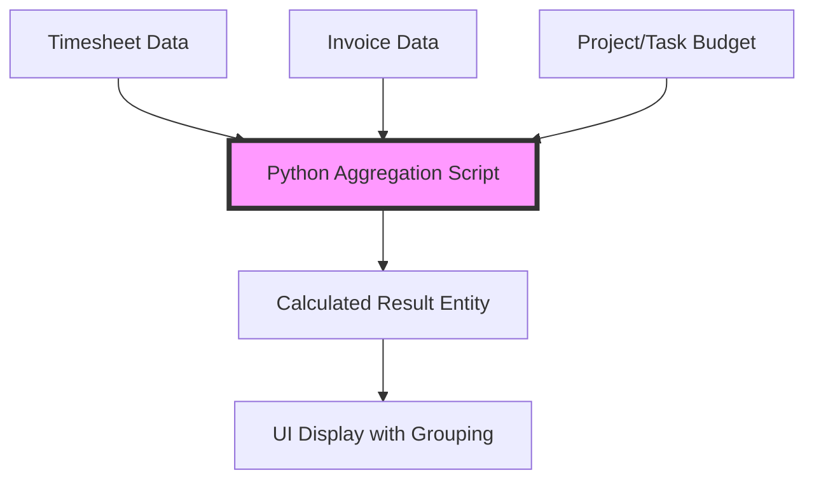

# Budgetkontrolle von Projekten und Tätigkeiten

time cockpit bietet leistungsfähige integrierte Listen für die Rentabilitätsanalyse von Projekten in Echtzeit. Diese Listen führen Daten aus Zeitbuchungen und Rechnungen zusammen und ermöglichen so eine umfassende Budgetkontrolle.

## Überblick

Die Funktionen zur Budgetkontrolle bestehen aus zwei Hauptlisten:
- **[Budgetkontrolle für Projekte](https://web.timecockpit.com/app/lists/APP_BudgetaryControlOfProjectsList)**: Budgetanalyse auf Projektebene
- **[Budgetkontrolle für Tätigkeiten](https://web.timecockpit.com/app/lists/APP_BudgetaryControlOfTasksList)**: Budgetanalyse auf Tätigkeitsebene

Beide Listen sind als **eigene Python-Skripte** umgesetzt, die Daten aus mehreren Quellen zusammenfassen und abgeleitete Kennzahlen in Echtzeit berechnen.

## Wichtige Kennzahlen erklärt

### Aus den Daten der Zeitbuchungen

#### Stunden
```python
.Hours = Sum(T.DurationInHours)
```
Gesamtzahl der erfassten Stunden über alle Zeitbuchungen des Projekts, unabhängig von der Verrechenbarkeit.

#### Verrechenbare Stunden
```python
.HoursBillable = Sum(:Iif(T.APP_Billable = True And T.HourlyRateActual > 0, T.DurationInHours, 0))
```
Zählt nur Stunden, die:
- als verrechenbar markiert sind (`APP_Billable = True`)
- einen tatsächlichen Stundensatz größer als 0 haben

**Warum das wichtig ist**: Auch bei verrechenbaren Projekten können Zeitbuchungen selbst nicht verrechenbar sein (interne Besprechungen, Einrichtungszeit usw.)

#### Budget in Stunden
```python
.BudgetInHours = :Iif(
    :Iif(T.Project = Null, T.Task.Project.BudgetInHours, T.Project.BudgetInHours) = Null 
    And :Iif(T.Project = Null, T.Task.Project.HourlyRateActual, T.Project.HourlyRateActual) <> 0,
    :Iif(T.Project = Null, T.Task.Project.Budget, T.Project.Budget) / 
    :Iif(T.Project = Null, T.Task.Project.HourlyRateActual, T.Project.HourlyRateActual),
    :Iif(T.Project = Null, T.Task.Project.BudgetInHours, T.Project.BudgetInHours)
)
```
Leitet die Stunden aus dem Budgetbetrag ab, wenn `BudgetInHours` nicht direkt gesetzt ist:
- Hat das Projekt ein `Budget` (Betrag), aber kein `BudgetInHours`, wird berechnet: `Budget / HourlyRate`
- Andernfalls wird `BudgetInHours` direkt verwendet

#### Fortschritt in Prozent
```python
.ProgressBillablePercent = newEntry.HoursBillable / newEntry.BudgetInHours if newEntry.BudgetInHours > 0 else 0
.ProgressPercent = newEntry.Hours / newEntry.BudgetInHours if newEntry.BudgetInHours > 0 else 0
```
Zwei Kennzahlen:
- **ProgressBillablePercent**: Wie viel Prozent der budgetierten Stunden sind verrechenbare Stunden?
- **ProgressPercent**: Wie viel Prozent der budgetierten Stunden sind Gesamtstunden? (einschließlich nicht verrechenbarer Stunden)

#### Umsatz
```python
.Revenue = Sum(T.Revenue)
```
Summe des Umsatzes aller Zeitbuchungen. Der Umsatz jeder Zeitbuchung wird so berechnet:
```tcql
T.APP_Revenue = T.APP_DurationInHours * T.APP_HourlyRateActual
```

#### Noch nicht verrechneter Umsatz
```python
.RevenueNotBilled = Sum(:Iif(T.APP_Billed = True Or T.APP_Billable = False, 0, T.Revenue))
```
Umsatz aus Zeitbuchungen, die:
- verrechenbar sind (`APP_Billable = True`)
- noch nicht verrechnet sind (`APP_Billed = False`)

#### Kosten
```python
.Costs = Sum(T.DurationInHours * T.UserDetail.APP_HourlyRate)
```
Berechnung der internen Kosten mit dem **internen Stundensatz des Mitarbeiters** (nicht dem verrechneten Satz). Das zeigt Ihre tatsächlichen Personalkosten.

#### Effektiver Stundensatz
```python
.EffectiveHourlyRate = Sum(T.Revenue) / Sum(T.DurationInHours)
```
Durchschnittlicher Umsatz pro geleisteter Stunde. Nützlich für den Vergleich mit dem geplanten Stundensatz des Projekts.

**Beispiel**: 
- Geplanter Satz: 100 €/Stunde
- Effektiver Satz: 85 €/Stunde
- → Einige Stunden waren nicht verrechenbar oder rabattiert

### Aus den Rechnungsdaten (Gegenprüfung)

Die Liste führt **separate Abfragen** auf Rechnungen aus, um die Werte gegenzuprüfen:

#### Verrechneter Umsatz aus Rechnungen
```python
invoiceQuery = '''
    From I In APP_Invoice
    Where (@Project = Null Or I.Project.ProjectUuid = @Project)
    Select New With {
        .ProjectUuid = I.Project.ProjectUuid,
        .InvoiceRevenue = Sum(I.ReadOnlyRevenue)
    }
'''
```
Das ist der **tatsächlich in Rechnung gestellte Betrag** – was Sie dem Kunden verrechnet haben.

**Warum getrennt vom Umsatz aus Zeitbuchungen?**
- Rechnungen können Festpreispositionen, Spesen oder Artikel enthalten
- Auf Rechnungen können Rabatte angewendet sein
- Der in Rechnung gestellte Betrag ≠ Summe des Umsatzes aus Zeitbuchungen

#### Verrechnete Stunden aus Rechnungen
```python
invoiceDetailQuery = '''
    From I In APP_InvoiceDetail
    Where (I.Unit.Code = "hour")
    Select New With {
        .ProjectUuid = I.Invoice.Project.ProjectUuid,
        .InvoicedHours = Sum(I.Quantity)
    }
'''
```
Zählt nur Rechnungspositionen, deren Einheit "hour" ist (keine Pauschalpositionen).

#### Nicht verrechnete Stunden aus Rechnungen
```python
.UnbilledHoursFromInvoices = newEntry.BudgetInHours - newEntry.BilledHoursFromInvoices
```
Verbleibende Stunden im Budget, die noch nicht in Rechnung gestellt wurden.

**Warnung**: Der Wert kann negativ sein, wenn Sie mehr in Rechnung gestellt als budgetiert haben!

## Datenfluss und Architektur



### Verarbeitungsschritte

1. **Zeitbuchungen filtern**: Die Filterparameter des Benutzers anwenden (Kunde, Projekt, Datum, abgeschlossene Projekte)
2. **Berechtigungen anwenden**: Nach den Rollen des Benutzers filtern (BillingAdmin, ProjectController, ProjectManager)
3. **Daten der Zeitbuchungen zusammenfassen**: Nach Projekt gruppieren, Stunden, Umsatz und Kosten berechnen
4. **Rechnungen separat abfragen**: In Rechnung gestellte Beträge und Stunden ermitteln
5. **Gegenprüfung**: Rechnungsdaten den Projekten über die UUID zuordnen
6. **Ergebnisobjekte aufbauen**: Entitätsobjekte im Arbeitsspeicher mit allen berechneten Feldern anlegen
7. **An die Benutzeroberfläche zurückgeben**: Mit Gruppierung, Sortierung und Formatierung anzeigen

### Durchsetzung der Berechtigungen

**Wichtig**: Diese Listen berücksichtigen die Standardberechtigungen:

```python
if defaultPermissionsEnabled == True:
    whereCondExt = '''
        And :Iif('BillingAdmin' In Set('CurrentUserRoles') Or
                 'ProjectController' In Set('CurrentUserRoles') Or
                 ('ProjectManager' In Set('CurrentUserRoles') And 
                  (T.APP_Project.APP_Manager1 = Environment.CurrentUser.UserDetailUuid Or 
                   T.APP_Project.APP_Manager2 = Environment.CurrentUser.UserDetailUuid)),
                 True, False) = True
    '''
```

**Der Zugriff ist beschränkt auf**:
- Benutzer mit der Rolle `BillingAdmin`: sehen alle Projekte
- Benutzer mit der Rolle `ProjectController`: sehen alle Projekte  
- Benutzer mit der Rolle `ProjectManager`: sehen nur Projekte, in denen sie als Manager1 oder Manager2 eingetragen sind

Normale Benutzer sehen diese Listen nicht in der Navigation.

## Die vollständige TCQL-Abfrage im Detail

### Hauptabfrage auf Zeitbuchungen

```python
timesheetQuery = '''
From T In Timesheet.Include('Task.Project.Customer').Include('Project.Customer')
Where
    (@IncludeClosed = True Or (T.Task <> Null And T.Task.Project.Closed = False) Or T.Project.Closed = False)
    And (@IncludeUnbillable = True Or T.Task.Project.Billable = True Or T.Project.Billable = True)
    And (@Customer = Null Or T.Task.Project.Customer.CustomerUuid = @Customer Or T.Project.Customer.CustomerUuid = @Customer)
    And (@Project = Null Or T.Task.Project.ProjectUuid = @Project Or T.Project.ProjectUuid = @Project)
    -- + permission filter if enabled
Order By :Iif(T.Project = Null, :DisplayValue(T.Task.Project.Customer), :DisplayValue(T.Project.Customer))
Select New With {
    .CustomerName = :Iif(T.Project = Null, :DisplayValue(T.Task.Project.Customer), :DisplayValue(T.Project.Customer)),
    .CustomerUuid = :Iif(T.Project = Null, T.Task.Project.Customer.CustomerUuid, T.Project.Customer.CustomerUuid),
    .ProjectName = :Iif(T.Project = Null, :DisplayValue(T.Task.Project), :DisplayValue(T.Project)),
    .ProjectUuid = :Iif(T.Project = Null, T.Task.Project.ProjectUuid, T.Project.ProjectUuid),
    .Billable = :Iif(T.Project = Null, T.Task.Project.Billable, T.Project.Billable),
    .FixedPrice = :Iif(T.Project = Null, T.Task.Project.FixedPrice, T.Project.FixedPrice),
    .Hours = Sum(T.DurationInHours),
    .HoursBillable = Sum(:Iif(T.APP_Billable = True And T.HourlyRateActual > 0, T.DurationInHours, 0)),
    .Budget = [complex calculation - see "Budget in Hours" above],
    .BudgetInHours = [see above],
    .Costs = Sum(T.DurationInHours * T.UserDetail.APP_HourlyRate),
    .Revenue = Sum(T.Revenue),
    .HoursNotBilled = Sum(:Iif(:Iif(T.Project = Null, T.Task.Project.Billable, T.Project.Billable) = True,
                              :Iif(T.APP_Billed = True Or T.APP_Billable = False Or T.APP_HourlyRateActual = 0, 0, T.DurationInHours),
                              Null)),
    .RevenueNotBilled = Sum(:Iif(T.APP_Billed = True Or T.APP_Billable = False, 0, T.Revenue)),
    .EffectiveHourlyRate = Sum(:Iif(:Iif(T.Project = Null, T.Task.Project.Billable, T.Project.Billable) = True,
                                     T.Revenue, Null)) / Sum(T.DurationInHours)
}
'''
```

**Wichtige Muster**:
- **Tätigkeit oder Projekt**: `T.Project = Null` prüft, ob die Zeitbuchung einer Tätigkeit zugeordnet ist (dann wird `T.Task.Project` verwendet) oder direkt einem Projekt
- **Gruppierung**: Gruppiert automatisch nach Projekt (und für die Sortierung nach Kunde)
- **Bedingte Summen**: Verwendet ausgiebig `:Iif()`, um Werte bedingt einzubeziehen

## Eine eigene Liste mit Aggregation erstellen

Sie möchten einen ähnlichen Bericht erstellen? So gehen Sie vor:

### 1. Ergebnisentität definieren

```python
def getResultModelEntity(context):
    entity = ModelEntity({ "Name": "Result" })
    entity.Properties.Add(TextProperty({ "Name": "ProjectName" }))
    entity.Properties.Add(GuidProperty({ "Name": "ProjectUuid" }))
    entity.Properties.Add(NumericProperty({ "Name": "Revenue" }))
    entity.Properties.Add(NumericProperty({ "Name": "Costs" }))
    entity.Properties.Add(NumericProperty({ "Name": "Margin" }))
    return entity
```

### 2. Abfragefunktion erstellen

```python
def getItems(context, queryParameters):
    dc = context
    resultEntity = getResultModelEntity(context)
    
    # Query your data
    data = dc.SelectWithParams({
        "Query": "From T In APP_Timesheet Where ... Select ...",
        "QueryParameters": queryParameters
    })
    
    # Build result objects
    result = List[EntityObject]()
    for row in data:
        entry = resultEntity.CreateEntityObject()
        entry.ProjectName = row.ProjectName
        entry.Revenue = row.Revenue
        entry.Costs = row.Costs  
        entry.Margin = row.Revenue - row.Costs
        result.Add(entry)
    
    return result.Cast[EntityObject]().ToArray()
```

### 3. Listenkonfiguration erstellen

```xml
<List AllowDelete="False" ExecuteOnOpen="False" AllowEdit="True"
      EditModelEntityName="APP_Project" EditProperty="ProjectUuid"
      xmlns="clr-namespace:TimeCockpit.Data.DataModel.View;assembly=TimeCockpit.Data">
    
    <List.ScriptSource>
        <sys:String xml:space="preserve">
            [Your Python script here]
        </sys:String>
    </List.ScriptSource>
    
    <List.Groups>
        <Group AutoExpand="True" MemberPath="CustomerName" SortDirection="Ascending" />
    </List.Groups>
    
    <List.Filter>
        <!-- Add filter parameters -->
    </List.Filter>
    
    <!-- Column definitions -->
    <BoundCell Content="=Current.ProjectName" Header="Project" />
    <NumericCell Content="=Current.Revenue" Header="Revenue" NumberFormatPattern="#,##0.00" />
    <!-- ... more columns ... -->
</List>
```

## Hinweise zur Performance

Die Listen zur Budgetkontrolle können bei großen Datenmengen langsam sein, weil sie:
1. alle Zeitbuchungen abfragen (möglicherweise Tausende)
2. alle Rechnungen separat abfragen  
3. Gruppierungen und Berechnungen in Python durchführen
4. Ergebnisobjekte im Arbeitsspeicher aufbauen

**Tipps zur Optimierung**:
- Verwenden Sie immer Filter (Kunde, Projekt, Zeitraum), um die Datenmenge zu begrenzen
- Erwägen Sie, Summenwerte in nächtlichen Batch-Jobs vorab zu berechnen
- Legen Sie bei sehr großen Tenants materialisierte Views an oder speichern Sie Ergebnisse zwischen

## Häufige Fragen

### Warum stimmen die Umsatzzahlen nicht überein?

**Umsatz aus Zeitbuchungen** und **Umsatz aus Rechnungen** können sich unterscheiden, weil:
- Rechnungen Positionen enthalten können, die nicht aus Zeitbuchungen stammen (Spesen, Artikel, Pauschalen)
- auf Rechnungen Rabatte oder Korrekturen angewendet sein können
- möglicherweise noch nicht alle Zeitbuchungen verrechnet sind
- bei internationalen Rechnungen Wechselkursdifferenzen auftreten

**Prüfen Sie immer beide Werte!**

### Kann ich eigene Spalten hinzufügen?

Ja! Passen Sie das Python-Skript an:
1. Fügen Sie in `getResultModelEntity()` eine Eigenschaft hinzu
2. Berechnen Sie den Wert in `getItems()`
3. Fügen Sie im XML eine `<BoundCell>` oder `<NumericCell>` hinzu

Beispiel – Gewinnmarge in Prozent hinzufügen:
```python
# In getResultModelEntity:
entity.Properties.Add(NumericProperty({ "Name": "MarginPercent" }))

# In getItems:
entry.MarginPercent = (entry.Revenue - entry.Costs) / entry.Revenue * 100 if entry.Revenue > 0 else 0

# In XML:
<NumericCell Content="=Current.MarginPercent" Header="Margin %" NumberFormatPattern="#,##0.0 '%'" />
```

### Kann ich diese Daten über die API exportieren?

Nicht direkt – es handelt sich um **zur Laufzeit berechnete Listen**, nicht um gespeicherte Daten. 

**Möglichkeiten**:
1. **Die Logik nachbauen** – in Ihrem externen Skript mit Abfragen über die Web API
2. **Aus der Benutzeroberfläche exportieren** – mit der Schaltfläche für den Excel-Export
3. **Einen geplanten Bericht erstellen**, der die Ergebnisse täglich per E-Mail versendet

## Verwandte Dokumentation

- [Referenz der Entität APP_Project](/doc/data-model/standard-entities.html#app_project)
- [Referenz der Entität APP_Timesheet](/doc/data-model/standard-entities.html#app_timesheet)
- [Referenz der Entität APP_Invoice](/doc/data-model/standard-entities.html)
- [Leitfaden zu eigenen Listen](/doc/data-model-customization/list.html)
- [TCQL im Überblick](/doc/tcql/overview.html)
- [Scripting im Überblick](/doc/scripting/overview.html)

## Siehe auch

- **Ähnlicher Anwendungsfall**: [Soll-Ist-Vergleich](https://web.timecockpit.com/app/lists/APP_TargetActualHoursComparisonList)
- **Verwandte Liste**: [Nicht verrechnete Zeitbuchungen](https://web.timecockpit.com/app/lists/APP_UnbilledTimesheetsList)
- **Alternative über die API**: [Beispiele für den Query-Endpunkt](/doc/web-api/query.html)
