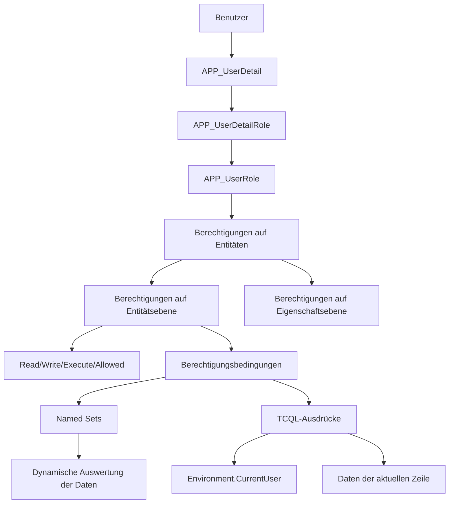
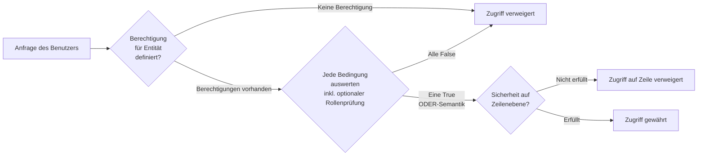

# Leitfaden zu Berechtigungen & Sicherheit

Time cockpit setzt ein ausgefeiltes, mehrschichtiges Sicherheitssystem um, das **rollenbasierte Zugriffskontrolle (RBAC)** mit **Sicherheit auf Zeilenebene (RLS)** kombiniert und dafür dynamische **Named Sets** und Berechtigungsbedingungen verwendet.

## Überblick über die Sicherheitsarchitektur



## Grundbegriffe der Berechtigungen

### 1. Zugriffsarten

Jede Berechtigung legt fest, welche Operationen sie steuert. Die zugrunde liegende Enumeration enthält sowohl das kombinierte Flag `Write` als auch die einzelnen CRUD-Bit-Flags:

| Zugriffsart | Wert | Beschreibung |
|-------------|-------|-------------|
| **Read** | 1 | Daten der Entität anzeigen |
| **Insert** | 2 | Neue Datensätze anlegen; in `Write` enthalten |
| **Update** | 4 | Bestehende Datensätze ändern; in `Write` enthalten |
| **Delete** | 8 | Datensätze entfernen; in `Write` enthalten |
| **Write** | 15 | Kombinierte Schreibberechtigung für Daten; umfasst `Read`, `Insert`, `Update` und `Delete` |
| **Execute** | 16 | Aktionen ausführen; wird für Berechtigungen zur Ausführung von Aktionen verwendet |
| **Allowed** | 32 | Allgemeine Funktionsberechtigung, die vom Framework verwendet wird |

In der Dokumentation und in der Konfiguration von Mandanten sind die häufigsten Berechtigungsarten `APP_ReadPermission`, `APP_WritePermission` und die aktionsspezifische `APP_ExecutePermission`.

### 2. Ablauf der Berechtigungsprüfung



> **Mehrere Berechtigungen werden mit ODER verknüpft**: Sind für eine Entität und Zugriffsart mehrere Berechtigungen definiert, wird der Zugriff gewährt, sobald *irgendeine* Bedingung `True` ergibt.

### 3. Named Sets

Named Sets sind **dynamische Abfragen**, die zur Laufzeit ausgewertet werden und so eine kontextabhängige Sicherheit ermöglichen:

**Zweck**: Listen von Entitäten vorab berechnen, auf die der aktuelle Benutzer zugreifen darf
**Auswertung**: Erfolgt bei der Prüfung der Berechtigung
**Caching**: Ergebnisse werden aus Performancegründen pro Anfrage zwischengespeichert

## Standardrollen

Time cockpit enthält vordefinierte Rollen mit bestimmten Befugnissen:

### Administratorrollen

**BillingAdmin**
- Vollzugriff auf Rechnungslegung, Projekte und Kunden
- Kann Rechnungen anlegen, bearbeiten und löschen
- Sieht alle Zeitbuchungen für die Verrechnung

```tcql
-- Example: Invoice write permission
'BillingAdmin' In Set('CurrentUserRoles')
```

**HumanResourcesAdmin**
- Verwaltet Benutzer, Abteilungen und Arbeitszeit
- Genehmigt Abwesenheiten (Urlaub, Krankenstand)
- Sieht alle Mitarbeiterdaten

```tcql
-- Example: UserDetail full access
'HumanResourcesAdmin' In Set('CurrentUserRoles')
```

**BaseDataAdmin**
- Verwaltet Stammdaten (Artikel, Einheiten, Kunden)
- Kann nicht auf Finanz- oder Mitarbeiterdaten zugreifen
- Pflegt Referenztabellen

### Managerrollen

**ProjectManager**
- Sieht die Projekte, die er leitet
- Sieht die Zeitbuchungen auf seinen Projekten
- Kann Zeitbuchungen anderer nicht ändern

```tcql
-- Example: Project manager sees their projects
'ProjectManager' In Set('CurrentUserRoles') And 
(Current.APP_Manager1 = Environment.CurrentUser.UserDetailUuid Or
 Current.APP_Manager2 = Environment.CurrentUser.UserDetailUuid)
```

**DepartmentLead**
- Verwaltet die Mitarbeiter der Abteilung
- Genehmigt Abwesenheiten für seine Abteilung
- Sieht die Zeitbuchungen der Abteilung

```tcql
-- Named Set: APP_MyDepartmentsAsLead
From DL In APP_DepartmentLead
Where DL.APP_UserDetail = Environment.CurrentUser.UserDetailUuid
Select DL.APP_Department

-- Permission condition: Department lead sees their department
Current.APP_Department In Set('APP_MyDepartmentsAsLead')
```

### Standardbenutzer

**User** (Basisrolle)
- Legt eigene Zeitbuchungen an
- Sieht nur eigene Daten
- Stellt Urlaubsanträge

## Häufige Berechtigungsmuster

### Muster 1: Eigene Daten + Administratoren

**Anwendungsfall**: Benutzer sehen ihre eigenen Datensätze, Administratoren sehen alle

**Beispiel**: Zeitbuchungen
```tcql
:Iif(
  'BillingAdmin' In Set('CurrentUserRoles') Or
  'HumanResourcesAdmin' In Set('CurrentUserRoles'),
  True,  -- Admins see everything
  Current.APP_UserDetail = Environment.CurrentUser.UserDetailUuid  -- Users see own
) = True
```

**Beispiel**: Urlaubsanträge
```tcql
:Iif(
  'HumanResourcesAdmin' In Set('CurrentUserRoles'),
  True,  -- HR sees all absences
  Current.APP_UserDetail = Environment.CurrentUser.UserDetailUuid  -- Users see own
) = True
```

### Muster 2: Hierarchischer Zugriff für Vorgesetzte

**Anwendungsfall**: Vorgesetzte sehen die Daten ihrer Mitarbeiter

**Beispiel**: Zugriff auf Zeitbuchungen nach Abteilung
```tcql
:Iif(
  'HumanResourcesAdmin' In Set('CurrentUserRoles'),
  True,  -- HR admin sees all
  :Iif(
    Current.APP_UserDetail = Environment.CurrentUser.UserDetailUuid,
    True,  -- Users see own timesheets
    :Iif(
      'DepartmentLead' In Set('CurrentUserRoles') And 
      Current.APP_UserDetail.APP_Department In Set('APP_MyDepartmentsAsLead'),
      True,  -- Department leads see their department
      False
    )
  )
) = True
```

### Muster 3: Projektbezogener Zugriff

**Anwendungsfall**: Projektleiter greifen auf projektbezogene Daten zu

**Beispiel**: Sichtbarkeit der Zeitbuchungen eines Projekts
```tcql
:Iif(
  'BillingAdmin' In Set('CurrentUserRoles'),
  True,
  :Iif(
    Current.APP_UserDetail = Environment.CurrentUser.UserDetailUuid,
    True,  -- Own timesheets
    :Iif(
      'ProjectManager' In Set('CurrentUserRoles') And
      (Current.APP_Project.APP_Manager1 = Environment.CurrentUser.UserDetailUuid Or
       Current.APP_Project.APP_Manager2 = Environment.CurrentUser.UserDetailUuid),
      True,  -- Project manager's projects
      False
    )
  )
) = True
```

### Muster 4: Bedingter Schreibzugriff

**Anwendungsfall**: Änderungen abhängig vom Status einschränken

**Beispiel**: Verrechnete Zeitbuchungen können nicht bearbeitet werden
```tcql
-- Read permission: see timesheet
'BillingAdmin' In Set('CurrentUserRoles') Or
Current.APP_UserDetail = Environment.CurrentUser.UserDetailUuid

-- Write permission: can only edit if not billed
:Iif(
  'BillingAdmin' In Set('CurrentUserRoles'),
  True,  -- Admins can edit anything
  :Iif(
    Current.APP_UserDetail = Environment.CurrentUser.UserDetailUuid And
    Current.APP_Billed = False,  -- Not yet invoiced
    True,
    False
  )
) = True
```

**Beispiel**: Nur eigene Zeitbuchungen abschließen
```tcql
-- APP_DeviatingBookingCompletionDate property permission
:Iif(
  'HumanResourcesAdmin' In Set('CurrentUserRoles'),
  True,
  :Iif(
    Current.APP_UserDetailUuid = Environment.CurrentUser.UserDetailUuid And
    (Current.APP_AllowDeviatingBookingCompletionDateUntil = Null Or
     Current.APP_AllowDeviatingBookingCompletionDateUntil >= :Today()),
    True,
    False
  )
) = True
```

### Muster 5: Abhängig von Feature Flags

**Anwendungsfall**: Berechtigungen abhängig von Mandanteneinstellungen aktivieren oder deaktivieren

```tcql
-- Disable default permissions if feature flag is off
:Iif(:IsFeatureFlagEnabled('APP_DefaultPermissions'), False, True)
```

## Referenz der Named Sets

### Integrierte Named Sets

#### CurrentUserRoles
Liefert die Rollen, die dem aktuellen Benutzer zugewiesen sind.

```tcql
-- Definition
From R In APP_UserDetailRole 
Where 
    R.APP_UserDetail = Environment.CurrentUser.UserDetailUuid
    And (R.APP_ValidFrom = Null Or R.APP_ValidFrom <= :Today())
    And (R.APP_ValidTo = Null Or R.APP_ValidTo >= :Today())
Select New With { R.APP_UserRole.APP_Code }

-- Usage
'BillingAdmin' In Set('CurrentUserRoles')
```

#### APP_MyDepartmentsAsLead
Liefert die Abteilungen, in denen der aktuelle Benutzer Abteilungsleiter ist.

```tcql
-- Definition
From DL In APP_DepartmentLead
Where 
    DL.APP_UserDetail = Environment.CurrentUser.UserDetailUuid
Select DL.APP_Department

-- Usage
Current.APP_Department In Set('APP_MyDepartmentsAsLead')
```

#### APP_MyManagedProjects
Liefert die Projekte, bei denen der aktuelle Benutzer Manager1 oder Manager2 ist.

```tcql
-- Definition
From P In APP_Project
Where 
    P.APP_Manager1 = Environment.CurrentUser.UserDetailUuid Or
    P.APP_Manager2 = Environment.CurrentUser.UserDetailUuid
Select P

-- Usage
Current.APP_Project In Set('APP_MyManagedProjects')
```

### Eigene Named Sets erstellen

Named Sets lassen sich programmgesteuert erstellen, um eigene Sicherheitsszenarien zu unterstützen:

**Beispiel**: Projekte, auf die der Benutzer Zeit gebucht hat
```tcql
-- Named Set: APP_MyProjectsWithTime
From T In APP_Timesheet
Where T.APP_UserDetail = Environment.CurrentUser.UserDetailUuid
Select Distinct T.APP_Project
```

## Berechtigungen auf Eigenschaftsebene

Schränken Sie den Zugriff auf bestimmte Eigenschaften (Felder) innerhalb einer Entität ein.

**Anwendungsfall**: Gehaltsinformationen vor Benutzern außerhalb von HR verbergen

```tcql
-- APP_UserDetail.APP_HourlyRate property permission
:Iif(
  'HumanResourcesAdmin' In Set('CurrentUserRoles') Or
  'BillingAdmin' In Set('CurrentUserRoles'),
  True,  -- Admins can see/edit hourly rate
  :Iif(
    Current.APP_UserDetailUuid = Environment.CurrentUser.UserDetailUuid,
    True,  -- Users can see their own rate
    False  -- Others cannot see
  )
) = True
```

**Anwendungsfall**: Rechnungsnummern nach dem Anlegen sperren

```tcql
-- APP_Invoice.APP_InvoiceNumber - read-only after set
:Iif(
  Current.APP_InvoiceNumberIsSet = True,
  True,  -- Read-only if already set
  False  -- Editable before set
)
```

## Berechtigungen für Aktionen

Legen Sie fest, wer bestimmte Aktionen ausführen darf (z. B. Rechnung erstellen, Urlaub genehmigen).

**Beispiel**: Rechnungslegung nur für Abrechnungsadministratoren
```tcql
-- APP_CreateInvoiceAction execute permission
:Iif('BillingAdmin' In Set('CurrentUserRoles'), True, False) = True
```

**Beispiel**: Abteilungsleiter genehmigen Abwesenheiten
```tcql
-- APP_ApproveAbsenceAction
-- Implemented in action code - checks department membership
'DepartmentLead' In Set('CurrentUserRoles') Or
'HumanResourcesAdmin' In Set('CurrentUserRoles')
```

## Best Practices für die Sicherheit

### 1. Prinzip der minimalen Rechte

**❌ Schlecht**: Weitreichenden Zugriff gewähren
```tcql
'User' In Set('CurrentUserRoles')  -- Too permissive
```

**✅ Gut**: Gezielten Zugriff gewähren
```tcql
:Iif(
  'BillingAdmin' In Set('CurrentUserRoles'),
  True,
  Current.APP_UserDetail = Environment.CurrentUser.UserDetailUuid
) = True
```

### 2. Named Sets für komplexe Logik verwenden

**❌ Schlecht**: Komplexe Abfragen in jeder Berechtigung wiederholen
```tcql
-- Repeated in multiple permissions
(From DL In APP_DepartmentLead 
 Where DL.APP_UserDetail = Environment.CurrentUser.UserDetailUuid
 Select DL.APP_Department) Contains Current.APP_Department
```

**✅ Gut**: Einmal als Named Set definieren
```tcql
Current.APP_Department In Set('APP_MyDepartmentsAsLead')
```

### 3. Grenzen der Berechtigungen testen

Testen Sie immer:
- ✅ Benutzer können auf ihre eigenen Daten zugreifen
- ✅ Benutzer können NICHT auf Daten anderer zugreifen
- ✅ Vorgesetzte können auf die Daten ihrer Mitarbeiter zugreifen
- ✅ Vorgesetzte können NICHT auf die Daten gleichrangiger Kollegen zugreifen
- ✅ Administratoren können auf alles zugreifen

### 4. Eigene Berechtigungen dokumentieren

```tcql
/* Permission: ProjectManagerReadAccess
   Purpose: Project managers see timesheets on projects they manage
   Roles: ProjectManager, BillingAdmin
   Condition: User is Manager1 or Manager2 of the project */
:Iif(
  'BillingAdmin' In Set('CurrentUserRoles'),
  True,
  :Iif(
    'ProjectManager' In Set('CurrentUserRoles') And
    (Current.APP_Project.APP_Manager1 = Environment.CurrentUser.UserDetailUuid Or
     Current.APP_Project.APP_Manager2 = Environment.CurrentUser.UserDetailUuid),
    True,
    False
  )
) = True
```

### 5. Änderungen an Berechtigungen nachvollziehen

Wenn Sie Berechtigungen ändern:
1. Dokumentieren Sie die Änderung und den Grund
2. Testen Sie mit den betroffenen Benutzerrollen
3. Stimmen Sie die Änderung mit dem Sicherheits- bzw. Compliance-Team ab
4. Beobachten Sie, ob unbeabsichtigte Zugriffsmuster auftreten

## Fehlerbehebung bei Berechtigungen

### Fehler „Zugriff verweigert“

**Schritt 1**: Ermitteln Sie, welche Berechtigung fehlgeschlagen ist
- Auf Entitätsebene? (Die Entität kann gar nicht gelesen oder geschrieben werden)
- Auf Zeilenebene? (Einige Datensätze sind sichtbar, dieser aber nicht)
- Auf Eigenschaftsebene? (Ein bestimmtes Feld kann nicht angezeigt oder bearbeitet werden)
- Berechtigung für Aktionen? (Die Aktion kann nicht ausgeführt werden)

**Schritt 2**: Prüfen Sie die Rollen des Benutzers
```tcql
-- Query current user's roles
From R In APP_UserDetailRole
Where R.APP_UserDetail = Environment.CurrentUser.UserDetailUuid
And (R.APP_ValidFrom = Null Or R.APP_ValidFrom <= :Today())
And (R.APP_ValidTo = Null Or R.APP_ValidTo >= :Today())
Select R.APP_UserRole.APP_Code
```

**Schritt 3**: Werten Sie die Berechtigungsbedingung manuell aus

Testen Sie die Bedingung mit bekannten Werten:
- Ersetzen Sie `Environment.CurrentUser.UserDetailUuid` durch die tatsächliche UUID
- Ersetzen Sie `Current.XXX` durch die tatsächlichen Werte des Datensatzes
- Prüfen Sie die Ergebnisse der Named Sets

**Schritt 4**: Prüfen Sie die Feature Flags
```tcql
-- Is default permissions enabled?
:IsFeatureFlagEnabled('APP_DefaultPermissions')
```

### Berechtigung funktioniert nicht wie erwartet

**Häufige Ursachen**:

1. **Rolle nicht zugewiesen**: Der Benutzer hat die erforderliche Rolle nicht
   - Lösung: Rolle über `APP_UserDetailRole` zuweisen

2. **Rolle abgelaufen**: Die Datumswerte `ValidFrom`/`ValidTo` schließen das heutige Datum aus
   - Lösung: Zeiträume aktualisieren

3. **Named Set liefert kein Ergebnis**: Die dynamische Abfrage liefert keine Treffer
   - Lösung: Die Abfrage des Named Sets separat debuggen

4. **Falsche Abteilung**: Der Benutzer ist einer anderen Abteilung zugeordnet
   - Lösung: `APP_UserDetail.APP_Department` aktualisieren

5. **Berechtigung deaktiviert**: `IsDisabledExpression` ergibt `True`
   - Lösung: Feature Flags oder Bedingungen prüfen

## Fortgeschritten: Eigene Sicherheitsszenarien

### Szenario 1: Zeitabhängiger Zugriff

Bearbeitung auf den Zeitraum vor dem Buchungsabschluss beschränken:

```tcql
-- Can only edit timesheets before booking completion date
:Iif(
  'BillingAdmin' In Set('CurrentUserRoles'),
  True,
  :Iif(
    Current.APP_UserDetail = Environment.CurrentUser.UserDetailUuid And
    Current.APP_DateActual > :BookingCompletionDateOfUser(Environment.CurrentUser.UserDetailUuid),
    True,  -- Can edit recent timesheets
    False  -- Cannot edit old/closed timesheets
  )
) = True
```

### Szenario 2: Kundenspezifische Sichtbarkeit

Kundenbetreuer sehen nur die ihnen zugeordneten Kunden:

```tcql
-- Custom Named Set: APP_MyManagedCustomers
From C In APP_Customer
Where C.APP_AccountManager = Environment.CurrentUser.UserDetailUuid
Select C

-- Permission: Account manager sees their customers
:Iif(
  'BillingAdmin' In Set('CurrentUserRoles'),
  True,
  Current In Set('APP_MyManagedCustomers')
) = True
```

### Szenario 3: Mandantentrennung

Stellen Sie sicher, dass Benutzer nur Daten ihrer eigenen Firma sehen:

```tcql
-- All entities: Tenant isolation
:Iif(
  'SystemAdmin' In Set('CurrentUserRoles'),  -- System admin sees all tenants
  True,
  Current.APP_Company = Environment.CurrentUser.UserDetail.APP_Company  -- Same company only
) = True
```

## Siehe auch

- [Referenz der Standardentitäten](~/doc/datenmodell/standardentitaeten.md) - Berechtigungen einzelner Entitäten
- [Dokumentation der Named Sets](#referenz-der-named-sets)
- [TCQL-Ausdruckssprache](/doc/tcql/expression-language.html)
- [Migrationsleitfaden für Standardberechtigungen](~/doc/migrationsleitfaeden/standardberechtigungen.md)
- [Anpassung des Datenmodells - Berechtigungen](/doc/data-model-customization/permission.html)
