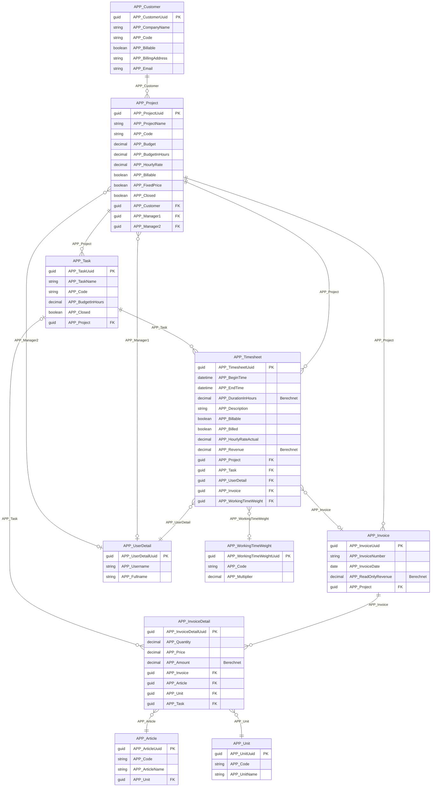
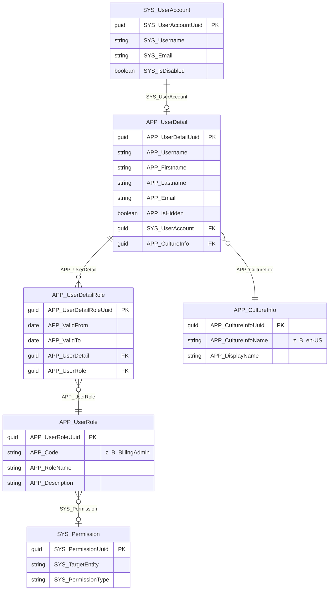
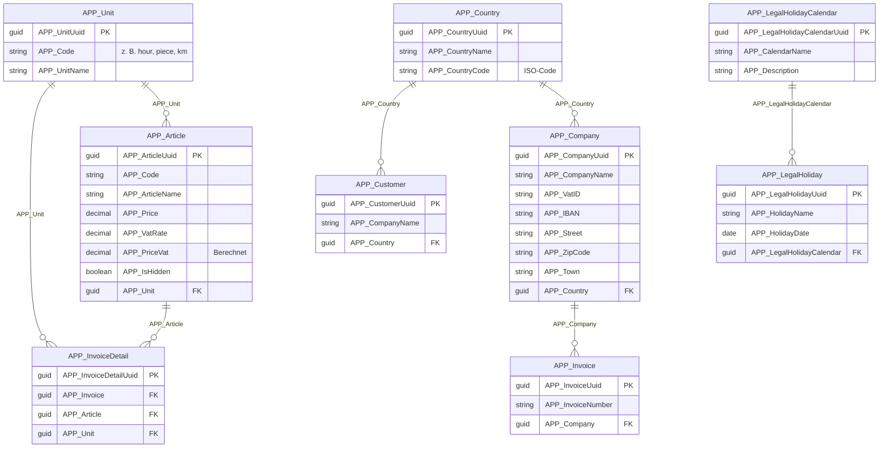

# Entity-Relationship-Diagramme

Diese Seite stellt die Beziehungen zwischen den Standardentitäten von time cockpit (Präfix APP_) grafisch dar. Zur besseren Übersicht ist das Datenmodell in logische Bereiche gegliedert.

## Bereich 1: Projekte & Rechnungslegung

Dieser Bereich umfasst Kundenbeziehungen, Projektmanagement, Zeiterfassung und Rechnungslegung.



### Wichtige Beziehungen

- `APP_Customer` ist die Wurzel; jedes `APP_Project` gehört zu genau einem Kunden.
- `APP_Task` gehört zu genau einem `APP_Project`; ein Projekt kann viele Tätigkeiten haben.
- `APP_Timesheet` hat einen Pflicht-Fremdschlüssel auf `APP_UserDetail`, einen Pflicht-Fremdschlüssel auf `APP_Project` und einen optionalen Fremdschlüssel auf `APP_Task`.
- `APP_Timesheet` hat einen optionalen Fremdschlüssel auf `APP_Invoice` und ist damit höchstens einer Rechnung zugeordnet.
- `APP_Invoice` gehört zu genau einem `APP_Project`; ein Projekt kann viele Rechnungen haben.
- `APP_InvoiceDetail` gehört zu genau einer `APP_Invoice` und hat Pflicht-Fremdschlüssel auf `APP_Article` und `APP_Unit` sowie einen optionalen Fremdschlüssel auf `APP_Task`.
- `APP_Project` enthält zwei optionale Fremdschlüssel auf `APP_UserDetail` (Manager1, Manager2).

## Bereich 2: Zeit & Anwesenheit

Dieser Bereich verwaltet Arbeitszeitpläne der Mitarbeiter, Abwesenheiten, Genehmigungen und die Einhaltung der Arbeitszeitregelungen.

```mermaid
erDiagram
    APP_UserDetail ||--o{ APP_WeeklyHoursOfWork : "APP_UserDetail"
    APP_UserDetail ||--o{ APP_VacationEntitlement : "APP_UserDetail"
    APP_UserDetail ||--o{ APP_Vacation : "APP_UserDetail"
    APP_UserDetail ||--o{ APP_SickLeave : "APP_UserDetail"
    APP_UserDetail ||--o{ APP_CompensatoryTime : "APP_UserDetail"
    APP_UserDetail ||--o{ APP_OvertimeCorrection : "APP_UserDetail"
    APP_UserDetail }o--o| APP_Department : "APP_Department"
    APP_Department ||--o{ APP_DepartmentLead : "APP_Department"
    APP_DepartmentLead }o--|| APP_UserDetail : "APP_UserDetail"
    APP_UserDetail }o--o| APP_LegalHolidayCalendar : "APP_LegalHolidayCalendar"
    APP_LegalHolidayCalendar ||--o{ APP_LegalHoliday : "APP_LegalHolidayCalendar"
    APP_UserDetail ||--o{ APP_WorkingTimeLimit : "APP_UserDetail"
    APP_Vacation }o--o| APP_UserDetail : "APP_Approver"
    APP_SickLeave }o--o| APP_UserDetail : "APP_Approver"
    APP_CompensatoryTime }o--o| APP_UserDetail : "APP_Approver"
    APP_UserDetail ||--o{ APP_Timesheet : "APP_UserDetail"
    
    APP_UserDetail {
        guid APP_UserDetailUuid PK
        string APP_Username
        string APP_Firstname
        string APP_Lastname
        string APP_Email
        decimal APP_HourlyRate "Interner Kostensatz"
        boolean APP_IsAbsenceApprovalRequired
        date APP_DeviatingBookingCompletionDate
        guid APP_Department FK
        guid APP_LegalHolidayCalendar FK
    }
    
    APP_Department {
        guid APP_DepartmentUuid PK
        string APP_DepartmentName
        string APP_Code
    }
    
    APP_DepartmentLead {
        guid APP_DepartmentLeadUuid PK
        boolean APP_ReceiveNotificationsForAbsenceApproval
        guid APP_Department FK
        guid APP_UserDetail FK
    }
    
    APP_WeeklyHoursOfWork {
        guid APP_WeeklyHoursOfWorkUuid PK
        date APP_EffectiveDate
        decimal APP_MondayHours
        decimal APP_TuesdayHours
        decimal APP_WednesdayHours
        decimal APP_ThursdayHours
        decimal APP_FridayHours
        decimal APP_SaturdayHours
        decimal APP_SundayHours
        guid APP_UserDetail FK
    }
    
    APP_Vacation {
        guid APP_VacationUuid PK
        datetime APP_BeginTime
        datetime APP_EndTime
        string APP_Description
        boolean APP_IsWholeDay
        datetime APP_ApprovedTimestampUtc
        boolean APP_IsApproved "Berechnet"
        guid APP_UserDetail FK
        guid APP_Approver FK
    }
    
    APP_SickLeave {
        guid APP_SickLeaveUuid PK
        datetime APP_BeginTime
        datetime APP_EndTime
        string APP_Description
        boolean APP_IsWholeDay
        datetime APP_ApprovedTimestampUtc
        boolean APP_IsApproved "Berechnet"
        string APP_RejectionReason
        guid APP_UserDetail FK
        guid APP_Approver FK
    }

    APP_CompensatoryTime {
        guid APP_CompensatoryTimeUuid PK
        datetime APP_BeginTime
        datetime APP_EndTime
        boolean APP_IsApproved "Berechnet"
        guid APP_UserDetail FK
        guid APP_Approver FK
    }

    APP_OvertimeCorrection {
        guid APP_OvertimeCorrectionUuid PK
        date APP_EffectiveDate
        decimal APP_Hours
        string APP_Reason
        guid APP_UserDetail FK
    }
    
    APP_VacationEntitlement {
        guid APP_VacationEntitlementUuid PK
        int APP_Year
        decimal APP_Days
        guid APP_UserDetail FK
    }
    
    APP_WorkingTimeLimit {
        guid APP_WorkingTimeLimitUuid PK
        date APP_EffectiveDate
        decimal APP_MaxDailyWorkingTime
        decimal APP_MinDailyBreakTime
        decimal APP_MaxWeeklyWorkingTime
        guid APP_UserDetail FK
    }

    APP_LegalHolidayCalendar {
        guid APP_LegalHolidayCalendarUuid PK
        string APP_CalendarName
        string APP_Description
    }

    APP_LegalHoliday {
        guid APP_LegalHolidayUuid PK
        string APP_HolidayName
        date APP_HolidayDate
        guid APP_LegalHolidayCalendar FK
    }

    APP_Timesheet {
        guid APP_TimesheetUuid PK
        date APP_DateActual
        datetime APP_BeginTime
        datetime APP_EndTime
        guid APP_UserDetail FK
    }
```



### Wichtige Beziehungen

- `APP_UserDetail` ist die zentrale Entität dieses Bereichs; alle Datensätze zu Abwesenheiten, Arbeitszeitplänen und Höchstarbeitszeiten haben einen Pflicht-Fremdschlüssel darauf.
- `APP_Vacation`, `APP_SickLeave` und `APP_CompensatoryTime` haben jeweils einen Pflicht-Fremdschlüssel auf `APP_UserDetail` (den Mitarbeiter) und einen optionalen Fremdschlüssel zurück auf `APP_UserDetail` (die genehmigende Person).
- `APP_WeeklyHoursOfWork`, `APP_VacationEntitlement`, `APP_WorkingTimeLimit` und `APP_OvertimeCorrection` haben jeweils einen Pflicht-Fremdschlüssel auf `APP_UserDetail`; ein Benutzer kann von jedem Typ viele Datensätze haben.
- `APP_UserDetail` hat einen optionalen Fremdschlüssel auf `APP_Department`; eine Abteilung kann viele Benutzer haben.
- `APP_DepartmentLead` ist eine Verknüpfungsentität zwischen `APP_Department` und `APP_UserDetail`; eine Abteilung kann mehrere Abteilungsleiter haben, und ein Benutzer kann mehrere Abteilungen leiten.
- `APP_UserDetail` hat einen optionalen Fremdschlüssel auf `APP_LegalHolidayCalendar`; ein Kalender kann von vielen Benutzern gemeinsam verwendet werden.
- `APP_LegalHoliday` hat einen Pflicht-Fremdschlüssel auf `APP_LegalHolidayCalendar`; ein Kalender enthält viele Feiertage.

## Bereich 3: Sicherheit & Benutzerverwaltung

Dieser Bereich umfasst Authentifizierung, Autorisierung, Rollen und Berechtigungen.



### Wichtige Beziehungen

- `SYS_UserAccount` hat höchstens ein `APP_UserDetail`-Profil (eins zu null oder eins).
- `APP_UserDetail` gehört zu genau einer `APP_CultureInfo`.
- `APP_UserDetailRole` ist eine Verknüpfungsentität zwischen `APP_UserDetail` und `APP_UserRole`; ein Benutzer kann viele Rollen haben, und eine Rolle kann vielen Benutzern zugewiesen sein.
- `APP_UserRole` hat einen optionalen Fremdschlüssel auf `SYS_Permission`.

## Bereich 4: Stammdaten & Konfiguration

Unterstützende Entitäten für Konfiguration und Referenzdaten.



## Bereichsübergreifende Beziehungen

**APP_UserDetail** hat Fremdschlüsselbeziehungen zu Entitäten in jedem Bereich:
- Wird von `APP_Timesheet` referenziert (Bereich 1)
- Referenziert `APP_Department` und `APP_LegalHolidayCalendar` und wird von allen Entitäten für Abwesenheiten und Arbeitszeitpläne referenziert (Bereich 2)
- Wird von `SYS_UserAccount` und `APP_UserDetailRole` referenziert und referenziert `APP_CultureInfo` (Bereich 3)

**APP_Project** wird bereichsübergreifend referenziert:
- Referenziert `APP_Customer` (Bereich 1)
- Wird von `APP_Timesheet` und `APP_Invoice` referenziert (Bereich 1)

## Kardinalität verstehen

**Symbole**:
- `||` : Eins (genau eins)
- `o{` : Null oder viele
- `}o` : Viele zu null oder eins
- `||--o{` : Eins zu viele
- `}o--||` : Viele zu eins
- `}o--o|` : Viele zu null oder eins

**Beispiele**:
```
APP_Customer ||--o{ APP_Project
```
Ein Kunde hat null oder viele Projekte. Jedes Projekt gehört zu genau einem Kunden.

```
APP_Timesheet }o--o| APP_Invoice
```
Eine Zeitbuchung kann null oder einer Rechnung zugeordnet sein (optional). Eine Rechnung kann viele Zeitbuchungen haben.

## Vollständige Liste der Entitäten nach Bereich

### Rechnungslegung & Projekte
- APP_Customer
- APP_Project
- APP_Task
- APP_Timesheet
- APP_Invoice
- APP_InvoiceDetail
- APP_Article
- APP_Unit

### Zeit & Anwesenheit
- APP_UserDetail
- APP_Department
- APP_DepartmentLead
- APP_WeeklyHoursOfWork
- APP_Vacation
- APP_SickLeave
- APP_CompensatoryTime
- APP_OvertimeCorrection
- APP_VacationEntitlement
- APP_WorkingTimeLimit
- APP_WorkingTimeWeight
- APP_LegalHolidayCalendar
- APP_LegalHoliday

### Sicherheit
- SYS_UserAccount
- APP_UserDetail
- APP_UserDetailRole
- APP_UserRole
- APP_CultureInfo

### Stammdaten
- APP_Company
- APP_Country
- APP_MeansOfTransport

### Konfiguration
- APP_GlobalSettings
- APP_FeatureFlag
- APP_FormattingProfile
- APP_EntityViewProfile

## Verwandte Dokumentation

- [Referenz der Standardentitäten](~/doc/datenmodell/standardentitaeten.md) - Ausführliche Dokumentation jeder Entität
- [Leitfaden zu Berechtigungen](~/doc/datenmodell/berechtigungen-und-sicherheit.md) - Mit Berechtigungen auf Entitäten arbeiten
- [TCQL: Überblick](/doc/tcql/overview.html) - Die Abfragesprache von time cockpit
- [Web API - OData](/doc/web-api/odata.html) - REST-API-Zugriff auf Entitäten

## Siehe auch

- [Anpassung des Datenmodells](/doc/data-model-customization/overview.html)
- [Eigene Entitäten anlegen](/doc/data-model-customization/entity.html)
- [Named Sets für die Sicherheit](~/doc/datenmodell/berechtigungen-und-sicherheit.md#referenz-der-named-sets)
