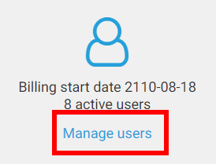
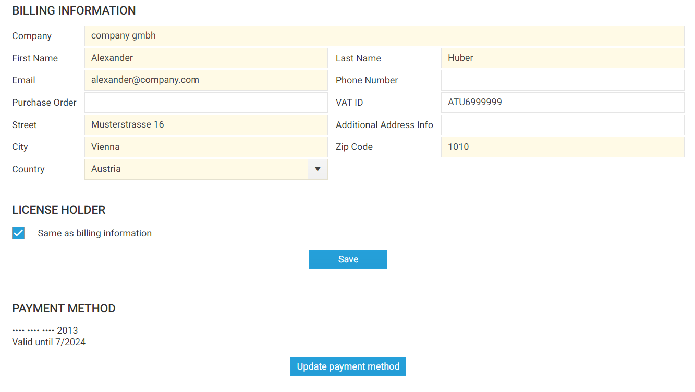

# Account Management

Time cockpit offers an intuitive interface for managing account details, including user management, billing information, and accessing invoices. The account management module provides comprehensive control over adding users, updating billing information, and downloading invoices.

>[!NOTE]
Previously, account management was handled via the time cockpit website (www.timecockpit.com) until July 2023. Since then, account management has been moved to the time cockpit web app, offering users a unified and streamlined experience.

## Adding Users

To add users to your time cockpit account, follow these steps:

1. Access the account management module by navigating to [Account Information](https://web.timecockpit.com/app/account/account-information).
2. On the main page, find the option to add users by clicking on "Manage users."
3. time cockpit will present a list of users, showing enabled and visible users by default.
4. Configure the filter to display disabled and hidden users if required.
5. To add a user, click "Add" and enter the necessary information.
6. Mandatory fields include "User Name," "First Name," and "Last Name."
7. Set the "Enabled" and "Tenant Admin" properties
   - Enabling a user will bill them based on their active days in a month.
   - The "Tenant Admin" status allows managing the account, adding users, updating payment details, and canceling the account.

## Entering Billing Information

To ensure seamless billing and account management, time cockpit requires specific details to be filled in the billing information section. Follow these steps to enter your billing details:

1. **Accessing Billing Information:**
   - Navigate to [Account Information](https://web.timecockpit.com/app/account/account-information) within your time cockpit account.

2. **Required Fields:**
   - The following fields are mandatory:
     - **Company:** Enter the name of your company.
     - **First Name:** Provide your first name.
     - **Last Name:** Enter your last name.
     - **Email:** Enter a valid email address.
     - **Street:** Enter your street address.
     - **City:** Provide the name of your city.
     - **Zip Code:** Enter the postal code.
     - **Country:** Specify your country.
   
3. **Optional Fields:**
   - The following fields are optional but recommended for better account management:
     - **Phone Number:** Enter your contact phone number.
     - **Purchase Order:** If applicable, include your purchase order number.
     - **VAT ID:** Provide your VAT identification number.
     - **Additional Address Info:** Include any supplementary information regarding your address.

### Stripe

Billing management within time cockpit is facilitated by **Stripe**, a secure and trusted payment gateway provider widely used for online transactions.

Stripe is a global technology company that builds economic infrastructure for the internet. It provides a secure platform for businesses to manage online payments, billing, and subscription services. The platform is known for its robust security measures, user-friendly interfaces, and broad support for various payment methods.

Stripe supports a wide range of payment methods, including credit and debit cards (Visa, Mastercard, American Express), bank transfers, and more. This diverse array of payment options offers users flexibility and convenience in managing their billing preferences.

## Invoice Download

Time cockpit provides downloads for all past invoices directly from the account management module. Users can access and download their invoices for accounting and record-keeping purposes.