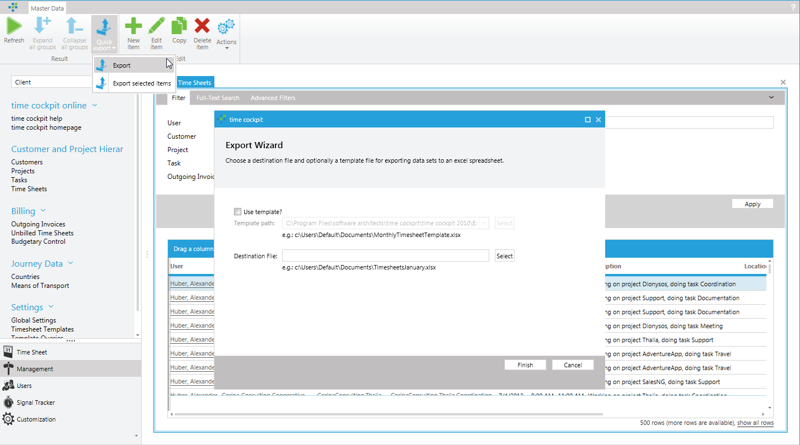
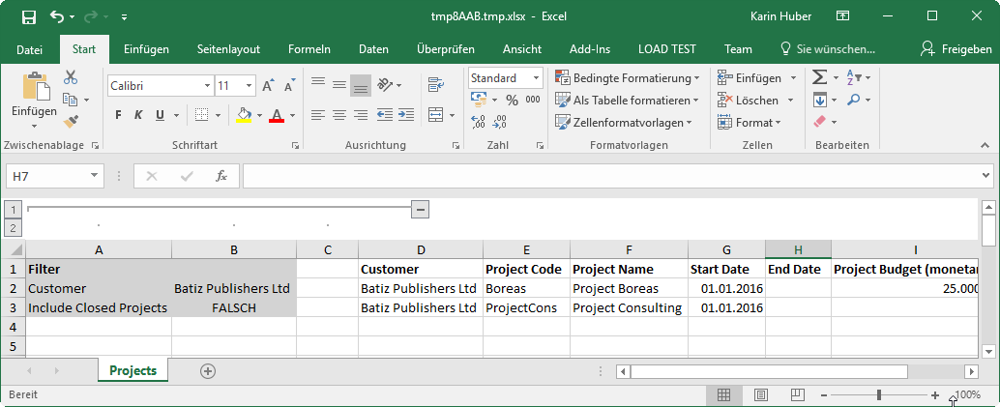
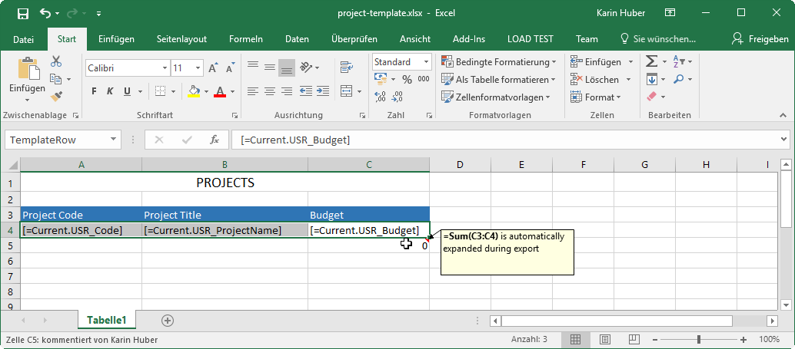

# Data Export

## Reports

Time cockpit can export every list to Excel, Word and PDF. Therefor, it provides an automatically generated print view which contains all columns of the list.

If you only want to export parts of the list, you can build custom print views with [Microsoft Reporting Services (SSRS)](http://msdn.microsoft.com/de-de/library/ms159106.aspx).

[Read more about reporting in time cockpit ...](~/doc/reporting/overview.md)

## Quick Excel Export (Full Client Only)

The full client of time cockpit offers another way to export data of a list to Microsoft Excel. Use **Quick Export** in the ribbon. You can either export all the records in a list or only the selected items.

You can use the quick export with or without a template. A template allows you to format the data in a special way or to add analysis or charts.

> [!NOTE]
Please note, that time cockpit can only work with Microsoft Office 2017 or newer. If you are using older versions of Microsoft Office, you will have to use the [Microsoft Office Compatibility Pack](http://support.microsoft.com/kb/924074/en).

### Default Format for Excel Export

When exporting your data without a template, all columns of your list will be exported. The generated Excel file contains all filter conditions and all data. Groupings will not be considered.

### Export Template

Time cockpit searches for a named range **TemplateRow** in the template Excel. This area may contain [TCQL Expressions](~/doc/tcql/expression-language.md) in square brackets (e.g. `[=Current.USR_ProjectCode]`). You can access the exported objects with `Current`.

> [!NOTE]
Use **CTRL + F3** to access the **Name Manager** of Excel to set the named range **TemplateRow**.

Outside the TemplateRow you can arrange everything the way you like. It will not be changed during export. Data below the TemplateRow will be moved down. Formulas containing references to the TemplateRow will be automatically extended (see comment in screenshot below). So you can add total lines to your template.

Time cockpit ships with a template for the default **Time Sheets** list. You can find the template **TimesheetListPivotAnalysis.xlsx** in the installation folder of time cockpit.

