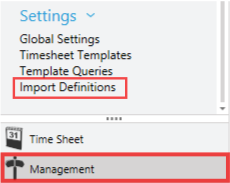
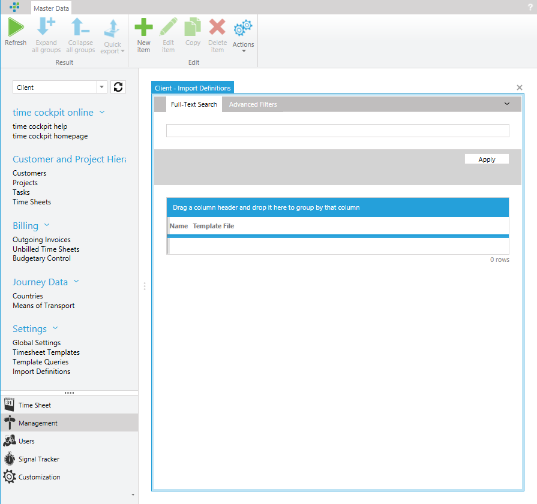
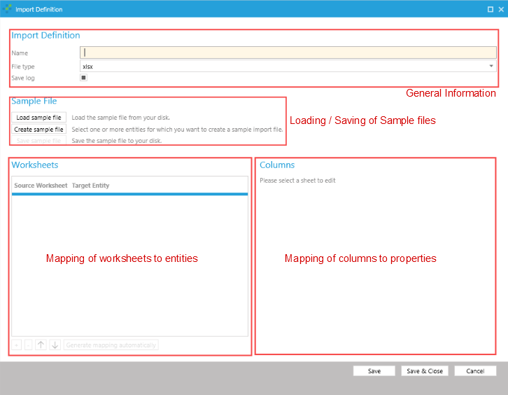
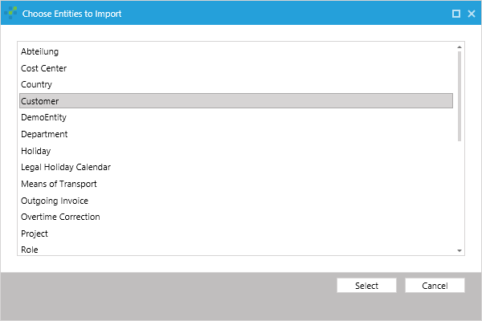
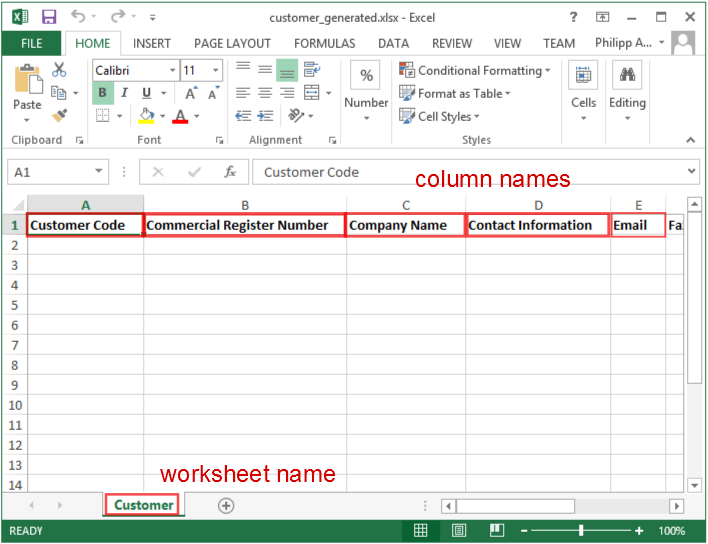
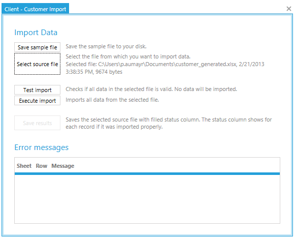
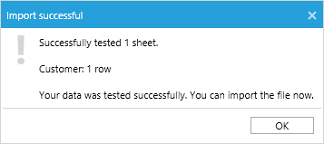
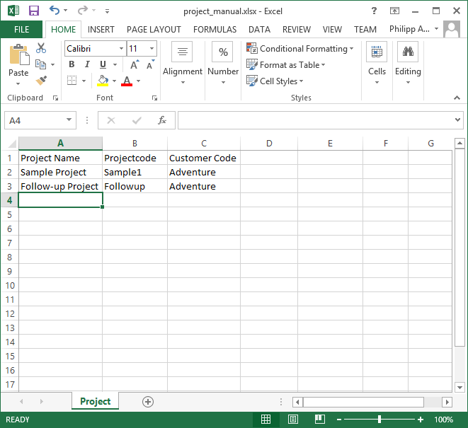
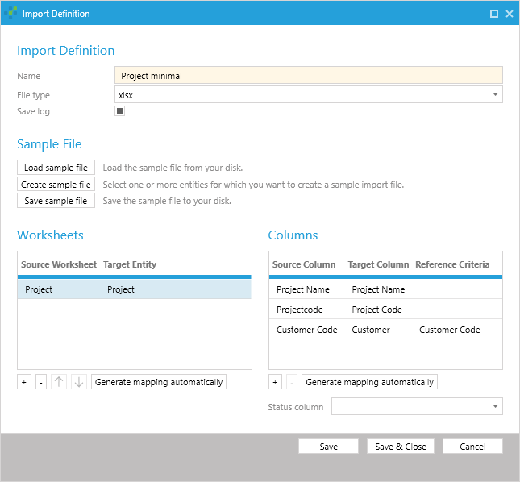

# Data Import

In Version 1.10 of time cockpit we have introduced an importer module that is capable of importing data from excel and CSV files.

Often it is necessary to import data from external sources into time cockpit. Use cases include importing a list of projects or customers, time sheet entries from previous time tracking solutions or from an external contractor not tracking time sheet entries with time cockpit.

In order for time cockpit's importer to be useful, it has to have an understanding of how columns in an Excel or CSV sheet relate to properties and relations of an entity. This information is held in an import definition object, a structure containing mappings from column names to properties for multiple entities. An import definition is therefore a 2 level structure with worksheet and column mappings. A worksheet mapping maps a specific worksheet in excel to a single specific entity in time cockpit and contains one or more column mappings. A column mapping maps a single column to a specific property within the entity mapped by the parenting worksheet mapping.

As an example, consider a situation where projects are imported. The import definition consists of a single worksheet mapping, mapping an excel worksheet to the project entity. The worksheet mapping contains multiple column mappings, mapping fields such as the project title and description, or the start date of the project. A column mapping may also map a relation, in which case a match criteria has to be chosen. The match criteria is a property related to the entity that contains the information that has to match the content of the cell that is imported. The importer queries the database for such an entity and ensures that exactly one item will be found. It will issue an error if none or multiple matches are found.

> [!NOTE]
An important thing to note about the importer is that it does not update existing rows but always creates new ones. Reimporting the sample file multiple times will cause duplicate items in time cockpit. Be sure to review the newly created data once it has been imported.

## Viewing Import Definitions

The import definitions can be found in the **Management** module within the **Settings** section.

The link leads to a list of import definitions. Double clicking an import definition will open up the import definition editor. When opening the list for the first time, the list will be empty. A new import definition can be created as usual by clicking the new item ribbon button. This opens up the import definition editor described below.

## Auto-Generating New Import Definitions

Open the import definition list and click the 'New' ribbon button. This will bring up the import definition editor pictured below. The import definition editor consists of four major regions:

- General information: The name, the source type and whether to save a report log or not.
- Sample file handling: Load, save or generate a sample file for an import definition.
- The worksheet mapping grid: Lists mappings of worksheets to entities.
- The column mapping grid: Lists mappings of source columns to properties for the currently selected worksheet mapping.

In order to define a column mapping, the importer definition editor requires a clue about the source data that should be imported. There are two different common scenarios: First, you want to use the excel sheet as a way to enter data quickly. In this scenario you can freely define the structure of the source data, in which case it is best to let time cockpit's importer automatically generate the source file and column mapping. The second use case is that data is delivered to you in a specific format. In that scenario you have to adjust the mappings manually.

For now, let's assume the first scenario, where the importer should auto generate an import definition as well as a sample file for us. Click **Create sample file** and select **Customer** from the list of available entities. You can select multiple entities as well and the importer will create multiple worksheet mappings, one per selected entity.

Clicking **Select** will generate an excel file as well as a corresponding import definition. Examining the created worksheet mapping, we can tell that the importer generated one worksheet mapping for a worksheet named **Customer** to the entity **Customer** as well as a column mapping for every property in customer (customer code, commercial register number, company name, contact information, email, fax, etc.) and a column mapping for the country relation.

The country relation is special, as the importer cannot just set the value of the property to the name of the country. Instead it has to set it to the entity object that is identified by the value in the column. The criteria to find the related object can be adjusted by changing the 'Reference Criteria' of the column mapping. In this simple scenario, the reference criteria could only be changed to the ISO code of the country, as country has no other properties to match.

> [!NOTE]
It is important that the relation criteria is a unique property of the related entity as the importer will warn and fail to import data if relations lead to ambiguous references.

> [!NOTE]
The relation criteria is not necessarily a direct property of the related entity. It can be any property that is 'reachable' from the target entity.

Finally, we can observe that the automatically generated import definition also maps a status column. The status column is used for the importer to write back information on whether the import for this row was successful or not. If there was an error a message is written to the cell to aid the user to quickly identify and resolve problems when importing data.

In order to view the generated sample file, click 'Save sample file'. The editor will prompt you for a file path and save the sample file to the chosen destination. Opening the saved file will show an excel file similar to the one pictured below:

The name of the worksheet is the name of the source worksheet in the import definition and the name of the column is the content of the first cell of every column. Since we are fine with the import definition we enter a name (e.g. 'Customer import') and save the import definition which will then appear in the list of import definitions.

## Performing an Import

In the previous section we created an import definition for the customer entity. We did not actually import any data, but rather prepared a sample file and a mapping between the sample files worksheets' columns to the respective entities and properties. This process is usually only performed once and every time data is imported to that structure, the import definition and sample file are reused.

In order to actually import data, first fill a sample file for the import with the data of the customers you want to import. For this test, the sample data used is the following:

Customer Code | Commercial Register Number | Company Name | Contact Information | Email | Fax | Hourly Rate | Invoice FAO | Invoicing Rules | Phone | Street | Town | VAT ID | ZIP Code | Country
--- | --- | --- | --- | --- | --- | --- | --- | --- | --- | --- | --- | --- | --- | ---
CUST1 | 123450001 | Nowhere Corp | Ms. Customer 1 | nobody@nowhere.com | +4350609020 | 120 | Mr. Nowhere | none | +4350609019 | nowhere road | nowhere town | 90603010 | 204041 | Austria

The status column remains empty, as that column will be filled by the importer with the result of the import for that specific row.

In order to import the file with the customer data, we click on the 'Import' hyperlink in the list of import definitions which will open the import dialog. This dialog is used to import files for the chosen import definition. Ensure that the file you want to import is not open within excel and select the source file to import by clicking 'Select source file'.

> [!NOTE]
The source file is read at the time the source file is selected. Changes to the source file are not automatically picked up by the importer. If the source changes, the source file has to be re-selected. The time stamp next to the file name indicates the point in time the file was chosen.

After a source file has been selected, two buttons will become active: **Test import** and **Execute import**. Testing an import causes the transaction to be rolled back after it has finished. This allows testing the import and seeing if the import would succeed without actually importing any rows. Executing the import will commit the transaction if no errors have occurred at all. In order to verify if our sample import works correctly, click the **Test import** button:

> [!NOTE]
Executing an import will only commit the transaction if no error occurred. Rows producing an error have to be removed from the source file or changed to pass in order for any row of the import process to be actually saved.

The test as well as the real import produce a report file that can be saved. In order to do so, click the **Save results** button and a select a file to save to. The report file will be identical to the source file, but the status column (if one was mapped) will contain error messages or a message ('Ok.') indicating that the import succeeded.

After testing the import, we can trigger the actual import by pressing **Execute import**. After the import succeeded, opening up the customer list will show the newly imported customer.

## Advanced Example: Importing Projects

In the previous example, an import definition and a sample file were generated for a specific entity. In this example, projects will be imported, but only the fields required to actually create a project will be added.

The first step is to create an empty excel sheet and enter the names of the columns that should be imported. For importing projects, a first look at an empty new project form shows that three fields are required: The customer (a relation), the project code and the project name.

We then create a new excel worksheet, rename it to 'Project' and name the first cell of the first three columns 'Project Name', 'Projectcode' and 'Customer Code'. We also enter some sample projects to later try the import definition. You excel sheet should be similar to the following image:

The next step is to create a new import definition. Open the 'Import Definition' list and add a new import definition. Enter a name (e.g. 'Project minimal') and click 'Load sample file'.

After loading the sample file, create a new worksheet mapping by clicking on the '+' sign below the worksheet mapping table. In the newly appeared row, click on the source column to open the combo box and select the 'Project' worksheet. Select the matching 'Project' entity in the 'Target Entity' column as well.

> [!NOTE]
time cockpit's importer is capable of automatically finding mappings if the name matches. This functionality can also be used on custom created sample workbooks by clicking the 'Generate mapping automatically' button. It is therefore a best practice to keep the naming of columns in worksheets identical to entity properties or the (localized) names of those properties.

The second step is to map the column names to the properties of the target entity (project in this case). This is again achieved by clicking the '+' sign below the column mapping table. Since three columns are mapped we add three column mappings and map the following columns and properties:

Source Column | Target Column | Reference Criteria
--- | --- | ---
Project Name | Project Name | (empty)
Projectcode | Project Code | (empty)
Customer Code | Customer | Customer Code

> [!NOTE]
When choosing the reference criteria for the 'Customer' relation, be sure to first select the target column, as the combo box for the relation criteria remains disabled until a relation member is actually selected.

After mapping the columns, the import definition should appear similar to the image below. Note that the order of the column mappings does not matter.

> [!NOTE]
In this example, we did not use any status column. The status column is optional, but usually a good idea when importing complex data sets, as it makes spotting an error easier.

After saving the import definition, the import can be performed just as if it was automatically generated.

## Best Practices and Common Pitfalls

The order of worksheet imports is defined by the import definition. Use the arrows below the worksheet mappings to change the order of worksheet mappings. Within a single worksheet, the importer starts importing at the second row (the first row being the header) and works downwards to the last row.

When importing multiple entities with one excel sheet, the order of the worksheets in the import definition is relevant, because related objects may not be found. To correctly import dependencies, make sure that entities that are related in following worksheet mappings are imported first.

If an entity has a relation to itself, the order of the rows in the excel sheet is important. In order to resolve related objects, they have to be saved in the database. Therefore, ensure that related objects appear first in the excel file ( in a row with a lower row number).

Any data not related to the import table in a worksheet should be removed from the source worksheet, as it may cause the importer to determine an incorrect range. It will then try to import for instance empty rows. In case of uncertainty, copy the table to a fresh excel workbook and name the worksheet accordingly.

In some situations it may be possible that a previous row affects the current row. It is therefore advisable to resolve errors in the order they appeared, starting with the first row with an error message in the first mapped worksheet.

Since time cockpit's validation rules are defined at the data access layer, they are valid for the importer as well. Generally, it can be assumed that importing data using the importer is the equivalent of manually entering the data.

Give an import definition a name before automatically generating a sample file as the name of the sample file will be empty otherwise.