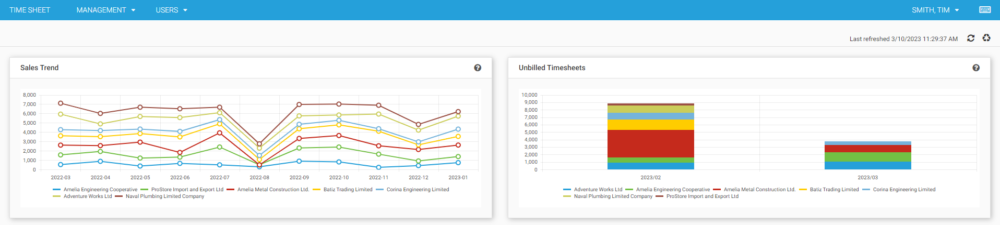
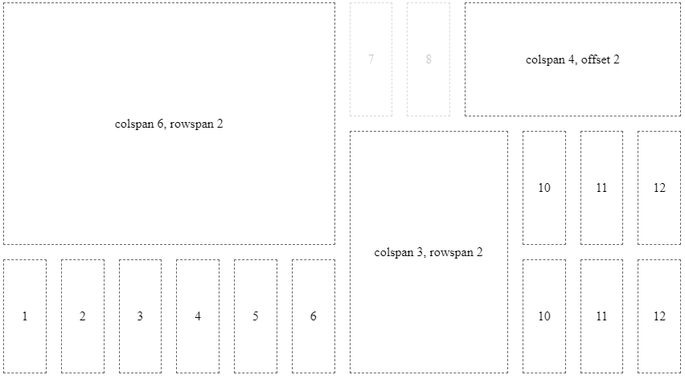
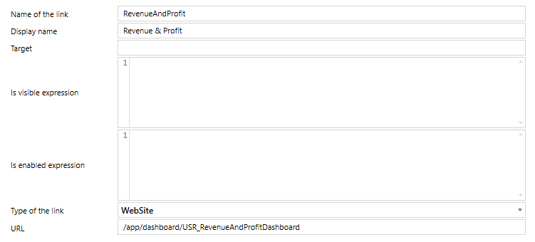

# Dashboards



Dashboards allow you to arrange different type of data on a board. The following three types of widgets are allowed:

- Chart
- Key Figure
- List

Widgets can be arranged in 12 columns that are distributed evenly per line. Each line has a height of 140px.



## Create and Update Dashboards

Dashboard configurations are stored as time cockpit EntityView. The following creates or updates a dashboard with the specified name

```
model = Context.GetWritableModel()
dashboard = "USR_RevenueAndProfitDashboard"
entity = model.Entities.APP_Invoice

if model.ModelEntityViews.Contains(dashboard):
   view = model.ModelEntityViews[dashboard]
else:
   view = EntityView()
   view.Name = dashboard
   view.TypeName = "TimeCockpit.Data.DataModel.View.Dashboard"
   model.ModelEntityViews.Add(view)

print view.ConfigurationMarkup
view.TypeName = "TimeCockpit.Data.DataModel.View.Dashboard"
view.TargetEntity = entity
view.ConfigurationMarkup = '''{
   "title": "Revenue & Profit",
   "widgets": [ ... ]
}
'''

Context.SaveModel(model)
```

## Add Dashboard to Menu

You can add dashboards to the menu similar to other entity views in the Modules configuration. The required configuration is as follows:



## Configuration of Widgets

All widgets share some common information like `title` or `type`:

```
{
   "title": "Title of the widget",
   "infoTooltip": "Tooltip that is displayed in the title bar of the widget",
   "type": "chart" | "list" | "keyFigure",
   "layoutXs": { ... },
   "layoutSm": { ... },
   "layoutMd": { ... },
   "layoutLg": { ... },
   "layoutXl": { ... },
   "configuration": { ... }
}
```

The property `configuration` contains the actual configuration according to the type of the widget.

### Layout

Each widget can contain 5 different layout configurations for different screens according to the breakpoints of [angular/flex-layout](https://github.com/angular/flex-layout/wiki/Responsive-API).

The default configuration for charts and lists is as follows:

```
defaultLayoutXs = { colspan: 12, rowspan: 2, offset: 0, order: null };
defaultLayoutSm = { colspan: 6, rowspan: 2, offset: 0, order: null };
defaultLayoutMd = { colspan: 6, rowspan: 2, offset: 0, order: null };
defaultLayoutLg = { colspan: 4, rowspan: 2, offset: 0, order: null };
defaultLayoutXl = { colspan: 4, rowspan: 2, offset: 0, order: null };
```

Key figures only use a rowspan of 1 instead of 2. All other properties are identical to the chart and list default values.

The `order` property specifies the sort order within the grid. If no order is specified, the order of the elements in the configuration JSON for the widget is used.

If no custom layout is specified, the default values are used. 

If not all layout sizes are specified, a layout is used for the specified size and all larger screen sizes with no specified layout.

## Chart

For charts the name of a list has to specified as data source. Additionally, `series`, `seriesDefaults`, `categoryAxis`, `valueAxis` and `legend` can be specified according to the [Kendo UI for Angular documentaion](https://www.telerik.com/kendo-angular-ui/components/charts/api/).

```
{
   ...,
   "configuration": {
      "title": "Unbilled Timesheets",
      "listDataSource": "USR_Dashboard_UnbilledTimesheets",
      "series": [
            {
               "name": "Revenue",
               "field": "USR_Revenue",
               "categoryField": "USR_Month",
               "groupField": "USR_Customer",
               "type": "column",
               "stack": true
            }
      ],
      "legend": {
            "position": "bottom",
            "orientation": "horizontal",
            "labels": {
               "font": "10px Roboto, sans-serif"
            }
      },
      "valueAxis": { "labels": { "format": "n0" }}
   }
}
```

In `series` there is one additional field `groupField` that does not exist in the Kendo UI API. It allows you to specify a field for grouping data within a category.

## Key Figure

For key figures a list and a result column of this list has to be specified:

```
{
   ...,
   "configuration": {
      "listDataSource": "USR_Dashboard_RevenueAndProfitForecast",
      "valueField": "USR_RevenuePlanned",
      "aggregate": "count" | "sum" | "average" | "min" | "max" | "first" | "last"
   }
}
```

If no aggregate function is specified, the first row of the result is used.

## List

For lists the name of the list has to be specified:

```
{
   ...,
   "configuration": {
      "listName": "USR_Dashboard_RevenueAndProfitForecast"
   }
}
```