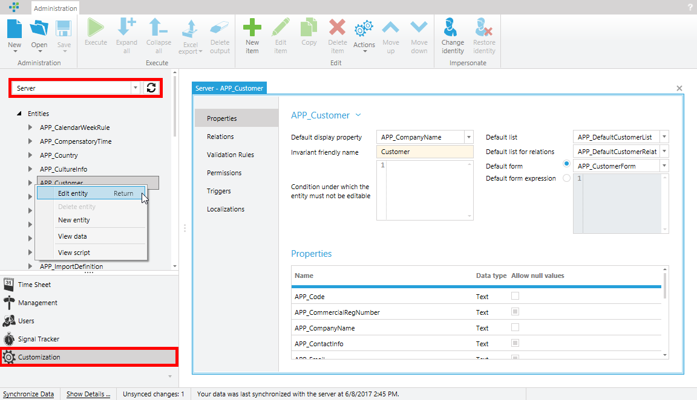
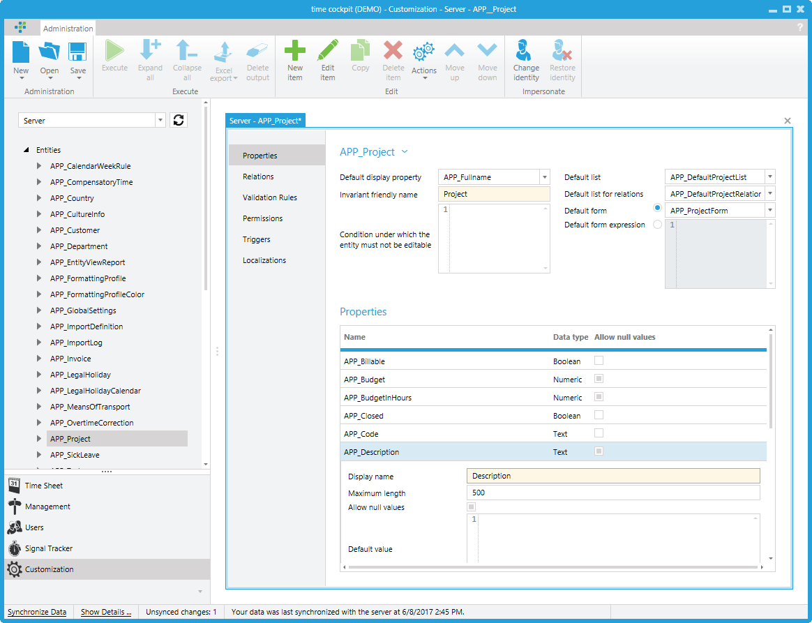
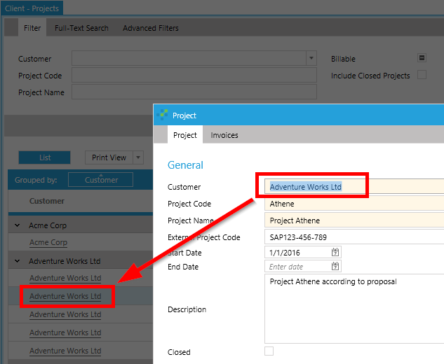
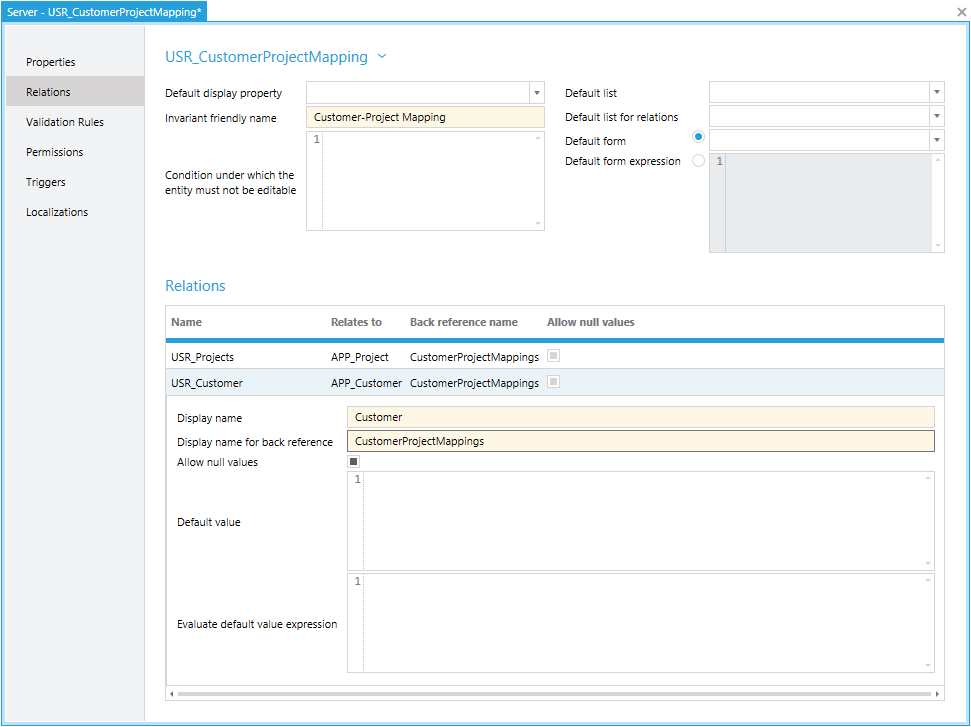
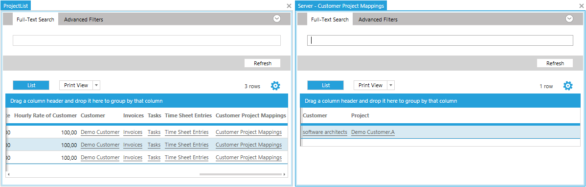

# Customize Entities

This chapter gives an overview of what can be customized in time cockpit and how.

## A Metadata-driven Approch

time cockpit is driven by metadata. That is, as much information about customer-specific customizations as possible (entities, properties, relations, validation rules etc.) is configured in the data model. In most of the cases customizations of the data model influence how the user interface looks and behaves.

Example: The standard data model featues a validation rule ```APP_ValidateCustomerSet``` which ensures that every project is assigned to a customer. By adding this validation rule to the data model, the user interface shows a validation error if the validation rule is not satisfied that is, no customer is set. Further, if a project is created via script ([Modifying the Model](~/doc/scripting/modify-data-model.md)) or the ([Web API](~/doc/web-api/overview.md)) without a customer, the validation error will also prevent saving the invalid project. Other examples of information in the data model that drives the user interface are formatting options of date/time or numeric fields.

## Editing Entities

In the ```Customization``` module, a tree of all the entities, lists, forms, actions, modules, and sets contained in the data model are displayed. These can only be edited on the ```Server``` in order to avoid synchronization conflicts at data model level.

> [!NOTE]
Each entity in the time cockpit data model corresponds to a table in the underlying database.



In the editor you can add and modify the properties of the entity, relationships to other entities, validation rules, permissions, and interfaces provided by the entity. Basically, each of the different elements can be added with the ```New item``` button in the Ribbon. The ```New item``` button is context-dependent, ie a new element of the selected type is created depending on which subgroup is selected on elements (properties, relationships, etc.).

> [!NOTE]
The deletion of properties and relations, as well as the insertion of properties where no null values are allowed, represent operations which should be handled with particular care. If several users or devices have already been set up and an entity for which data already exists is edited, conflicts can occur during synchronization.



## System Properties of an Entity

* **Invariant friendly name:** The invariant friendly name represents the name of an entity in a user-friendly form. Each entity has two names. On the one hand, a unique technical name (e.g. ```APP_Project```) is assigned when an entity is created. This name is used as a table name in the database and appears only in the administration area. The invariant friendly name is shown in the user interface.

* **Default display property**: The default display property indicates which property is displayed by default (e.g., in a combo box) when an instance of an entity is displayed in the user interface. For example, in the case of customers, the default display property is ```CompanyName```.



* **Default list:** Users can create custom lists for entities (see [Custom Lists](~/doc/scripting/customizing-lists.md)) These custom lists can be set as a default list for an entity. If, for example, a list "MyProjectList" is defined for a project and set as a default list, MyProjectList is used in the user interface whenever a list of projects needs to be displayed. If no default list is selected, time cockpit automatically generates a list of all properties and relations of an entity on the fly.

* **Default list for relations:** Users can create a custom list for an entity and set it as default list for relations. Example: If the entity ```APP_Project``` has a custom list for relations "CustomProjectRelationList", the list is used in the user interface whenever a list of projects needs to be displayed in a combo box.

* **Default form:** The default form property behaves similar to the default list property. The only difference is that a default form is used by the user interface whenever a single instance of a record (e.g., a project) is to be displayed. If no default form is stored, time cockpit generates a form with all properties and relations of the entity.

## Properties

Properties can be managed in the editing mode of an entity. To create a property, select the ```Properties``` subgroup so that the ```New item``` button creates a new property. Time cockpit provides various predefined types of properties. Each of these different types has its own representation in the user interface.

> [!NOTE]
Each property in the time cockpit data model corresponds to a column in a table in the underlying database

* **Text properties:** Text properties are used to store text. ```Maximum length``` allows users to define how long (in characters) the text may be. Text properties with a length of less than 100 characters are represented in the user interface with a single line input field. Texts with a maximum length of more than 100 lines are represented with multi-line input fields (this behavior can be changed in the respective form).

* **Date properties:** Date properties are used to store date values without time. With ```date format```, users can define in which format a date value is displayed in the user interface. For possible values for date formats, see [Format Strings](http://msdn.microsoft.com/en-us/library/zdtaw1bw.aspx).

* **DateTime properties:** DateTime properties are used to store date values with time. As with date properties, users can specify with ```date format``` in which format a date and time property is displayed in the user interface. Possible values for date formats can be found at [Format Strings](http://msdn.microsoft.com/en-us/library/zdtaw1bw.aspx).

* **Numeric property:** Numeric properties are used to store numeric values. For numeric properties, different parameters can be defined:
  * Maximum number of digits: Sets the maximum number of digits before and after the number's comma.
  * Number of decimal places: Specifies the number of digits after the comma. That is, the number of decimal places for a number 3 is configured, the numeric value for the number property is rounded to 3 decimal places.
  * Number format: Similar to date properties, the format can also be defined for number properties. For possible values, see [Format Strings](https://msdn.microsoft.com/en-us/library/fzeeb5cd.aspx).
  * Aggregation function: The aggregation function defines the behavior of a numeric property in the case of a grouping in a list. For example, if a project list is grouped by customer, and the budget property is stored as an aggregation function ```Sum```, the values of budget per customer are added up and a total sum is displayed.
* **Boolean property:** Boolean properties are used to store true / false values.
* **Calculated property:** Calculated properties are used to calculate values using [TCQL expressions](~/doc/tcql/expression-language.md). With calculated properties, non-concrete values are stored in the database, but only the formulas that lead to a value. For example, an example of a calculated property on the entity ```APP_Project``` is ```FullName```. The formula for determining the full name of a project is ```:Iif(Current.Customer = Null, '(n/a).', Current.Customer.Code + '.') + Current.Code```. As can be seen from the formula, the calculated property accesses other properties of the project entity and determines a project name for a project.
  
## Relations
 
Entities can have relationships to other entities. These relationships correspond to so-called n:1 relationships. An example of a relationship would be the relationship between a project and its customer. This relationship assigns a customer to a project. Relationships are displayed in forms as combo boxes and in lists as [Hyperlinks](~/doc/scripting/customizing-lists.md). Just as one can access properties of an entity in TCQL, one can access relationships (e.g., ```Current.Customer``` outgoing from the project entity).  

> [!NOTE]
Each relationship in the time cockpit data model corresponds to a foreign key relationship in the underlying database.

When creating a new relationship, the following properties can be set:

* Specifies the other entity to which the source entity is related.
* Back-reference name: From a database point of view, a relationship has two directions. For example, the relationship customer on the project entity has the direction ```Project -> Customer``` and on the other hand ```Customer -> Project```. ```Project -> Customer``` assigns exactly one project to one customer. ```Customer -> Project``` means all projects assigned to a customer. The latter direction is represented in time cockpit with a named back-reference. Back-references can be navigated using [TCQL subqueries](~/doc/tcql/expression-language.md). In addition, the back-reference name is used to create so-called back-reference tabs (see also [:N Hyperlinks](~/doc/scripting/customizing-lists.md)).

> [!NOTE]
Best practice for naming back-references using the example of the relationship ```Project -> Customer```: Since the back-reference represents the reverse direction of the relationship of ```Project -> Customer```, the back-reference name of the relationship is the name of the source entity in the plural that is ```Projects```.

> [!ATTENTION]
Back-references cannot be accessed in TCQL. For example, the expression ```Current.Projects``` cannot be used in permissions, calculated properties, and validation rules. In the latter example, ```Current``` would represent the project entity, and Projects would reject the ```Project -> Customer``` relationship.

## M:N Relationships (multiple assignments)

M:N relationships can be implemented with entities in time cockpit. A use case for a multiple assignment would be, for example, the assignment of a project to several customers. This scenario can be implemented with an assignment entity. An assignment entity consists at least of two relationships to the entities that are to be assigned in a multiple assignment. In the case of a multiple assignment from project to customer, the assignment entity ```CustomerProjectMapping``` would therefore have a relationship to ```Project``` and ```Customer```.



The maintenance of multiple assignments from ```Project``` to ```Customer``` can be implemented in lists and input forms with the help of :N hyperlinks (back-references). As described above, there is an implicit back-reference from the ```Project``` entity to ```CustomerProjectMapping```. This back-reference can be implemented with a so-called <xref:TimeCockpit.Windows.Controls.ModelEntityControls.NamedListConfiguration> in user-defined lists or back-reference tabs in forms (see [back-reference tabs](~/doc/scripting/customizing-lists.md)).



* Hyperlink for assigned customers in project list

```xml
<BoundCell Content="Customer Project Mapping"> 
   <BoundCell.Hyperlink> 
     <Hyperlink Target="MappedCustomer" Title="= 'Customers of Project ' + Current.Me"> 
       <Hyperlink.NavigateContent> 
         <p:NamedListConfiguration ModelEntityName="USR_CustomerProjectMapping"> 
           <p:NamedListConfiguration.Parameters> 
             <Parameter Name="ProjectUuid" Value="=Current.ProjectUuid" /> 
           </p:NamedListConfiguration.Parameters> 
         </p:NamedListConfiguration> 
       </Hyperlink.NavigateContent> 
     </Hyperlink> 
   </BoundCell.Hyperlink> 
 </BoundCell>
}
``` 

* Back-reference tab for assigned customers in project input form

```xml
<BackReferenceTab BackReference="CustomerProjectMappings" />
``` 

## Validation Rules

Validation rules can be defined on entities to ensure that an instance of an entity, e.g. a record in the project table, meets certain criteria. These criteria results from business rules in a company. If a validation rule is not met, this prevents a record from being saved. This applies to saving a data record in the user interface as well as by means of a [Scripting](~/doc/scripting/overview.md) and via the [Web API](~/doc/web-api/overview.md).
