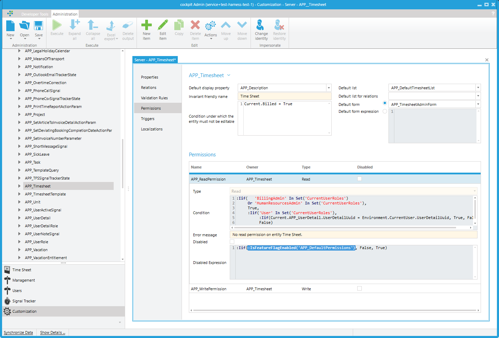

## Ensuring Compatibility in Time Cockpit

Time Cockpit is highly customizable, allowing customers to tailor the application to their own structures and processes. These customizations can range from simple user interface or data model adjustments (e.g., adding additional tables) to more advanced topics like permission configurations.

To separate standard functionality from customer-specific customizations, Time Cockpit employs several mechanisms:

### Namespacing

Elements such as tables, forms, lists, permissions, etc., are identified using specific prefixes:

- `APP_`: Used for all standard tables, forms, lists, permissions, validation rules, and more. These elements are part of the default data model.
- `USR_`: Used for customer-specific extensions. These elements are custom additions by clients to extend Time Cockpit's functionality.

These prefixes can be specified wherever tables, lists, or forms are utilized or queried. This mechanism already covers a large portion of the requirements when accessing customer-specific extensions in a standard Time Cockpit tenant.

## When Namespacing is Not Enough

While the namespacing mechanism handles most customization needs, there are scenarios where it is not sufficient—specifically around permissions. Time Cockpit's permission model is designed with an **"OR" logic** when it evaluates access rights. This means that if a user has multiple permissions assigned—either through roles, group memberships, or direct assignments—the system does not require *all* these permissions to be satisfied to grant access. Instead, it only checks if *any one* of these permissions allows the requested operation.

### Example Scenario

Suppose there is an entity called `ProjectData` and you have the following permissions configured for a user:

1. **USR_ReadProjects** — Allows reading all project data.
2. **USR_ReadSensitiveProjects** — Allows reading a specific subset of sensitive projects.

If Time Cockpit rolls out a new standard permission, say `APP_ReadArchivedProjects`, which grants read access to archived projects, and this permission is activated, the user now has additional read access automatically.


Suppose a customer has a specifically adapted permission model; it must still be possible to roll out updates to the standard data model without affecting the customer's existing permission configuration. Customers should always have access to the latest data model without interference.

To achieve this, Time Cockpit provides the **Feature Flag System**.

## Feature Flag System

The feature flag system allows deploying the latest data model to existing accounts while selectively disabling parts of it. For example, in May 2025, standard permissions were rolled out (see [here](~/doc/data-model-customization/feature-flags.md)). These standard permissions must not override existing customer configurations. Therefore, they are widely disabled for existing customers using feature flags. As a result, they are not considered during permission evaluation.

### isDisabledExpression

To support this selective behavior, a new attribute called `isDisabledExpression` was introduced to elements that govern Time Cockpit's behavior (e.g., permissions, validation rules, actions). The `isDisabledExpression` is a TCQL expression that determines whether a permission, validation rule, or action should be available or effective.

Feature flags are not limited to `isDisabledExpression`; they can be evaluated in any context where TCQL expressions are usable. This includes TCQL queries, forms, lists, and more. This flexibility enables fine-grained control, even allowing individual fields and columns to be hidden in forms and lists based on feature flags.

An example of querying a feature flag in a permission:

```tcql
:IsFeatureFlagEnabled('APP_DefaultPermissions')
```

Below is a screenshot showing the standard permissions for `APP_Timesheet`:



### Evaluation of `isDisabledExpression`

The `isDisabledExpression` is evaluated when the data model is initially loaded. This means that whether a feature flag is active or not is determined **per account** rather than per user. It is not possible to enable or disable feature flags individually for different users within the same account.

It is important to note that there is also an existing `isDisabled` boolean field in the data model. The behavior of the system is that the `isDisabledExpression` and the `isDisabled` flag field are **OR-chained**. This means that if either the `isDisabledExpression` evaluates to `true` or the `isDisabled` field is set to `true`, the corresponding permission, validation rule, or action will be disabled.


## Use Cases for Feature Flags

### Multi-Tenant Installations

Feature flags are particularly useful in large multi-tenant installations where different departments share the same Time Cockpit instance but require different features. Feature flags allow entire features to be deactivated for specific departments without impacting others, simplifying source code management, build pipelines, and maintenance.

### Compatibility Flags

In cases like the *Default Permissions* example, feature flags serve as compatibility flags. They allow Time Cockpit to maintain compatibility with customer environments while ensuring all customers are always on the latest data model—even if they are not actively using the new features. This approach also simplifies source code management and ensures smooth deployment of updates.