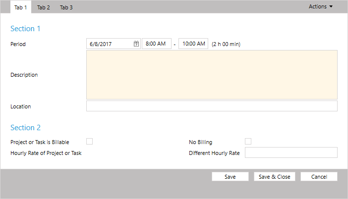
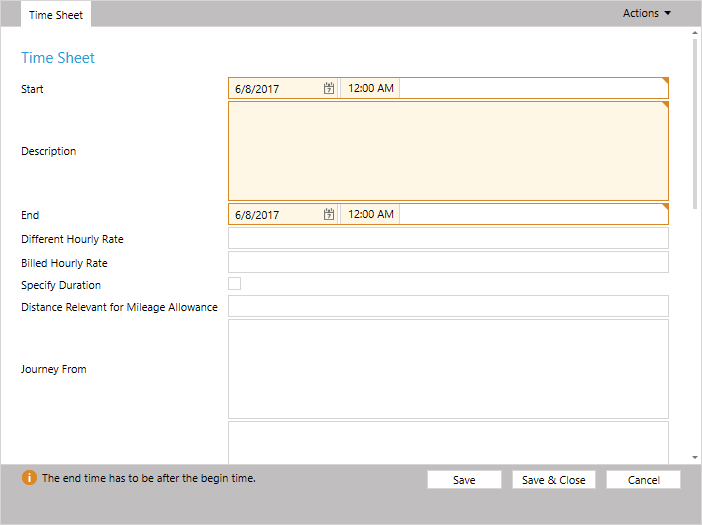
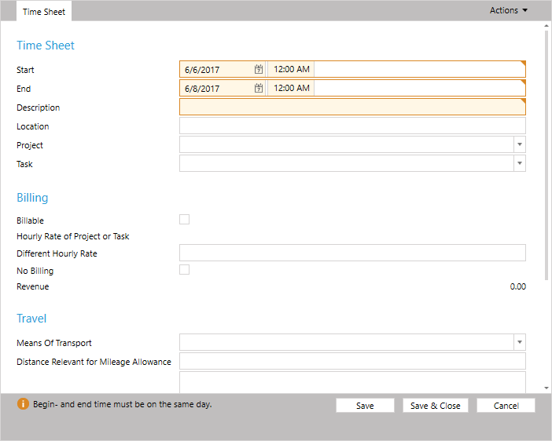
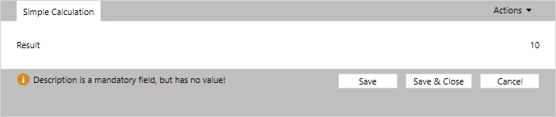
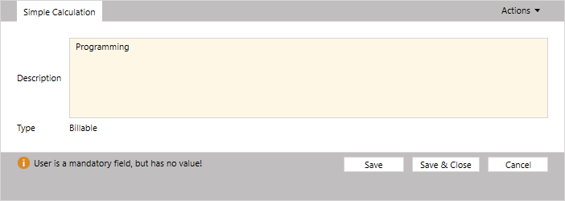
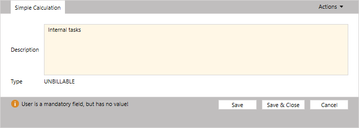

# Customizing Forms

Time cockpit allows you to create new forms and to customize them. Therefor, time cockpit provides a `XAML` based language to define the layout of forms. A form is used to edit one single row of a list, e.g. a customer or a time sheet entry. Additionally, a form can contain lists with related data.

## Structure of a Form

Forms contain three levels to structure data:

- Tab
- Section
- Section Column

Each form has to contain at least one tab. Each of the tabs has to contain at least one section and each section has to contain at least one section column.

Within these section columns <xref:TimeCockpit.Data.DataModel.View.BoundCell>s or derived cells are used to display data from a <xref:TimeCockpit.Data.DataModel.ModelEntity>.



## Generate New Form

When generating a new form for a <xref:TimeCockpit.Data.DataModel.ModelEntity>, a form with all properties and relations will be generated:

```
<Form ModelEntityName="APP_Timesheet" xmlns="clr-namespace:TimeCockpit.Data.DataModel.View;assembly=TimeCockpit.Data">
  <Tab Header="=:FriendlyName('APP_Timesheet')">
    <Section Header="=:FriendlyName('APP_Timesheet')">
      <SectionColumn>
        <BoundCell Content="=Current.APP_BeginTime" />
        <BoundCell Content="=Current.APP_Description" />
        <BoundCell Content="=Current.APP_EndTime" />
        <BoundCell Content="=Current.APP_HourlyRate" />
        <BoundCell Content="=Current.APP_HourlyRateBilled" />
        <BoundCell Content="=Current.APP_IsDurationTimesheet" />
        <BoundCell Content="=Current.APP_JourneyDistance" />
        <BoundCell Content="=Current.APP_JourneyFrom" />
        <BoundCell Content="=Current.APP_JourneyTo" />
        <BoundCell Content="=Current.APP_Location" />
        <BoundCell Content="=Current.APP_NoBilling" />
        <BoundCell Content="=Current.APP_BeginTimeActual" />
        <BoundCell Content="=Current.APP_Billable" />
        <BoundCell Content="=Current.APP_Billed" />
        <BoundCell Content="=Current.APP_CompanyNameActual" />
        <BoundCell Content="=Current.APP_DateActual" />
        <BoundCell Content="=Current.APP_DurationInDays" />
        <BoundCell Content="=Current.APP_DurationInHours" />
        <BoundCell Content="=Current.APP_EndTimeActual" />
        <BoundCell Content="=Current.APP_HourlyRateActual" />
        <BoundCell Content="=Current.APP_HourlyRateProjectOrTask" />
        <BoundCell Content="=Current.APP_ProjectCodeActual" />
        <BoundCell Content="=Current.APP_ProjectOrTaskIsBillable" />
        <BoundCell Content="=Current.APP_Revenue" />
        <BoundCell Content="=Current.APP_Invoice" />
        <BoundCell Content="=Current.APP_JourneyMeansOfTransport" />
        <BoundCell Content="=Current.APP_Project" />
        <BoundCell Content="=Current.APP_Task" />
        <BoundCell Content="=Current.APP_UserDetail" />
        <BoundCell Content="=Current.APP_WorkingTimeWeight" />
      </SectionColumn>
    </Section>
  </Tab>
</Form>
```



<xref:TimeCockpit.Data.DataModel.View.BoundCell> tries to generate the appropriate input control for each property and relation in the <xref:TimeCockpit.Data.DataModel.ModelEntity>.

For <xref:TimeCockpit.Data.DataModel.TextProperty>s the length of the property is used to determine the size for the input field. `APP_Timesheet` the properties `APP_Description`, `APP_JourneyFrom` and `APP_JourneyTo` are displayed as large text areas instead of single line text boxes. To use single line text boxes use the <xref:TimeCockpit.Data.DataModel.View.TextCell> instead of a <xref:TimeCockpit.Data.DataModel.View.BoundCell>. The <xref:TimeCockpit.Data.DataModel.View.BoundCell> provides a property `Height` which can be used to set the height explicitly. Without the property `Height`, <xref:TimeCockpit.Data.DataModel.View.TextCell>s always display a single line text box.

## Sections

To structure the form you can add multiple sections to each tab. Each section has to contain at least one section column.

```
<Form ModelEntityName="APP_Timesheet" xmlns="clr-namespace:TimeCockpit.Data.DataModel.View;assembly=TimeCockpit.Data">
  <Tab Header="=:FriendlyName('APP_Timesheet')">
    <Section Header="=:FriendlyName('APP_Timesheet')">
      <SectionColumn>
        <BoundCell Content="=Current.APP_BeginTime" />
        <BoundCell Content="=Current.APP_EndTime" />
        <TextCell Content="=Current.APP_Description" />
        <BoundCell Content="=Current.APP_Location" />
        <BoundCell Content="=Current.APP_Project" />
        <BoundCell Content="=Current.APP_Task" />
      </SectionColumn>
    </Section>
    <Section Header="Billing">
      <SectionColumn>
        <BoundCell Content="=Current.APP_Billable" />
        <BoundCell Content="=Current.APP_HourlyRateProjectOrTask" />
        <BoundCell Content="=Current.APP_HourlyRate" />
        <BoundCell Content="=Current.APP_NoBilling" />
        <BoundCell Content="=Current.APP_Revenue" />
       </SectionColumn>
    </Section>
    <Section Header="Travel">
      <SectionColumn>
        <BoundCell Content="=Current.APP_JourneyMeansOfTransport" />
        <BoundCell Content="=Current.APP_JourneyDistance" />
        <BoundCell Content="=Current.APP_JourneyFrom" />
        <BoundCell Content="=Current.APP_JourneyTo" />
      </SectionColumn>
    </Section>
  </Tab>
</Form>
```



## Section Columns

With <xref:TimeCockpit.Data.DataModel.View.SectionColumn>s you can add multiple columns to a section. Use `ColSpan` and `RowSpan` to span cell across multiple rows or columns.

```
<Form ModelEntityName="APP_Timesheet" xmlns="clr-namespace:TimeCockpit.Data.DataModel.View;assembly=TimeCockpit.Data">
  <Tab Header="=:FriendlyName('APP_Timesheet')">
    <Section Header="=:FriendlyName('APP_Timesheet')">
      <SectionColumn>
        <BoundCell Content="=Current.APP_BeginTime" />
        <TextCell Content="=Current.APP_Description" ColSpan="2" />
        <BoundCell Content="=Current.APP_Location" ColSpan="2" />
        <BoundCell Content="=Current.APP_Project" />
      </SectionColumn>
      <SectionColumn>
      	<BoundCell Content="=Current.APP_EndTime" />
      	<BoundCell Content="=Current.APP_Task" />
      </SectionColumn>
    </Section>
    <Section Header="Billing">
      <SectionColumn>
        <BoundCell Content="=Current.APP_Billable" />
        <BoundCell Content="=Current.APP_NoBilling" />
       </SectionColumn>
       <SectionColumn>
        <BoundCell Content="=Current.APP_HourlyRateProjectOrTask" />
      	<BoundCell Content="=Current.APP_HourlyRate" />
		<BoundCell Content="=Current.APP_Revenue" />        
      </SectionColumn>
    </Section>
    <Section Header="Travel">
      <SectionColumn>
        <BoundCell Content="=Current.APP_JourneyMeansOfTransport" />
        <BoundCell Content="=Current.APP_JourneyDistance" />
        <BoundCell Content="=Current.APP_JourneyFrom" />
        <BoundCell Content="=Current.APP_JourneyTo" />
      </SectionColumn>
    </Section>
  </Tab>
</Form>
```


## Expression in Cells

Most properties in <xref:TimeCockpit.Data.DataModel.View.Cell>s allow to use [expressions](~/doc/tcql/expression-language.md). For this the expression has to start with `=`:

```
<Form ModelEntityName="APP_Timesheet" xmlns="clr-namespace:TimeCockpit.Data.DataModel.View;assembly=TimeCockpit.Data">
  <Tab Header="Simple Calculation">
    <Section>
      <SectionColumn>
        <NumericCell Header="Result" Content="=2 + 2 * 4" />
      </SectionColumn>
    </Section>
  </Tab>
</Form>
```



The expressions may also contain references to the current <xref:TimeCockpit.Data.EntityObject> by using `Current`:

```
<Form ModelEntityName="APP_Timesheet" xmlns="clr-namespace:TimeCockpit.Data.DataModel.View;assembly=TimeCockpit.Data">
  <Tab Header="Simple Calculation">
    <Section>
      <SectionColumn>
        <BoundCell Content="=Current.APP_Description" />
        <TextCell Header="Type" Content="=:Iif(Current.APP_Description = 'Internal tasks', 'UNBILLABLE', 'Billable')" />
      </SectionColumn>
    </Section>
  </Tab>
</Form>
```





## Cell & BoundCell

All <xref:TimeCockpit.Data.DataModel.View.Cell>s that can be used in a form a derived from <xref:TimeCockpit.Data.DataModel.View.Cell>. <xref:TimeCockpit.Data.DataModel.View.Cell> and all derived class offer the following properties for configuration:

Name | Description
--- | ---
`RowSpan` | Number of rows for a cell.
`ColSpan` | Number of section columns for a cell.
`Header` | The caption for the cell.
`IsVisible` | Indicates, if the cell is visible.
`IsEnabled` | Indicates, if the input control is enabled.
`IsReadOnly` | Indicates, if an input control or a read only value like in lists is displayed.

### TextCell

The <xref:TimeCockpit.Data.DataModel.View.TextCell> allows you the specify the height of a text box in pixels.

### BooleanCell

The <xref:TimeCockpit.Data.DataModel.View.BooleanCell> allows to display the values `True`, `False` and `Null`.

### NumericCell

The <xref:TimeCockpit.Data.DataModel.View.NumericCell> allows to specify the `NumberFormatPattern` for the displayed numbers. All allowed patterns can be found in [MSDN Decimal.ToString()](http://msdn.microsoft.com/en-us/library/18sthszb.aspx).

### DateCell and DateTimeCell

The <xref:TimeCockpit.Data.DataModel.View.DateCell> and <xref:TimeCockpit.Data.DataModel.View.DateTimeCell> display a date picker to select dates and times in forms.

### RelationCell

The <xref:TimeCockpit.Data.DataModel.View.RelationCell> displays a combo box with all values of a related table. You can use the `DisplayProperty` to select the property to show and the `List` property to use a list as data source for the combo box. 

The `SortDirection` property allows you to order the items in the combo box. It is only used, if no default relation list is defined and the `List` property is not used. When a list is used as data source, the sort order of the list is used.

Additionally, <xref:TimeCockpit.Data.DataModel.View.RelationCell>s allow you to specify a `Condition` to filter the combo box values. The `Condition` may refer to values of the current <xref:TimeCockpit.Data.EntityObject>. In the default `APP_TimesheetForm` the `Condition` is used to only show projects which are not closed, and to only show tasks that belong to the currently selected project:

```
<Section Header="=:Translate('Form.APP_TimesheetForm.ProjectSection')">
    <SectionColumn>
        <RelationCell Condition="Current.Closed = False" Content="=Current.APP_Project" />
        <RelationCell Condition="=:Iif(Current.Project = Null, '1 = 0', 'Current.Project = Null Or Current.Project.ProjectUuid={' + Current.Project.ProjectUuid + '}') + ' And (Current.Closed = Null Or Current.Closed = False)'" Content="=Current.APP_Task" LookupCondition="=:Iif(Current.Project = Null, '1 = 0', 'Current.Project = Null Or Current.Project.ProjectUuid={' + Current.Project.ProjectUuid + '}')" />
    </SectionColumn>
</Section>
```

### Other Cell Types

Time cockpit offers some more <xref:TimeCockpit.Data.DataModel.View.Cell>s. You can find all available cell types in the API Documentation(<xref:TimeCockpit.Data.DataModel.View.Cell>).