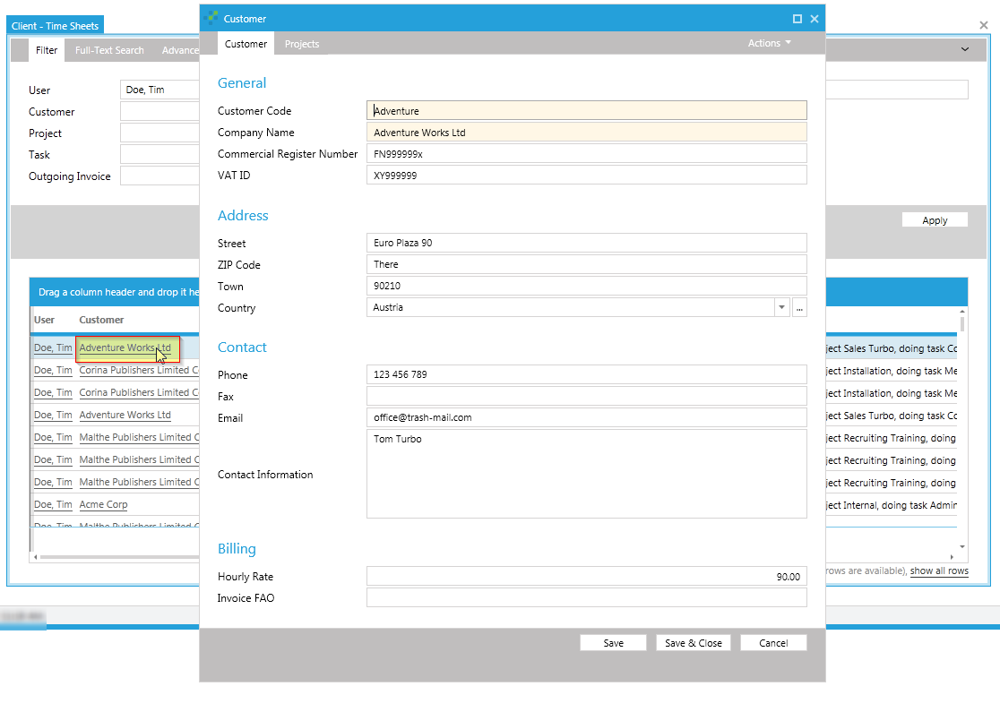
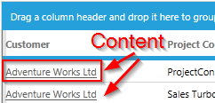
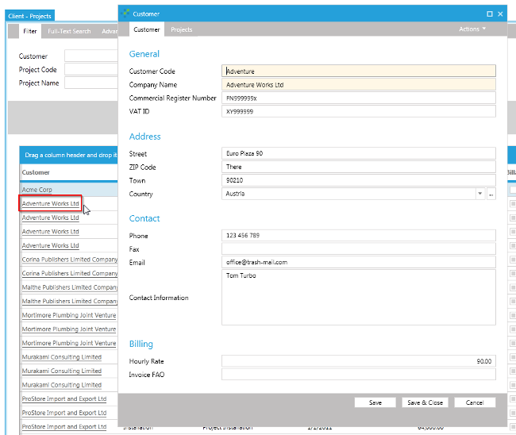
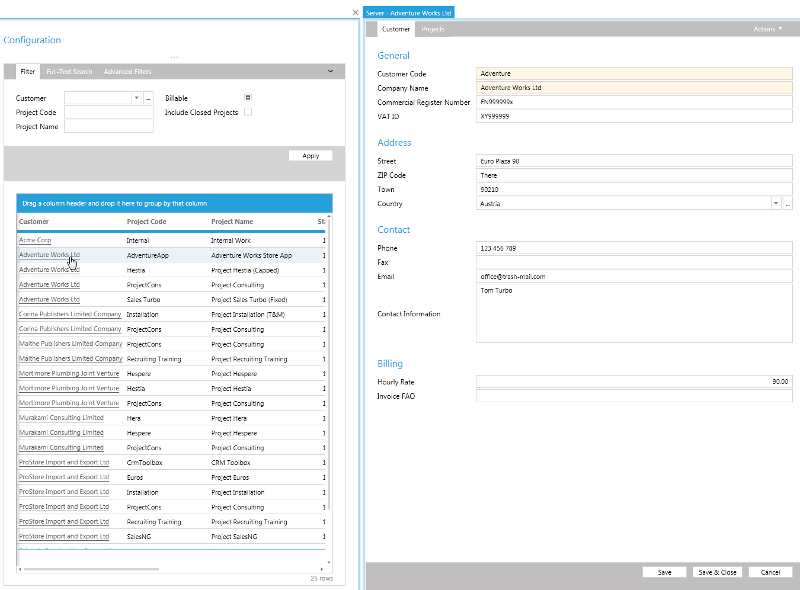
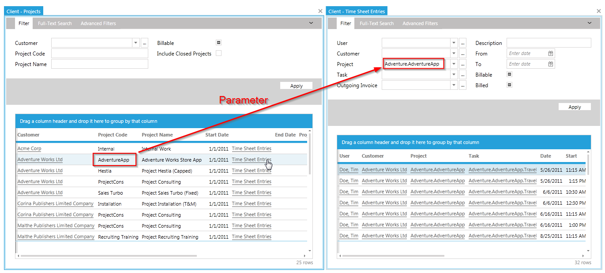
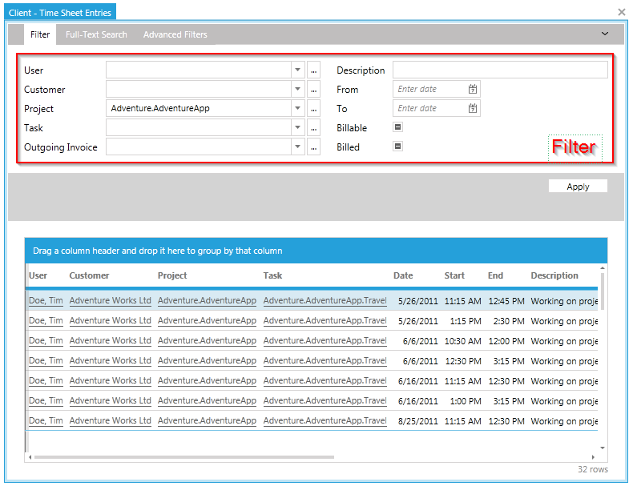
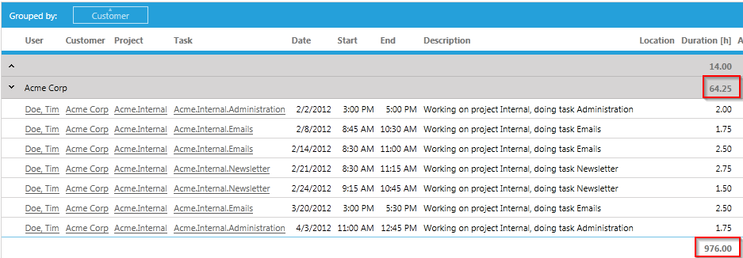
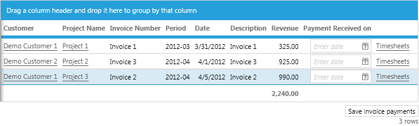

# Customizing Lists

Users of time cockpit can create their own customized lists to view their data as they need it. To be able to distinguish lists defined by users from lists defined by the time cockpit team, we use prefixes. Lists with an `APP` prefix are shipped with time cockpit and cannot be changed by the user. If users create their own lists, the will be prefixed with `USR` automatically. This prefix ensures that the list is never changed by time cockpit's upgrade process.

Users will need to create their own lists, if they add additional properties or relations to an entity (see [Customize Entities](entity.md)), or want to remove unwanted properties or relations from the lists time cockpit provides out-of-the-box. Here we describe how to create your own user-defined lists.

## Simple Lists

Like user-defined forms, user-defined lists consist of so called <xref:TimeCockpit.Data.DataModel.View.BoundCell>s. <xref:TimeCockpit.Data.DataModel.View.BoundCell>s automatically render a standard UI control for the property or relation they visualize. If a <xref:TimeCockpit.Data.DataModel.View.BoundCell> should visualize a date property, it renders a date picker in the UI. If a <xref:TimeCockpit.Data.DataModel.View.BoundCell> should represent a boolean field, it automatically renders a checkbox in the UI.

```
<List AllowDelete="True" AllowEdit="True" Query="From Current In APP_Project.Include(*) Where (Current.APP_StartDate &lt;= @DueDate Or @DueDate = Null) And (Current.APP_EndDate &gt;= @DueDate Or @DueDate = Null) Order By Current.APP_Code Select Current" xmlns="clr-namespace:TimeCockpit.Data.DataModel.View;assembly=TimeCockpit.Data" xmlns:p="http://www.timecockpit.com/2009/ui/controls"> 
  <BoundCell Content="=Current.APP_Customer" /> 
  <BoundCell Content="=Current.APP_Code" /> 
  <BoundCell Content="=Current.APP_ProjectName" /> 
  <BoundCell Content="=Current.APP_StartDate" /> 
  <BoundCell Content="=Current.APP_EndDate" /> 
  <BoundCell Content="=Current.APP_Budget" /> 
  <BoundCell Content="=Current.APP_BudgetInHours" /> 
  <BoundCell Content="=Current.APP_Billable" /> 
  <BoundCell Content="=Current.APP_Closed" /> 
</List>
```

For a lot of cases, using BoundCells will be just fine. However, if users want to gain more control about how a property or relation is rendered in the UI, users need to use specialized cell types. The specialized cell types provide additional attributes to control how a UI element (e.g. a date picker) should behave. In the following, we will talk about the specializations of BoundCell and their additional attributes:

...

```
<List AllowDelete="True" AllowEdit="True" Query="From Current In APP_Project.Include(*) Where (Current.APP_StartDate &lt;= @DueDate Or @DueDate = Null) And (Current.APP_EndDate &gt;= @DueDate Or @DueDate = Null) Order By Current.APP_Code Select Current" xmlns="clr-namespace:TimeCockpit.Data.DataModel.View;assembly=TimeCockpit.Data" xmlns:p="http://www.timecockpit.com/2009/ui/controls"> 
  <BoundCell Content="=Current.APP_Customer" /> 
  <BoundCell Content="=Current.APP_Code" /> 
  <BoundCell Content="=Current.APP_ProjectName" /> 
  <DateTimeCell Content="=Current.APP_StartDate" ShowTime="False" DateTimeFormatPattern="M"/> 
  <NumericCell Content="=Current.APP_Budget" NumberFormatPattern="G"/> 
</List>
```

## Hyperlinks in Lists

In lists, relations are rendered in a special way, namely as hyperlinks. There are two different kinds of hyperlinks:

### : 1 Hyperlinks

Coming from a list, this kind of hyperlink opens a form to view/edit exactly on record. The customer hyperlink in the time sheet entry list is an example for a :1 hyperlink.



The following code shows how to configure : 1 Hyperlinks:

```
<BoundCell Content="=Current.Customer" > 
    <BoundCell.Hyperlink> 
        <Hyperlink Target="CustomerForm" Title="=Current.CustomerName.CustomerName"> 
            <Hyperlink.NavigateContent> 
                <p:NamedFormConfiguration EntityObjectUuid="=Current.Customer.CustomerUuid" ModelEntityName="APP_Customer" /> 
            </Hyperlink.NavigateContent> 
        </Hyperlink> 
    </BoundCell.Hyperlink> 
</BoundCell>
```

The BoundCell in the above example represents a customer a project was conducted for. The `Content` property determines which relation should be visualized as a hyperlink, in our case, `=Current.Customer`. The keyword `Current` represents a reference to the record that is displayed in a list. In the above example, `Current` represents a row in a project list.

A relation can also be visualized with just a BoundCell. In that case, time cockpit does not render a hyperlink, but uses the default display property of the entity that is related to and renders a text cell. So `<BoundCell Content="=Current.APP_Customer" />` would result in a cell holding the company name of a customer

To change a <xref:TimeCockpit.Data.DataModel.View.BoundCell> to a hyperlink, we need to nest a <xref:TimeCockpit.Data.DataModel.View.Hyperlink> in the <xref:TimeCockpit.Data.DataModel.View.BoundCell>. A hyperlink has some additional properties to control its behavior:

Field | Description
--- | ---
Content | In the above example we only use `Current.Customer` as content for the hyperlink. In that case, time cockpit renders the value of the default display property of an entity. For the entity customer that would be `CompanyName`. Of course users can change the default display property for an entity. If a user would change the default display property to e.g. `Code`, the column would render the code of a customer as hyperlink.<br/><br/>
Title | Determines the title of the window that opens. The content of the title attribute is usually a TCQL expression (see also TCQL Expression Language), e.g. =Current.Customer.CompanyName. However, you can also use more complex expressions like ='Code: ' + Current.APP_Customer.APP_CustomerCode. This configuration would result in the window title Code: [Code des ausgewählten Kunden].
DockPosition | This property defines where the visualization of a record (in our case a customer) should be opened. If no dock position is defined, a modal window will open representing a single record, e.g. a customer (see following left figure). If you want to open the window in another tab (not model) you need to set a dock position. You can choose from Left, Right or Center (see following right figure).<br/><br/><br/><br/>
Target | **The target property only works in combination with a dock position.** If there is no dock position defined, the target property does not have any effect. If you have defined a dock position, the target property tells time cockpit to open the hyperlink in either a new tab, or reuse an existing tab. If no target property is set, the hyperlink will always be opened in a new tab. If target is set to a value, the hyperlink will check if a tab with the same target is already opened and, if yes, reuse it.
ModelEntityName | Tells time cockpit of which type (=entity) the record that is going to be opened is.
EntityObjectUuid | Represents the technical id of the record that is going to be fetched from the database and displayed.

### : N Hyperlinks (Back-References)

These hyperlinks represent the inverse direction of the relation. An example would be if we want to show all time sheet entries that are booked on a given project. Project represents the : 1 side of the relation, whereas the time sheet entries are the : N side. The : N side cannot be represented in a form representing a single record, but needs to be a list with multiple records. The following code samples shows how to define a : N hyperlink in a list.

```
<BoundCell Content="Time Sheets"> 
  <BoundCell.Hyperlink> 
    <Hyperlink Target="Time Sheets" Title="Time Sheets"> 
      <Hyperlink.NavigateContent> 
        <p:NamedListConfiguration ModelEntityName="APP_Timesheet"> 
          <p:NamedListConfiguration.Parameters> 
            <Parameter Name="Project" Value="=Current.ProjectUuid" /> 
          </p:NamedListConfiguration.Parameters> 
        </p:NamedListConfiguration> 
      </Hyperlink.NavigateContent> 
    </Hyperlink> 
  </BoundCell.Hyperlink> 
</BoundCell>
```

The definition of a : N hyperlink is quite similar to the definition of a : 1 hyperlink. Not that we do not use a `NamedFormConfiguration` for a : N hyperlink, but a `NamedListConfiguration`. That is, when a : N hyperlink is clicked, a list of records will be opened in a tab. In the above example, time cockpit tries to determine the **Default list** that is configured for the time sheet entity and uses the list to display time sheet entry records. To filter for the time sheet entry that are booked on a given project, the above NamedListConfiguration passes a parameter (see the following section), the id of the project record, to the time sheet entry list. The result is time sheet entry list for a selected project.

The properties Target and Title do exactly the same as with : 1 hyperlinks.



For more complex scenarios, : N hyperlinks provide two additional properties, `ListName` and `Condition`. If you configure a dedicated list name like in the following sample, you can choose a specific list that is used to show a given set of records in a new tab. If you want to apply an additional filter on result set returned by the configured list, you can define a condition. The condition is a [TCQL expression](~/doc/tcql/expression-language.md) which will be used to filter the records. In the above hyperlink example, the `APP_DefaultTimesheetList` is used which returns results based on the following query:

```
From Current In APP_Timesheet
Where (Current.APP_BeginTime &gt;= @BeginTime Or @BeginTime = Null) And (:AddDays(Current.APP_EndTime, -1) &lt;= @EndTime Or @EndTime = Null) 
Order By Current.APP_BeginTime, :DisplayValue(Current.APP_UserDetail)
Select New With
{
        .ObjectUuid = Current.APP_TimesheetUuid,
        .UserDetailUuid = Current.APP_UserDetail.APP_UserDetailUuid,
        .UserDetailName = :DisplayValue(Current.APP_UserDetail),
        .CustomerUuid = Current.APP_Project.APP_Customer.APP_CustomerUuid,
        .CustomerName = :DisplayValue(Current.APP_Project.APP_Customer),
        .ProjectUuid = Current.APP_Project.APP_ProjectUuid,
        .ProjectName = :DisplayValue(Current.APP_Project),
        .TaskUuid = Current.APP_Task.APP_TaskUuid,
        .TaskName = :DisplayValue(Current.APP_Task),
        ...
}
```

Now if we only want to view the time sheet entries for the project that have not already been billed, we could define an expression like Current.APP_IsBilled = False. The expression will be passed as additional filter clause to the query and thus return only the not billed time sheet entries.

> [!NOTE]
Conditions should only be used if absolutely necessary. It is a good practice to use parameters instead, because it is much easier for users to see which filters are applied.

```
From T In Timesheet Where T.APP_Project.APP_ProjectUuid = {@ProjectId} Select T
```

## Filtered Lists

User-defined lists can be configured to have user-defined filter sections (see following filter). Basically, the filter section in a list is just a form used throughout time cockpit. For how to define custom forms see [User-defined Forms](form.md).



The following filter is taken from the `APP_DefaultTimesheetList` in time cockpit's default data model. As you can see the filter is just a form with sections and cells. So it can be configured just like any other form.

```
<List.Filter> 
    <Form> 
        <Tab Header="=:Translate('List.General.FilterTab')"> 
            <Section> 
                <SectionColumn> 
                    <RelationCell FilterOperator="=" FilterParameterName="UserDetail" FilterPath="APP_UserDetail" DefaultValue="=Environment.CurrentUser.Me" /> 
                    <RelationCell FilterOperator="=" FilterPath="APP_Project.APP_Customer" /> 
                    <BoundCell FilterOperator="=" FilterParameterName="Project" FilterPath="APP_Project" /> 
                    <BoundCell FilterOperator="=" FilterParameterName="Task" FilterPath="APP_Task" /> 
                    <BoundCell FilterOperator="=" FilterParameterName="Invoice" FilterPath="APP_Invoice" /> 
                </SectionColumn> 
                <SectionColumn> 
                    <TextCell FilterOperator="Like" FilterPath="APP_Description" /> 
                    <DateCell FilterParameterName="BeginTime" Header="=:Translate('List.APP_DefaultTimesheetList.From')" DefaultValue="=:AddYears(:FirstOfMonth(:Today()), -1)" /> 
                    <DateCell FilterParameterName="EndTime" Header="=:Translate('List.APP_DefaultTimesheetList.To')" /> 
                    <BoundCell FilterOperator="=" FilterPath="APP_Billable" /> 
                    <BoundCell FilterOperator="=" FilterPath="APP_Billed" /> 
                </SectionColumn> 
            </Section> 
        </Tab> 
    </Form> 
</List.Filter>
```

Since you can use normal <xref:TimeCockpit.Data.DataModel.View.BoundCell>s as in lists and forms, you should use <xref:TimeCockpit.Data.DataModel.View.BoundCell>s for all the cases where you do not want to achieve special behavior of a cell. That is, use <xref:TimeCockpit.Data.DataModel.View.BoundCell> as often as long as you do not need to set specific properties like `ShowTime` (<xref:TimeCockpit.Data.DataModel.View.DateTimeCell>) or `Condition` (<xref:TimeCockpit.Data.DataModel.View.RelationCell>). Apart from that, a <xref:TimeCockpit.Data.DataModel.View.BoundCell> offer additional properties if used in the context of a list filter. Additional, filter-related properties are:

### FilterPath

Represents a property or relation name that indicates on which property or relation to apply the filter. The following expression adds an additional where clause to the query that provides the list with data.

```
APP_Project.APP_Customer
```

Taking the APP_DefaultTimesheetList as an example, time cockpit would issue the following query to get the data for the list:

```
From Current In APP_Timesheet
Where ...
And Current.APP_Project.APP_Customer.APP_CustomerUuid = {4517d585-36d7-4832-9abc-c29a2c3e22d1}
...
Select New With
{
...
}
```

### FilterOperator

The filter operator property specifies which operator to use. Relations, as described above, can only be checked for equality.

- Text properties can be checked for equality (=), inequality (<>) and similarity (Like).
- Numeric and date properties can be checked for equality (=), inequality (<>). Further, the operators <, <=, > and => can be used.
- Boolean properties can only be checked for equality (=) or inequality (<>).

> [!NOTE]
Any property or relation can be check for Null, e.g. ... = Null or ... <> Null.

### DefaultValue

A default value can be either a constant (e.g. True or 9) or a TCQL expression (see also [TCQL Expression Language](~/doc/tcql/expression-language.md)). An example for a common default value expression for filters would be `:Today()`.

## Grouped Lists

time cockpit provides means to configure standard groupings for a list. Lists can be grouped by multiple columns. The following example shows how to group a list by the customer. This grouping configuration could be applied to a project list since a project has a relation to customer.

```
<List.Groups> 
<Group AutoExpand="True" MemberPath="CustomerName" SortDirection="Ascending" /> 
</List.Groups>
```

Further, users can define a **default aggregate function** for various properties of an entity. For example, it could be meaningful to configure that the duration in hours of time sheet entries should be summed up if a list of time sheet entries is grouped. You can configure that kind of behavior in the time cockpit data model (see [Properties of entities](entity.md#properties)).

If an aggregate function is configured and a list of time sheet entries is grouped by, e.g. customer, the list would render the sum of revenue for the time sheet entries per customer (see following figure).



> [!NOTE]
You can use Sum, Average, Minimum and Maximum as aggregate functions.

## Editable Lists

To edit an item in a common list, you usually need to double click on the record to open it. However, time cockpit also provides means to edit records directly within the list itself (see figure). Each property type (text, numeric, bool) can be configured as inline editable.

> [!NOTE]
Relations do not provide inline editing capabilities right now.



To implement editable lists, you need to configure two things:

Firstly, the list must be configured to allow inline editing. For that, you can set the `EditMode` property of the list to `AllRows`. Further, you need to set the property `IsReadOnly` to `False` for all the columns you want to edit inline.

Finally, you need to configure which action does the saving of the change records. With the `ViewAction` property you tell the list which action to use for saving.

```
<List.ViewActions> 
  <ViewAction Name="SavePayments" /> 
</List.ViewActions>
```

The following code snippet shows the relevant parts of an editable list.

```
<List AllowDelete="True" AllowEdit="True" EditMode="AllRows" xmlns="clr-namespace:TimeCockpit.Data.DataModel.View;assembly=TimeCockpit.Data" xmlns:p="http://www.timecockpit.com/2009/ui/controls"> 
  <List.Query>
  From I In APP_Invoice.Include(*) Where I.APP_PaymentReceivedOn = Null Order By I.APP_InvoiceDate Select I
  </List.Query> 
  <List.ViewActions> 
    <ViewAction Name="SaveInvoicePayments" /> 
  </List.ViewActions> 
  <List.Filter>
    ...
  </List.Filter>
    ...
  <BoundCell Content="=Current.APP_InvoiceDate" /> 
  <BoundCell Content="=Current.APP_Description" /> 
  <BoundCell AggregateFunction="Sum" Content="=Current.APP_Revenue" /> 
  <BoundCell Content="=Current.APP_PaymentReceivedOn" IsReadOnly="False" />
  ...
</List>
```

Secondly, you need to provide a time cockpit action that saves the changed records. Just saving the changed records is the most common scenario. But basically you can do whatever you want in the action. You could, for example, send mails to trigger a confirmation workflow before you actually save the changed records. The following example shows you a basic example where we just iterate over all the records in the list and save each one of them.

```
clr.AddReference("System")

def actionSample(actionContext):
    for item in actionContext.InputSet:
        # ... additional business logic ...
        actionContext.DataContext.SaveObject(item)
```

> [!NOTE]
Take a look at [Actions](~/scripting/actions.md) to see how time cockpit actions can be implemented.
