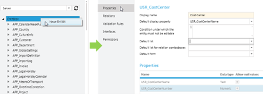
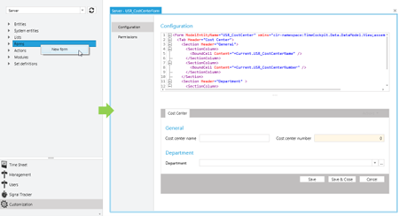
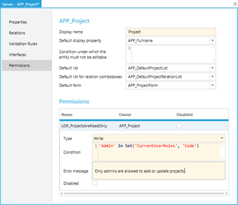

# Customization Capabilities

> [!NOTE] This section shows the gives an introduction into advance customization capabilities of time cockpit. Customers have two options to customize their time cockpit. (1) DIY and (2) let the time cockpit team do it for you. If you are interested in any of the two options, please drop us a mail at [support@timecockpit.com](support@timecockpit.com).

## Entities, Properties, Relations etc

Time cockpit is a commercial of the shelf product, but still, it is completely customizable. You can create your own tables, properties, business rules or business logic. Time cockpit is completely scriptable using IronPython as scripting language. This language can be used to create your own custom business logic. You code can be deployed without rolling out a new version of time cockpit. See [Customize Entities](entity.md)

## User Interface

Also you can customize the user interface the way you want. Using customizations you can adapt time cockpit to your organizational structure and processes. Also you can create customized printable reports or dashboards that give you unique insights into your data. See [Customizing Forms](form.md)

## Permissions

With a powerful permission framework you can configure your own permission model that exactly fits your organization structure and needs. If your business grows overtime, so does time cockpit. With its customization capabilities, you can be sure, that time cockpit can be customized to fit the needs of your company whatever size it has grown to. See [Customizing Forms](form.md)

## Web API

Additionally, time cockpit features a powerful web api which lets you query and manage all yor data. The web api can be used for data analysis etc. data integration. See [Web API](~/doc/web-api/overview.md)

## Development Process

If the time cockit team customizes time cockpit for you, we follow a strict [Infrastructue-as-Code](https://learn.microsoft.com/en-us/devops/deliver/what-is-infrastructure-as-code) approach.

When we are implementing time cockpit extensions for a customer, we follow a strict [Infrastructue-as-Code](https://learn.microsoft.com/en-us/devops/deliver/what-is-infrastructure-as-code) approach that is, all changes are developed in the form of Python scripts (no configuration via the CoFX/time cockpit UI). IaC brings the following advantages:
1. Changes are traceable (version management in Azure DevOps)
1. Changes can be transferred to other time cockpit systems (e.g. importing the changes into the test and productive environment).

## Sandbox

Time cockpit allows you to create sandbox environments to test your changes before implementing them in your production environment.

Sandbox environments are essentially copies of your production environment, where you can test new features, workflows, and configurations without risking any negative impact on your live data. With sandbox environments, you can experiment freely and make changes without worrying about potential errors or consequences. For further information also refer to [Playing in the Sandbox](https://www.timecockpit.com/blog/2016/05/27/Playing-in-the-Sandbox).
