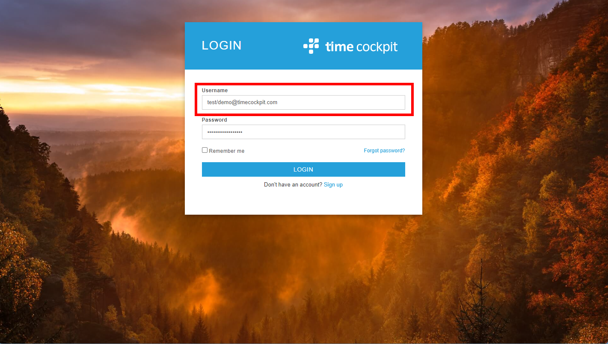
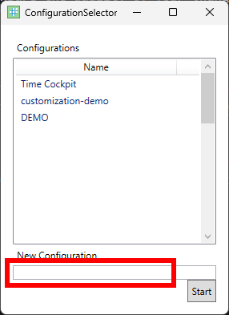
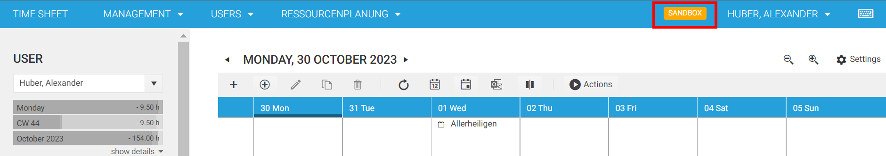

# Customization Capabilities

> [!NOTE]
This section gives an introduction into advanced customization capabilities of time cockpit. Customers have two options to customize their time cockpit. (1) DIY and (2) let the time cockpit team do it for you. If you want to customize time cockpit yourself, you need to download and install the [OnCockpit Admin](https://update-admin.on-cockpit.com/general/Setup.exe). With the OnCockpit Admin you can customize nearly every aspect of time cockpit, like its data structures, user interface etc. Please be aware that if you are altering your production environment this might impact your team colleages. That is why we offer sandbox environments to test your customizations before you put them in production. If you are interested in any of the two options, please drop us a mail at [support@timecockpit.com](mailto:support@timecockpit.com).

## Development Process

When we are implementing time cockpit extensions for a customer, we follow a strict [Infrastructue-as-Code](https://learn.microsoft.com/en-us/devops/deliver/what-is-infrastructure-as-code) approach. All changes are developed as IronPython scripts (no configuration via the CoFX/time cockpit UI). IaC brings the following advantages:
1. Changes are traceable (version management in Azure DevOps)
1. Changes can be transferred to other time cockpit systems (e.g. importing the changes into the test and productive environment).

## Sandboxes (Test Systems) in Time Cockpit

### Why Create a Sandbox?
  - **Safe Testing:** A sandbox environment provides a secure space to experiment, test changes, and explore new features without any impact on your live data.
  - **Training Ground:** It's an excellent training ground for new team members. They can learn and practice using the system without the risk of affecting real-time data.
  - **Quality Assurance:** Ensure the quality of your changes before deploying them to your live system. Test configurations, workflows, reports, and customizations confidently.

### Requesting a Sandbox
If you don't already have a test system in place, all you need to do is send an email to [support@timecockpit.com](mailto:support@timecockpit.com) to request one. We'll swiftly set it up for you.

To activate test users, please reach out to our support team. Unfortunately, users cannot enable test accounts themselves. Just let us know, and we'll take care of it.

Your test system is free for the time being. We only need to discuss any potential compromises if it starts significantly impacting our systems. You can enjoy the benefits of a test system without any immediate cost.

### Accessing the Sandbox WITHOUT Microsoft Entra (AAD)
Users can easily log in to the test system by visiting [web.timecockpit.com](https://web.timecockpit.com). Use the following format for the username: `test/originalemailaddress`. The password is the same as for your production time cockpit account.

If you're using the [OnCockpit Admin](https://update-admin.on-cockpit.com/general/Setup.exe) for customizations and development, you can connect to the sandbox by adding a "New Configuration" in the start dialog of OnCockpit Admin. Ensure that you use the following format for the username: `test/originalemailaddress`. The password is the same as for your production time cockpit account.

### Accessing the Sandbox WITH Microsoft Entra (AAD)

If you are using Microsoft Entra (AAD) for federated authentication you cannot use the pattern `test/originalemailaddress`. You can directly switch to the sandbox from your time cockpit. 

1. Log in to your time cockpit via Microsoft Entra (AAD)
2. Click on your user name in the right corner of time cockpit.
3. Click on "Switch to sandbox". Time cockpit will reload and forward you to the sandbox.

")

>[!NOTE]
You know that you are in the sandbox if time cockpit shows you the sandbox badge next to your user name.

## Entities, Properties, Relations etc

Time cockpit is a commercial of the shelf product, but still, it is completely customizable. You can create your own tables, properties, business rules or business logic. Time cockpit is completely scriptable using IronPython as scripting language. This language can be used to create your own custom business logic. You code can be deployed without rolling out a new version of time cockpit. See [Customize Entities](entity.md)

## User Interface

Also you can customize the user interface the way you want. Using customizations you can adapt time cockpit to your organizational structure and processes. Also you can create customized printable reports or dashboards that give you unique insights into your data. See [Customizing Forms](form.md)

## Permissions

With a powerful permission framework you can configure your own permission model that exactly fits your organization structure and needs. If your business grows overtime, so does time cockpit. With its customization capabilities, you can be sure, that time cockpit can be customized to fit the needs of your company whatever size it has grown to. See [Customizing Forms](form.md)

## Web API

Additionally, time cockpit features a powerful web api which lets you query and manage all your data. The web api can be used for data analysis etc. data integration. See [Web API](~/doc/web-api/overview.md)

## Sandbox (Test Environment)

Time cockpit allows you to create sandbox environments to test your changes before implementing them in your production environment.

Sandbox environments are essentially copies of your production environment, where you can test new features, workflows, and configurations without risking any negative impact on your live data. With sandbox environments, you can experiment freely and make changes without worrying about potential errors or consequences. For further information also refer to [Playing in the Sandbox](https://www.timecockpit.com/blog/2016/05/27/Playing-in-the-Sandbox).
