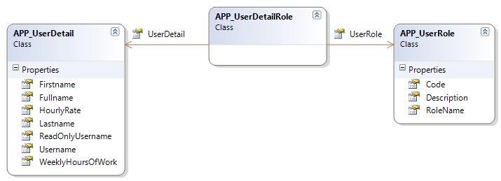
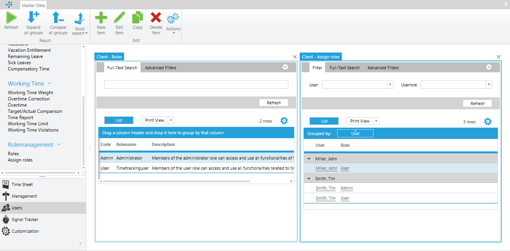

# Permissions

> [!WARNING]
This chapter is under construction. 

Time cockpit has a fully configurable and extensible permission management system. In the standard configuration of time cockpit, the permission management system is based on assigning roles to users. 

Time cockpit is delivered with two predefined roles, ```Admin``` and ```User```. Based on these two roles, permissions are defined in the time cockpit default configuration. All users are assigned to the ```User``` role when they are created via the website (www.timecockpit.com). Depending on whether a user was given the ```Admin``` role during the creation on the website, a user is also assigned the ```Admin``` role in time cockpit. Administrators have the right to use the customization module in time cockpit, edit the data model, issue queries, and to run IronPython scripts. Administrators may also create roles and assign roles to other users.

## Entities for Permission Management

In the standard data model of time cockpit, the role concept is implemented with three entities. ```APP_UserDetail``` contains the information about a user. ```APP_UserRole``` contains the various roles supported by time cockpit (in standard ```Admin``` and ```User```). ```APP_UserDetailRole``` contains the assignment of a user to different roles. Time cockpit allows a user to be assigned to multiple roles.

> [!WARNING]
It is not recommended to set restrictive permissions on the entity ```APP_UserDetail```. It must be possible for the application to store its own user entry at any time. This is because the user's language is stored in the user entry. A user can change his / her language and must always be able to store his / her own user entry. Incorrect permissions can cause time cockpit to stop working. If you are not sure about permissions on the ```APP_UserDetail``` entity, contact support@timecockpit.com. In terms of permissions we recommend **KISS** - Keep it small and simple!



## Manage Roles

Since roles are just conventional records like e.g. a project, a time sheet entry or a customer, they can also be created using the ```New item``` button. Only users in the ```Admin``` can create new roles. A role has 3 properties.

* Code: The code of the role. The code be short and **must** be unique.
* Name: The name of the role. This serves for easier identification of the role.
* Description: An optional more elaborate description of the role.

In the ```Users``` module in the section "Rolemanagement" you will find the list ```Roles``` where roles can be added, edited and removed. In addition, time cockpit provides a list ```Assign roles```. In this list, user-to-role assignments can be created.



## Creating Permissions

Like validation rules, calculated properties, or default values for properties, TCQL expressions are also used for permissions. In contrast to validation rules, etc., there is an additional keyword to ```Current``` in permission expressions - ```Environment```. ```Environment``` gives a user access to global and user-specific properties. 
* Environment.CurrentUser: The user who is currently logged on to the system. ```Environment.CurrentUser``` is the record from the entity APP_UserDetail that corresponds to the currently logged on user.
* Environment.GlobalSettings: Gives access to the system wide settings that are not dependent on a given user.

The following code snippet shows a simple permission for a user. An action in time cockpit should only be executed by a user in the ```Admin``` role. To implement this permissiom, a ```SetCurrentUserRoles```, which is included in the standard data model, is used (see [Sets](~/doc/scripting/sets.md)). ```CurrentUserRoles``` always returns the roles of a logged-in user. To illustrate the definition of the set:

```
From R In APP_UserDetailRole 
Where R.UserDetail.UserDetailUuid = Environment.CurrentUser.UserDetailUuid 
Select New With 
{ 
  R.UserRole.Code 
}
```

Using the set ```CurrentUserRoles```, you can create permissions to check whether the currently logged-on user is assigned to a specific role. The following permission definition checks whether a user is assigned to the role ```Admin```. ```Set('CurrentUserRoles', 'Code')``` returns the result of the ```CurrentUserRoles``` set for the logged-on user. The result of the set is a list of role codes. The permission checks whether the list of a user's role codes contains the value ```Admin```.

```
'Admin' In Set('CurrentUserRoles', 'Code')
```

> [!NOTE]
Due to the fact that ```CurrentUserRoles``` is configured as a **logon set**, the application must be restarted after changes to the role assignments. Logon sets are executed **only** once at the application startup and remain unchanged during the runtime of the application!

## Types of Permissions

Time cockpit allows users to assign permissions to different elements of the data model. In the following, all elements that can be permissionized are described. The various types of permissions are described using a concrete scenario. For the scenario, the following requirements should be fulfilled:

1. Only users with the role ```Projectadmin``` should be able to create projects
1. Users can only track time on projects which they are assigned to
1. Only users who are in the ```Projectadmin``` role are allowed to see the ```Projectbudget``` property
1. The ```budgetary control of projects``` list should only be available to users with the role ```Evaluator```
1. The ```Complete project``` action should only be executed by a ```Projectadmin```

A new role ```Projectadmin``` and a new set ```MyProjects``` is created as a prerequisite for the requirements. The ```Projectadmin``` role should be assigned to a user.


