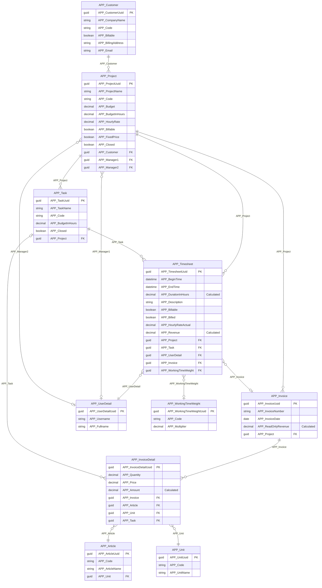
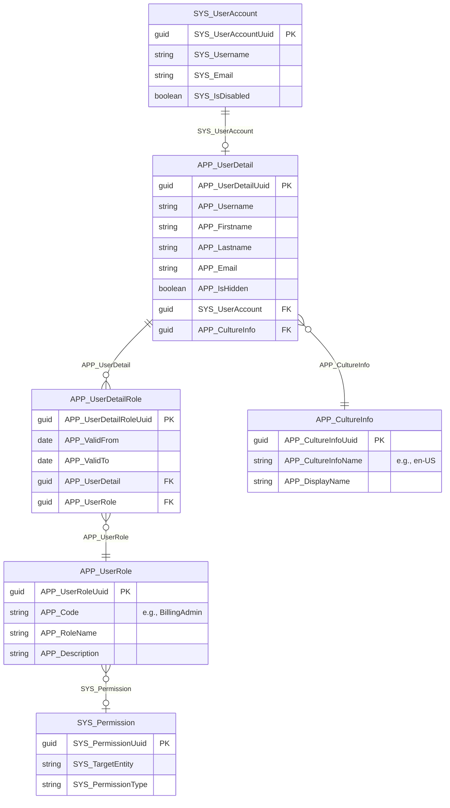
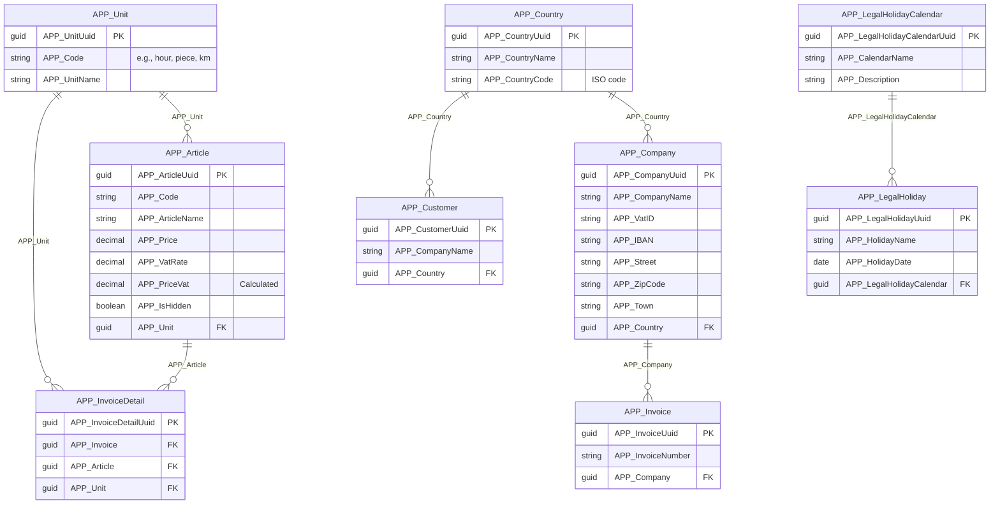

# Entity Relationship Diagrams

This page visualizes the relationships between time cockpit's standard entities (APP_ prefix). The data model is organized into logical domains for clarity.

## Domain 1: Project & Billing

This domain handles customer relationships, project management, time tracking, and invoicing.



### Key Relationships

- `APP_Customer` is the root; each `APP_Project` belongs to exactly one customer.
- `APP_Task` belongs to exactly one `APP_Project`; a project can have many tasks.
- `APP_Timesheet` has a mandatory FK to `APP_UserDetail`, a mandatory FK to `APP_Project`, and an optional FK to `APP_Task`.
- `APP_Timesheet` has an optional FK to `APP_Invoice`, linking it to at most one invoice.
- `APP_Invoice` belongs to exactly one `APP_Project`; a project can have many invoices.
- `APP_InvoiceDetail` belongs to exactly one `APP_Invoice` and has mandatory FKs to `APP_Article` and `APP_Unit`, plus an optional FK to `APP_Task`.
- `APP_Project` holds two optional FKs to `APP_UserDetail` (Manager1, Manager2).

## Domain 2: Time & Attendance

This domain manages employee work schedules, absences, approvals, and working time compliance.

```mermaid
erDiagram
    APP_UserDetail ||--o{ APP_WeeklyHoursOfWork : "APP_UserDetail"
    APP_UserDetail ||--o{ APP_VacationEntitlement : "APP_UserDetail"
    APP_UserDetail ||--o{ APP_Vacation : "APP_UserDetail"
    APP_UserDetail ||--o{ APP_SickLeave : "APP_UserDetail"
    APP_UserDetail ||--o{ APP_CompensatoryTime : "APP_UserDetail"
    APP_UserDetail ||--o{ APP_OvertimeCorrection : "APP_UserDetail"
    APP_UserDetail }o--o| APP_Department : "APP_Department"
    APP_Department ||--o{ APP_DepartmentLead : "APP_Department"
    APP_DepartmentLead }o--|| APP_UserDetail : "APP_UserDetail"
    APP_UserDetail }o--o| APP_LegalHolidayCalendar : "APP_LegalHolidayCalendar"
    APP_LegalHolidayCalendar ||--o{ APP_LegalHoliday : "APP_LegalHolidayCalendar"
    APP_UserDetail ||--o{ APP_WorkingTimeLimit : "APP_UserDetail"
    APP_Vacation }o--o| APP_UserDetail : "APP_Approver"
    APP_SickLeave }o--o| APP_UserDetail : "APP_Approver"
    APP_CompensatoryTime }o--o| APP_UserDetail : "APP_Approver"
    APP_UserDetail ||--o{ APP_Timesheet : "APP_UserDetail"
    
    APP_UserDetail {
        guid APP_UserDetailUuid PK
        string APP_Username
        string APP_Firstname
        string APP_Lastname
        string APP_Email
        decimal APP_HourlyRate "Internal cost rate"
        boolean APP_IsAbsenceApprovalRequired
        date APP_DeviatingBookingCompletionDate
        guid APP_Department FK
        guid APP_LegalHolidayCalendar FK
    }
    
    APP_Department {
        guid APP_DepartmentUuid PK
        string APP_DepartmentName
        string APP_Code
    }
    
    APP_DepartmentLead {
        guid APP_DepartmentLeadUuid PK
        boolean APP_ReceiveNotificationsForAbsenceApproval
        guid APP_Department FK
        guid APP_UserDetail FK
    }
    
    APP_WeeklyHoursOfWork {
        guid APP_WeeklyHoursOfWorkUuid PK
        date APP_EffectiveDate
        decimal APP_MondayHours
        decimal APP_TuesdayHours
        decimal APP_WednesdayHours
        decimal APP_ThursdayHours
        decimal APP_FridayHours
        decimal APP_SaturdayHours
        decimal APP_SundayHours
        guid APP_UserDetail FK
    }
    
    APP_Vacation {
        guid APP_VacationUuid PK
        datetime APP_BeginTime
        datetime APP_EndTime
        string APP_Description
        boolean APP_IsWholeDay
        datetime APP_ApprovedTimestampUtc
        boolean APP_IsApproved "Calculated"
        guid APP_UserDetail FK
        guid APP_Approver FK
    }
    
    APP_SickLeave {
        guid APP_SickLeaveUuid PK
        datetime APP_BeginTime
        datetime APP_EndTime
        string APP_Description
        boolean APP_IsWholeDay
        datetime APP_ApprovedTimestampUtc
        boolean APP_IsApproved "Calculated"
        string APP_RejectionReason
        guid APP_UserDetail FK
        guid APP_Approver FK
    }

    APP_CompensatoryTime {
        guid APP_CompensatoryTimeUuid PK
        datetime APP_BeginTime
        datetime APP_EndTime
        boolean APP_IsApproved "Calculated"
        guid APP_UserDetail FK
        guid APP_Approver FK
    }

    APP_OvertimeCorrection {
        guid APP_OvertimeCorrectionUuid PK
        date APP_EffectiveDate
        decimal APP_Hours
        string APP_Reason
        guid APP_UserDetail FK
    }
    
    APP_VacationEntitlement {
        guid APP_VacationEntitlementUuid PK
        int APP_Year
        decimal APP_Days
        guid APP_UserDetail FK
    }
    
    APP_WorkingTimeLimit {
        guid APP_WorkingTimeLimitUuid PK
        date APP_EffectiveDate
        decimal APP_MaxDailyWorkingTime
        decimal APP_MinDailyBreakTime
        decimal APP_MaxWeeklyWorkingTime
        guid APP_UserDetail FK
    }

    APP_LegalHolidayCalendar {
        guid APP_LegalHolidayCalendarUuid PK
        string APP_CalendarName
        string APP_Description
    }

    APP_LegalHoliday {
        guid APP_LegalHolidayUuid PK
        string APP_HolidayName
        date APP_HolidayDate
        guid APP_LegalHolidayCalendar FK
    }

    APP_Timesheet {
        guid APP_TimesheetUuid PK
        date APP_DateActual
        datetime APP_BeginTime
        datetime APP_EndTime
        guid APP_UserDetail FK
    }
```



### Key Relationships

- `APP_UserDetail` is the central entity in this domain; all absence, schedule, and limit records hold a mandatory FK to it.
- `APP_Vacation`, `APP_SickLeave`, and `APP_CompensatoryTime` each have a mandatory FK to `APP_UserDetail` (the employee) and an optional FK back to `APP_UserDetail` (the approver).
- `APP_WeeklyHoursOfWork`, `APP_VacationEntitlement`, `APP_WorkingTimeLimit`, and `APP_OvertimeCorrection` each have a mandatory FK to `APP_UserDetail`; one user can have many records of each type.
- `APP_UserDetail` has an optional FK to `APP_Department`; a department can have many users.
- `APP_DepartmentLead` is a join entity between `APP_Department` and `APP_UserDetail`; a department can have many leads, and a user can lead many departments.
- `APP_UserDetail` has an optional FK to `APP_LegalHolidayCalendar`; a calendar can be shared across many users.
- `APP_LegalHoliday` has a mandatory FK to `APP_LegalHolidayCalendar`; a calendar contains many holidays.

## Domain 3: Security & User Management

This domain handles authentication, authorization, roles, and permissions.



### Key Relationships

- `SYS_UserAccount` has at most one `APP_UserDetail` profile (one-to-zero-or-one).
- `APP_UserDetail` belongs to exactly one `APP_CultureInfo`.
- `APP_UserDetailRole` is a join entity between `APP_UserDetail` and `APP_UserRole`; a user can have many roles, and a role can be assigned to many users.
- `APP_UserRole` has an optional FK to `SYS_Permission`.

## Domain 4: Master Data & Configuration

Supporting entities for configuration and reference data.



## Cross-Domain Relationships

**APP_UserDetail** holds FKs from or to entities in every domain:
- Referenced by `APP_Timesheet` (Domain 1)
- References `APP_Department` and `APP_LegalHolidayCalendar`, and is referenced by all absence/schedule entities (Domain 2)
- Referenced by `SYS_UserAccount` and `APP_UserDetailRole`, and references `APP_CultureInfo` (Domain 3)

**APP_Project** is referenced across domains:
- References `APP_Customer` (Domain 1)
- Referenced by `APP_Timesheet` and `APP_Invoice` (Domain 1)

## Understanding Cardinality

**Symbols**:
- `||` : One (exactly one)
- `o{` : Zero or many
- `}o` : Many to zero or one
- `||--o{` : One to many
- `}o--||` : Many to one
- `}o--o|` : Many to zero-or-one

**Examples**:
```
APP_Customer ||--o{ APP_Project
```
One customer has zero or many projects. Each project belongs to exactly one customer.

```
APP_Timesheet }o--o| APP_Invoice
```
A timesheet can belong to zero or one invoice (optional). An invoice can have many timesheets.

## Complete Entity List by Domain

### Billing & Projects
- APP_Customer
- APP_Project
- APP_Task
- APP_Timesheet
- APP_Invoice
- APP_InvoiceDetail
- APP_Article
- APP_Unit

### Time & Attendance
- APP_UserDetail
- APP_Department
- APP_DepartmentLead
- APP_WeeklyHoursOfWork
- APP_Vacation
- APP_SickLeave
- APP_CompensatoryTime
- APP_OvertimeCorrection
- APP_VacationEntitlement
- APP_WorkingTimeLimit
- APP_WorkingTimeWeight
- APP_LegalHolidayCalendar
- APP_LegalHoliday

### Security
- SYS_UserAccount
- APP_UserDetail
- APP_UserDetailRole
- APP_UserRole
- APP_CultureInfo

### Master Data
- APP_Company
- APP_Country
- APP_MeansOfTransport

### Configuration
- APP_GlobalSettings
- APP_FeatureFlag
- APP_FormattingProfile
- APP_EntityViewProfile

## Related Documentation

- [Standard Entities Reference](standard-entities.md) - Detailed documentation for each entity
- [Permissions Guide](../security/permissions-guide.md) - How to work with entity permissions
- [TCQL Overview](../tcql/overview.md) - Query language for time cockpit
- [Web API - OData](../web-api/odata.md) - REST API access to entities

## See Also

- [Data Model Customization](../data-model-customization/overview.md)
- [Creating Custom Entities](../data-model-customization/entity.md)
- [Named Sets for Security](../security/named-sets.md)
