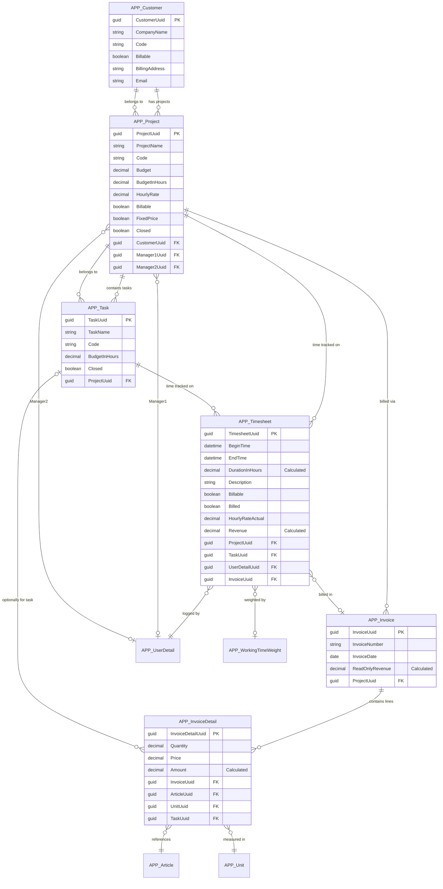
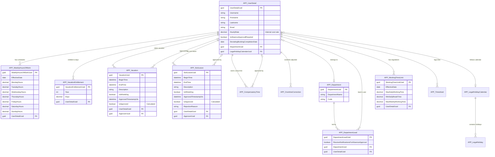
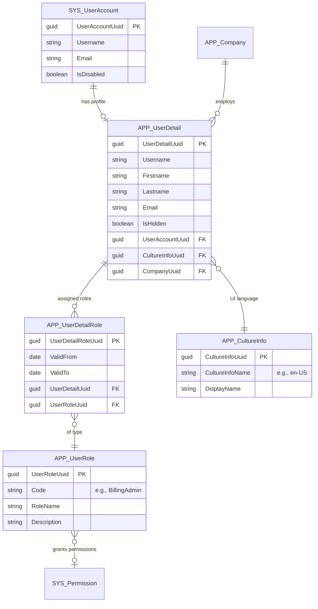
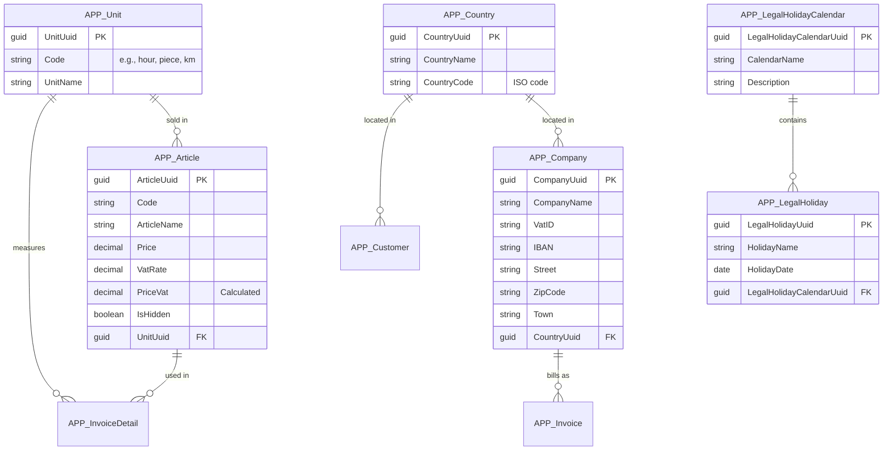

# Entity Relationship Diagrams

This page visualizes the relationships between time cockpit's standard entities (APP_ prefix). The data model is organized into logical domains for clarity.

## Domain 1: Project & Billing

This domain handles customer relationships, project management, time tracking, and invoicing.



### Key Relationships Explained

**Project Assignment**:
- Timesheets can be assigned to a **Project directly** OR to a **Task** (which belongs to a Project)
- When assigned to a task, project context is derived: `Task.Project`

**Billing Flow**:
1. Log timesheets on projects/tasks
2. Mark timesheets as billable
3. Create invoice for project
4. Assign timesheets to invoice (sets `APP_Billed = True`)
5. Invoice details can reference articles or tasks

**Customer Hierarchy**:
```
Customer → Project → Task → Timesheet
                  ↓
              Invoice → InvoiceDetail
```

## Domain 2: Time & Attendance

This domain manages employee work schedules, absences, approvals, and working time compliance.



### Key Relationships Explained

**Approval Chain**:
```
Employee → Creates Vacation/SickLeave
            ↓
Department Lead → Receives Notification
            ↓
Review & Approve → Sets ApprovedTimestampUtc + Approver
            ↓
Employee → Gets Notification of Approval
```

**Working Time Calculation**:
- `APP_WeeklyHoursOfWork`: Defines expected hours per day
- `APP_WorkingTimeLimit`: Defines legal/policy limits
- `APP_Timesheet`: Actual worked hours
- Functions: `:GetWorkTime()`, `:GetWeeklyHoursOfWork()` calculate compliance

**Absence Types** (all follow same pattern):
- `APP_Vacation`: Planned time off
- `APP_SickLeave`: Illness
- `APP_CompensatoryTime`: Time off in lieu of overtime

**Effective Date Pattern**:
Many entities use `EffectiveDate` to support multiple configurations over time:
- Change work schedule from 40h to 32h starting next month
- Add new working time limits when law changes
- Track vacation entitlement per year

## Domain 3: Security & User Management

This domain handles authentication, authorization, roles, and permissions.



### Key Security Concepts

**Role-Based Access Control (RBAC)**:
- Users have `APP_UserDetail` (profile)
- Roles assigned via `APP_UserDetailRole` (with validity period)
- Standard roles: `BillingAdmin`, `HumanResourcesAdmin`, `ProjectManager`, `DepartmentLead`, `User`

**Permission Evaluation**:
```tcql
-- Check if current user has role
'BillingAdmin' In Set('CurrentUserRoles')

-- Named Set definition (APP_CurrentUserRoles)
From R In APP_UserDetailRole 
Where R.UserDetail.UserDetailUuid = Environment.CurrentUser.UserDetailUuid
And (R.ValidFrom = Null Or R.ValidFrom <= :Today())
And (R.ValidTo = Null Or R.ValidTo >= :Today())
Select New With { R.UserRole.Code }
```

**Row-Level Security Example**:
```tcql
-- Timesheet read permission allows:
-- 1. Own timesheets
-- 2. Department leads see their department
-- 3. Project managers see their projects  
-- 4. Admins see all

:Iif(
  'BillingAdmin' In Set('CurrentUserRoles') Or
  'HumanResourcesAdmin' In Set('CurrentUserRoles'),
  True,
  :Iif(
    Current.UserDetail.UserDetailUuid = Environment.CurrentUser.UserDetailUuid Or
    ('DepartmentLead' In Set('CurrentUserRoles') And 
     Current.UserDetail.Department In Set('APP_MyDepartmentsAsLead')) Or
    ('ProjectManager' In Set('CurrentUserRoles') And 
     (Current.Project.Manager1 = Environment.CurrentUser.UserDetailUuid Or
      Current.Project.Manager2 = Environment.CurrentUser.UserDetailUuid)),
    True,
    False
  )
) = True
```

## Domain 4: Master Data & Configuration

Supporting entities for configuration and reference data.



## Cross-Domain Relationships

Some key entities span multiple domains:

**APP_UserDetail** is central to:
- Time tracking (logs timesheets)
- Absence management (takes vacation/sick leave)
- Security (has roles)
- Project management (manages projects)
- Approval workflows (approves absences)

**APP_Project** connects:
- Customer management (belongs to customer)
- Time tracking (timesheets reference it)
- Billing (invoices for it)
- Security (project managers have special access)

## Understanding Cardinality

**Symbols**:
- `||` : One (exactly one)
- `o{` : Zero or many
- `}o` : Many to zero or one
- `||--o{` : One to many
- `}o--||` : Many to one
- `}o--o|` : Many to zero-or-one

**Examples**:
```
APP_Customer ||--o{ APP_Project
```
One customer has zero or many projects. Each project belongs to exactly one customer.

```
APP_Timesheet }o--o| APP_Invoice
```
A timesheet can belong to zero or one invoice (optional). An invoice can have many timesheets.

## Complete Entity List by Domain

### Billing & Projects
- APP_Customer
- APP_Project
- APP_Task
- APP_Timesheet
- APP_Invoice
- APP_InvoiceDetail
- APP_Article
- APP_Unit

### Time & Attendance
- APP_UserDetail
- APP_Department
- APP_DepartmentLead
- APP_WeeklyHoursOfWork
- APP_Vacation
- APP_SickLeave
- APP_CompensatoryTime
- APP_OvertimeCorrection
- APP_VacationEntitlement
- APP_WorkingTimeLimit
- APP_WorkingTimeWeight
- APP_LegalHolidayCalendar
- APP_LegalHoliday

### Security
- SYS_UserAccount
- APP_UserDetail
- APP_UserDetailRole
- APP_UserRole
- APP_CultureInfo

### Master Data
- APP_Company
- APP_Country
- APP_MeansOfTransport

### Configuration
- APP_GlobalSettings
- APP_FeatureFlag
- APP_FormattingProfile
- APP_EntityViewProfile

## Related Documentation

- [Standard Entities Reference](standard-entities.md) - Detailed documentation for each entity
- [Permissions Guide](../security/permissions-guide.md) - How to work with entity permissions
- [TCQL Overview](../tcql/overview.md) - Query language for time cockpit
- [Web API - OData](../web-api/odata.md) - REST API access to entities

## See Also

- [Data Model Customization](../data-model-customization/overview.md)
- [Creating Custom Entities](../data-model-customization/entity.md)
- [Named Sets for Security](../security/named-sets.md)
