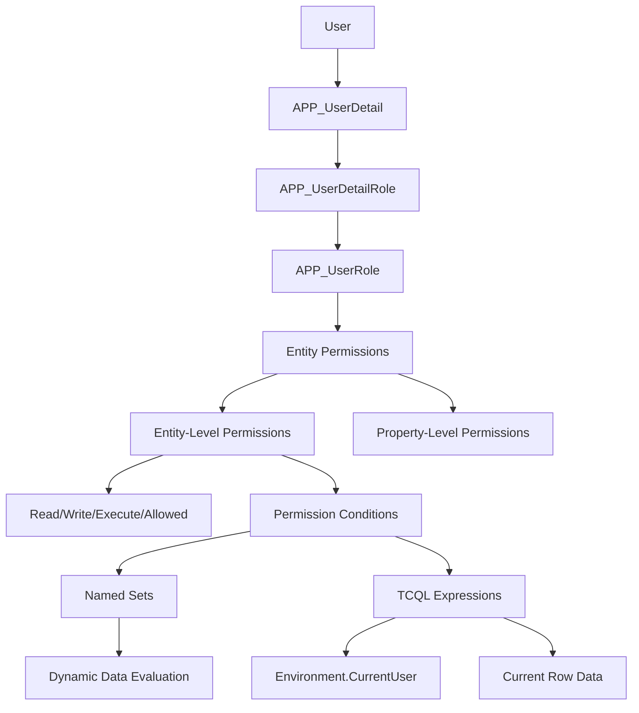
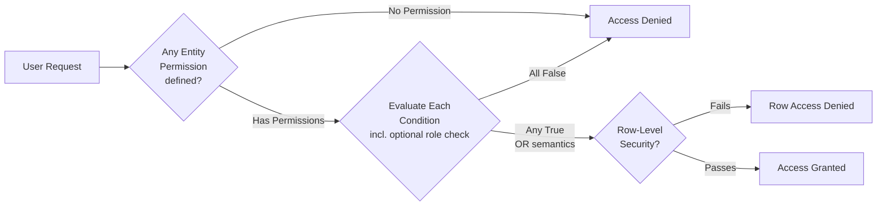

# Permissions & Security Guide

Time cockpit implements a sophisticated multi-layered security system that combines **role-based access control (RBAC)** with **row-level security (RLS)** using dynamic **Named Sets** and permission conditions.

## Security Architecture Overview



## Permission Concepts

### 1. Access Types

Every permission specifies which operations it controls. The underlying enum contains both the combined `Write` flag and the individual CRUD bit flags:

| Access Type | Value | Description |
|-------------|-------|-------------|
| **Read** | 1 | View entity data |
| **Insert** | 2 | Create new records; included in `Write` |
| **Update** | 4 | Modify existing records; included in `Write` |
| **Delete** | 8 | Remove records; included in `Write` |
| **Write** | 15 | Combined data-write permission; includes `Read`, `Insert`, `Update`, and `Delete` |
| **Execute** | 16 | Run actions; used for action execution permissions |
| **Allowed** | 32 | Generic function permission used by the framework |

In everyday documentation and tenant configuration, the most common permission types are `APP_ReadPermission`, `APP_WritePermission`, and action-specific `APP_ExecutePermission`.

### 2. Permission Evaluation Flow



> **Multiple permissions are OR-ed**: if more than one permission is defined for an entity and access type, access is granted as soon as *any one* condition evaluates to `True`.

### 3. Named Sets

Named Sets are **dynamic queries** that evaluate at runtime to provide context-aware security:

**Purpose**: Pre-calculate lists of entities the current user can access
**Evaluation**: Runs when permission is checked
**Caching**: Results cached per request for performance

## Standard Roles

Time cockpit includes predefined roles with specific capabilities:

### Admin Roles

**BillingAdmin**
- Full access to invoicing, projects, customers
- Can create/edit/delete invoices
- Views all timesheets for billing purposes

```tcql
-- Example: Invoice write permission
'BillingAdmin' In Set('CurrentUserRoles')
```

**HumanResourcesAdmin**
- Manages users, departments, working time
- Approves absences (vacation, sick leave)
- Views all employee data

```tcql
-- Example: UserDetail full access
'HumanResourcesAdmin' In Set('CurrentUserRoles')
```

**BaseDataAdmin**
- Manages master data (articles, units, customers)
- Cannot access financial or employee data
- Maintains reference tables

### Manager Roles

**ProjectManager**
- Views projects they manage
- Sees timesheets on their projects
- Cannot modify others' time entries

```tcql
-- Example: Project manager sees their projects
'ProjectManager' In Set('CurrentUserRoles') And 
(Current.APP_Manager1 = Environment.CurrentUser.UserDetailUuid Or
 Current.APP_Manager2 = Environment.CurrentUser.UserDetailUuid)
```

**DepartmentLead**
- Manages department members
- Approves absences for their department
- Views department timesheets

```tcql
-- Named Set: APP_MyDepartmentsAsLead
From DL In APP_DepartmentLead
Where DL.APP_UserDetail = Environment.CurrentUser.UserDetailUuid
Select DL.APP_Department

-- Permission condition: Department lead sees their department
Current.APP_Department In Set('APP_MyDepartmentsAsLead')
```

### Standard User

**User** (base role)
- Creates own timesheets
- Views own data only
- Submits vacation requests

## Common Permission Patterns

### Pattern 1: Own Data + Admins

**Use Case**: Users see their own records, admins see all

**Example**: Timesheets
```tcql
:Iif(
  'BillingAdmin' In Set('CurrentUserRoles') Or
  'HumanResourcesAdmin' In Set('CurrentUserRoles'),
  True,  -- Admins see everything
  Current.APP_UserDetail = Environment.CurrentUser.UserDetailUuid  -- Users see own
) = True
```

**Example**: Vacation requests
```tcql
:Iif(
  'HumanResourcesAdmin' In Set('CurrentUserRoles'),
  True,  -- HR sees all absences
  Current.APP_UserDetail = Environment.CurrentUser.UserDetailUuid  -- Users see own
) = True
```

### Pattern 2: Hierarchical Manager Access

**Use Case**: Managers see their subordinates' data

**Example**: Department-based timesheet access
```tcql
:Iif(
  'HumanResourcesAdmin' In Set('CurrentUserRoles'),
  True,  -- HR admin sees all
  :Iif(
    Current.APP_UserDetail = Environment.CurrentUser.UserDetailUuid,
    True,  -- Users see own timesheets
    :Iif(
      'DepartmentLead' In Set('CurrentUserRoles') And 
      Current.APP_UserDetail.APP_Department In Set('APP_MyDepartmentsAsLead'),
      True,  -- Department leads see their department
      False
    )
  )
) = True
```

### Pattern 3: Project-Based Access

**Use Case**: Project managers access project-related data

**Example**: Project timesheet visibility
```tcql
:Iif(
  'BillingAdmin' In Set('CurrentUserRoles'),
  True,
  :Iif(
    Current.APP_UserDetail = Environment.CurrentUser.UserDetailUuid,
    True,  -- Own timesheets
    :Iif(
      'ProjectManager' In Set('CurrentUserRoles') And
      (Current.APP_Project.APP_Manager1 = Environment.CurrentUser.UserDetailUuid Or
       Current.APP_Project.APP_Manager2 = Environment.CurrentUser.UserDetailUuid),
      True,  -- Project manager's projects
      False
    )
  )
) = True
```

### Pattern 4: Conditional Write Access

**Use Case**: Restrict modifications based on state

**Example**: Can't edit billed timesheets
```tcql
-- Read permission: see timesheet
'BillingAdmin' In Set('CurrentUserRoles') Or
Current.APP_UserDetail = Environment.CurrentUser.UserDetailUuid

-- Write permission: can only edit if not billed
:Iif(
  'BillingAdmin' In Set('CurrentUserRoles'),
  True,  -- Admins can edit anything
  :Iif(
    Current.APP_UserDetail = Environment.CurrentUser.UserDetailUuid And
    Current.APP_Billed = False,  -- Not yet invoiced
    True,
    False
  )
) = True
```

**Example**: Close own timesheets only
```tcql
-- APP_DeviatingBookingCompletionDate property permission
:Iif(
  'HumanResourcesAdmin' In Set('CurrentUserRoles'),
  True,
  :Iif(
    Current.APP_UserDetailUuid = Environment.CurrentUser.UserDetailUuid And
    (Current.APP_AllowDeviatingBookingCompletionDateUntil = Null Or
     Current.APP_AllowDeviatingBookingCompletionDateUntil >= :Today()),
    True,
    False
  )
) = True
```

### Pattern 5: Feature Flag Based

**Use Case**: Enable/disable permissions based on tenant settings

```tcql
-- Disable default permissions if feature flag is off
:Iif(:IsFeatureFlagEnabled('APP_DefaultPermissions'), False, True)
```

## Named Sets Reference

### Built-in Named Sets

#### CurrentUserRoles
Returns the roles assigned to the current user.

```tcql
-- Definition
From R In APP_UserDetailRole 
Where 
    R.APP_UserDetail = Environment.CurrentUser.UserDetailUuid
    And (R.APP_ValidFrom = Null Or R.APP_ValidFrom <= :Today())
    And (R.APP_ValidTo = Null Or R.APP_ValidTo >= :Today())
Select New With { R.APP_UserRole.APP_Code }

-- Usage
'BillingAdmin' In Set('CurrentUserRoles')
```

#### APP_MyDepartmentsAsLead
Returns departments where the current user is a department lead.

```tcql
-- Definition
From DL In APP_DepartmentLead
Where 
    DL.APP_UserDetail = Environment.CurrentUser.UserDetailUuid
Select DL.APP_Department

-- Usage
Current.APP_Department In Set('APP_MyDepartmentsAsLead')
```

#### APP_MyManagedProjects
Returns projects where the current user is Manager1 or Manager2.

```tcql
-- Definition
From P In APP_Project
Where 
    P.APP_Manager1 = Environment.CurrentUser.UserDetailUuid Or
    P.APP_Manager2 = Environment.CurrentUser.UserDetailUuid
Select P

-- Usage
Current.APP_Project In Set('APP_MyManagedProjects')
```

### Creating Custom Named Sets

Named sets can be created programmatically to support custom security scenarios:

**Example**: Projects where user has booked time
```tcql
-- Named Set: APP_MyProjectsWithTime
From T In APP_Timesheet
Where T.APP_UserDetail = Environment.CurrentUser.UserDetailUuid
Select Distinct T.APP_Project
```

## Property-Level Permissions

Restrict access to specific properties (fields) within an entity.

**Use Case**: Hide salary information from non-HR users

```tcql
-- APP_UserDetail.APP_HourlyRate property permission
:Iif(
  'HumanResourcesAdmin' In Set('CurrentUserRoles') Or
  'BillingAdmin' In Set('CurrentUserRoles'),
  True,  -- Admins can see/edit hourly rate
  :Iif(
    Current.APP_UserDetailUuid = Environment.CurrentUser.UserDetailUuid,
    True,  -- Users can see their own rate
    False  -- Others cannot see
  )
) = True
```

**Use Case**: Lock invoice numbers after creation

```tcql
-- APP_Invoice.APP_InvoiceNumber - read-only after set
:Iif(
  Current.APP_InvoiceNumberIsSet = True,
  True,  -- Read-only if already set
  False  -- Editable before set
)
```

## Action Permissions

Control who can execute specific actions (e.g., Create Invoice, Approve Vacation).

**Example**: Billing admin only for invoicing
```tcql
-- APP_CreateInvoiceAction execute permission
:Iif('BillingAdmin' In Set('CurrentUserRoles'), True, False) = True
```

**Example**: Department leads approve absences
```tcql
-- APP_ApproveAbsenceAction
-- Implemented in action code - checks department membership
'DepartmentLead' In Set('CurrentUserRoles') Or
'HumanResourcesAdmin' In Set('CurrentUserRoles')
```

## Security Best Practices

### 1. Principle of Least Privilege

**❌ Bad**: Grant broad access
```tcql
'User' In Set('CurrentUserRoles')  -- Too permissive
```

**✅ Good**: Grant specific access
```tcql
:Iif(
  'BillingAdmin' In Set('CurrentUserRoles'),
  True,
  Current.APP_UserDetail = Environment.CurrentUser.UserDetailUuid
) = True
```

### 2. Use Named Sets for Complex Logic

**❌ Bad**: Repeat complex queries in every permission
```tcql
-- Repeated in multiple permissions
(From DL In APP_DepartmentLead 
 Where DL.APP_UserDetail = Environment.CurrentUser.UserDetailUuid
 Select DL.APP_Department) Contains Current.APP_Department
```

**✅ Good**: Define once as named set
```tcql
Current.APP_Department In Set('APP_MyDepartmentsAsLead')
```

### 3. Test Permission Boundaries

Always test:
- ✅ Users can access their own data
- ✅ Users CANNOT access others' data
- ✅ Managers can access subordinate data
- ✅ Managers CANNOT access peer data
- ✅ Admins can access everything

### 4. Document Custom Permissions

```tcql
/* Permission: ProjectManagerReadAccess
   Purpose: Project managers see timesheets on projects they manage
   Roles: ProjectManager, BillingAdmin
   Condition: User is Manager1 or Manager2 of the project */
:Iif(
  'BillingAdmin' In Set('CurrentUserRoles'),
  True,
  :Iif(
    'ProjectManager' In Set('CurrentUserRoles') And
    (Current.APP_Project.APP_Manager1 = Environment.CurrentUser.UserDetailUuid Or
     Current.APP_Project.APP_Manager2 = Environment.CurrentUser.UserDetailUuid),
    True,
    False
  )
) = True
```

### 5. Audit Permission Changes

When modifying permissions:
1. Document the change and reason
2. Test with affected user roles
3. Review with security/compliance team
4. Monitor for unintended access patterns

## Troubleshooting Permissions

### "Access Denied" Errors

**Step 1**: Identify which permission failed
- Entity-level? (Can't read/write entity at all)
- Row-level? (Can see some records but not this one)
- Property-level? (Can't see/edit specific field)
- Action permission? (Can't execute action)

**Step 2**: Check user's roles
```tcql
-- Query current user's roles
From R In APP_UserDetailRole
Where R.APP_UserDetail = Environment.CurrentUser.UserDetailUuid
And (R.APP_ValidFrom = Null Or R.APP_ValidFrom <= :Today())
And (R.APP_ValidTo = Null Or R.APP_ValidTo >= :Today())
Select R.APP_UserRole.APP_Code
```

**Step 3**: Evaluate permission condition manually

Test the condition with known values:
- Replace `Environment.CurrentUser.UserDetailUuid` with actual UUID
- Replace `Current.XXX` with actual record values
- Check Named Set results

**Step 4**: Check feature flags
```tcql
-- Is default permissions enabled?
:IsFeatureFlagEnabled('APP_DefaultPermissions')
```

### Permission Not Working As Expected

**Common Issues**:

1. **Role not assigned**: User doesn't have the required role
   - Solution: Assign role via `APP_UserDetailRole`

2. **Role expired**: `ValidFrom`/`ValidTo` dates exclude today
   - Solution: Update date ranges

3. **Named set returns empty**: Dynamic query has no results
   - Solution: Debug the named set query independently

4. **Wrong department**: User is in different department
   - Solution: Update `APP_UserDetail.APP_Department`

5. **Permission disabled**: `IsDisabledExpression` evaluates to `True`
   - Solution: Check feature flags or conditions

## Advanced: Custom Security Scenarios

### Scenario 1: Time-Based Access

Restrict editing to within booking completion period:

```tcql
-- Can only edit timesheets before booking completion date
:Iif(
  'BillingAdmin' In Set('CurrentUserRoles'),
  True,
  :Iif(
    Current.APP_UserDetail = Environment.CurrentUser.UserDetailUuid And
    Current.APP_DateActual > :BookingCompletionDateOfUser(Environment.CurrentUser.UserDetailUuid),
    True,  -- Can edit recent timesheets
    False  -- Cannot edit old/closed timesheets
  )
) = True
```

### Scenario 2: Customer-Specific Visibility

Let account managers see only their assigned customers:

```tcql
-- Custom Named Set: APP_MyManagedCustomers
From C In APP_Customer
Where C.APP_AccountManager = Environment.CurrentUser.UserDetailUuid
Select C

-- Permission: Account manager sees their customers
:Iif(
  'BillingAdmin' In Set('CurrentUserRoles'),
  True,
  Current In Set('APP_MyManagedCustomers')
) = True
```

### Scenario 3: Multi-Tenant Isolation

Ensure users only see data from their company:

```tcql
-- All entities: Tenant isolation
:Iif(
  'SystemAdmin' In Set('CurrentUserRoles'),  -- System admin sees all tenants
  True,
  Current.APP_Company = Environment.CurrentUser.UserDetail.APP_Company  -- Same company only
) = True
```

## See Also

- [Standard Entities Reference](standard-entities.md) - Entity-specific permissions
- [Named Sets Documentation](../data-model-customization/named-sets.md)
- [TCQL Expression Language](../tcql/expression-language.md)
- [Default Permissions Migration Guide](../migration-guides/default-permissions.md)
- [Data Model Customization - Permissions](../data-model-customization/permission.md)
