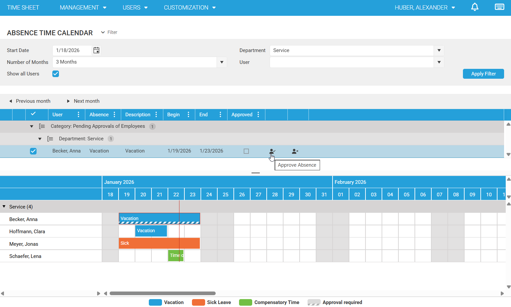
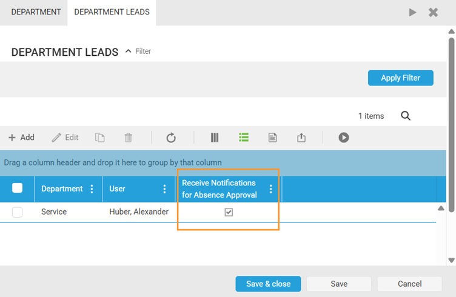
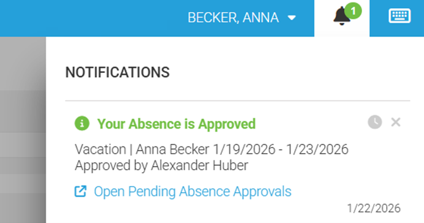

# Absence Approval Workflow (Vacation, Compensatory Time Off, Sick Leave)

Time cockpit supports an absence approval workflow that can be enabled in [Global Settings](https://web.timecockpit.com/app/forms/entity/APP_GlobalSettings) per absence type. This helps organizations manage leave requests consistently and review pending approvals in the [absence calendar](https://web.timecockpit.com/app/absence-time-calendar).

> [!NOTE]
> Absence approvals are controlled in two places:
> - Global Settings (per absence type)
> - User master data (per user via "Absence approval required")

## Absence types covered by approvals

The approval workflow can be enabled separately for all three absence types in time cockpit:

- [Vacation/Special Vacation](https://web.timecockpit.com/app/forms/entity/APP_Vacation)
- [Compensatory Time Off](https://web.timecockpit.com/app/forms/entity/APP_CompensatoryTime)
- [Sick Leave](https://web.timecockpit.com/app/forms/entity/APP_SickLeave)

Once you enable approvals for a category, users must have their absences of that category approved by either their supervisor (the department lead of their assigned department; the Department-Lead role is required) or a user with the HR-Admin role.

## When is an absence approval required?

Approvals are only required for users who have this enabled in their user master data via the checkbox "Absence approval required".

For users where absence approval is not required, newly created absences are automatically marked as approved (as long as the approval workflow is enabled in Global Settings for the corresponding absence type).

> [!TIP]
> If approvals are enabled globally but a user does not require approval, their new absences will be approved automatically.

## Important: Existing absences after enabling approvals

From the moment you enable the workflow in Global Settings and in user master data, unapproved absences (including absences in the past created before enabling this feature) are shown as unapproved in the absence calendar depending on permissions. Completed absences from before the activation must therefore be approved retroactively.

> [!IMPORTANT]
> After enabling the workflow, older absences may appear as unapproved and might need retroactive approval.

## Absence calendar visibility by user role

The following table provides a quick overview of what each role can see and do in the absence calendar.

| Role | Absences shown in calendar | Absence type visible for colleagues | Pending approvals list | Can approve / reject | Additional filters |
|---|---|---:|---:|---:|---|
| Time Tracking User | Assigned department | No | Own only | No | — |
| Department Lead | Own department + departments where user is department lead | Yes | Own + users in department lead's department | Yes | — |
| Human Resources Admin | Assigned department (default) | Yes | Own only (default) | Yes (on behalf of department leads) | Show all users, Department, User |

### Time Tracking User

Sees all absences of users in their assigned department in the absence calendar. For colleagues' absences, the absence type (Vacation, Sick Leave, Compensatory Time Off) is intentionally not visible. In the list above the calendar, only the user's own unapproved absences are shown.

> [!NOTE]
> This privacy setting prevents users from identifying whether a colleague is on vacation, sick leave, or compensatory time off.

### Department Lead

Sees all absences of users in their own assigned department and also absences of users in any departments where the user is assigned as department lead. Each user can be assigned to only one department (in user master data). However, a user can be assigned as department lead in multiple departments (department master data).

In the absence list, the department lead sees their own unapproved absences as well as unapproved absences of users in the department of the department lead.

### Human Resources Admin

Sees all absences of users in their assigned department in the absence calendar. In the list of unapproved absences, only the user's own unapproved absences are shown.

As a Human Resources Admin, you can approve absences for all users on behalf of department leads. To do this, you can use the additional filters:

- Checkbox "Show all users"

When you enable this checkbox, the absence calendar loads absences for all users and the list shows all unapproved absences. To narrow down the data, you can use the two filter fields Department and User:

- Dropdown "Department"
- Dropdown "User"

> [!TIP]
> Use "Show all users" only when needed, then narrow down with Department and User to keep the calendar and approval list manageable.

## Approving and rejecting absences

Department Leads and Human Resources Admins can approve or reject absences with pending approval in the list above the absence calendar. This is done using the two actions in the rightmost columns.

Before approving or rejecting, you can select a row to preview the absence in the calendar below. The calendar automatically jumps to the start date of the absence. This makes it easier to compare it with existing absences of other users in the same department and consider overlaps during the approval decision.

> [!TIP]
> Select an absence in the list to highlight it in the calendar and jump directly to the relevant date range.

View as Human Resources Admin:

## Automatic notifications in the approval workflow

When a user creates a new absence, the department leads of that user are automatically informed about the pending approval via a notification in time cockpit (bell icon in the top-right menu). If needed, notifications for department leads can be disabled per department lead in the department master data.

If an absence is approved or rejected, the notifications created for the department leads are automatically deleted.

After approval or rejection, the requesting user also receives a notification including when and by whom the absence was processed. In case of rejection, the processing person can provide a rejection reason, which is included in the notification to the requesting user.

Additionally, when an absence is rejected, it is deleted. Notifications for approved absences are not automatically deleted and can be kept as written confirmation.

> [!WARNING]
> Rejected absences are deleted. Approved-absence notifications are kept and can serve as written confirmation.

