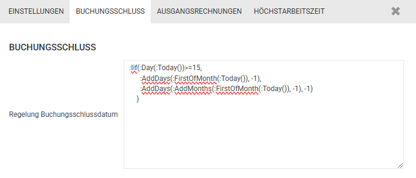
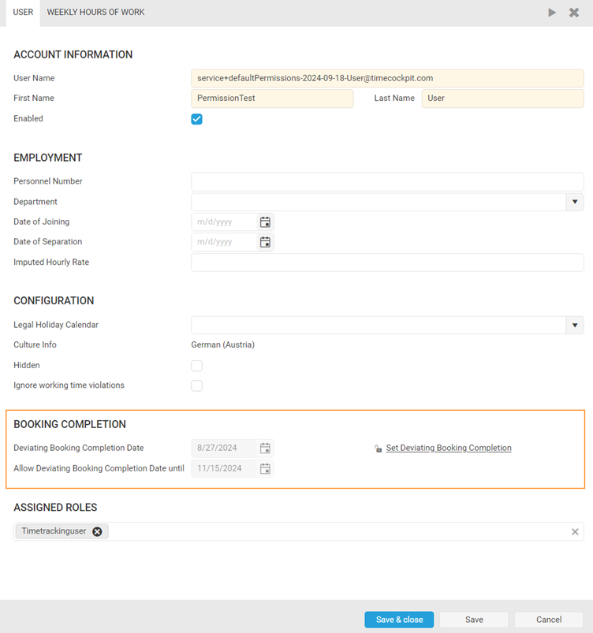

# Passive Booking Completion in Time Cockpit

## Overview

As part of the introduction of the new standard permissions, a new field has been added to the global settings in **time cockpit** to configure the rules for passive booking completion. This field allows the use of any TCQL expression that must return a valid date. 

By default, the preconfigured TCQL expression sets the booking cutoff date to the last day of the previous month starting from the **15th of each month**. This means that from the 15th of the current month, it is no longer possible to make changes to time tracking entries or absences in the previous month.

> [!NOTE] At the moment, the **Booking Completion** feature is technically coupled with the **Default Permissions** functionality (see our [migration guide](~/doc/migration-guides/default-permissions.md) for details).
If you would like to have it enabled in your environment, feel free to reach out to us at [support@timecockpit.com](mailto:support@timecockpit.com) – we're happy to activate it for you.

## How It Works

### Default Configuration

- Navige to [Global Settings](https://web.timecockpit.com/app/lists/entity/APP_GlobalSettings) to change the configuration.
- The default TCQL expression ensures that:
  - From the **15th of each month**, the **booking period** for the previous month is closed.
  - No further changes can be made to time tracking entries or absences from the closed period.

### Example Scenario
If today is **April 16th**, the booking period for **March** will already be closed, preventing any edits to time entries or absences for that period.

> [!NOTE] Users are not allowed to change time sheet entries AND absence times after prior to the booking completion date.

### Applicability Across Roles

This rule applies to **all user roles**, including those with the "Human Resources Admin" role. Even HR administrators cannot modify time entries or absences in a locked period.

## Adjusting the Booking Completion

If adjustments to time tracking entries are required within a locked period, an **individual override** for the booking completion can be configured. Users with the "Human Resources Admin" role can define an **deviating booking completion date** for individual users in their settings.

### Defining an Deviating Booking Completion Date
When setting an deviating date:
1. **Validity Period**: Specify how long the override will remain in effect.
2. Once the validity period expires, the global settings will automatically apply again.

## Restrictions on Reopening Booking Periods

Opening a closed booking period is subject to the following restrictions:
- The booking period **cannot be reopened** if the user has **overtime corrections** in the period to be reopened.
- If reopening is necessary despite existing overtime corrections:
  1. The overtime corrections must first be **deleted**.
  2. After adjustments are made to the time tracking entries, the corrections must be **recreated with the correct values**.

> [!NOTE] These restrictions ensure that the attendance time stays always consistent.

## Configuration Example

Below is an example of the global settings screen for configuring the passive booking completion:

> [!NOTE] Please be aware that if you have customized your time cockpit UserDetail form, the booking completion fields might not be visible. In that case, please contact support@timecockpit.com.

For further assistance or questions about configuring passive booking completion, please contact your system administrator.