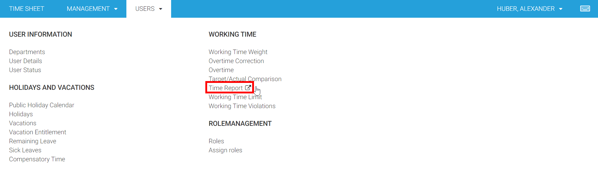
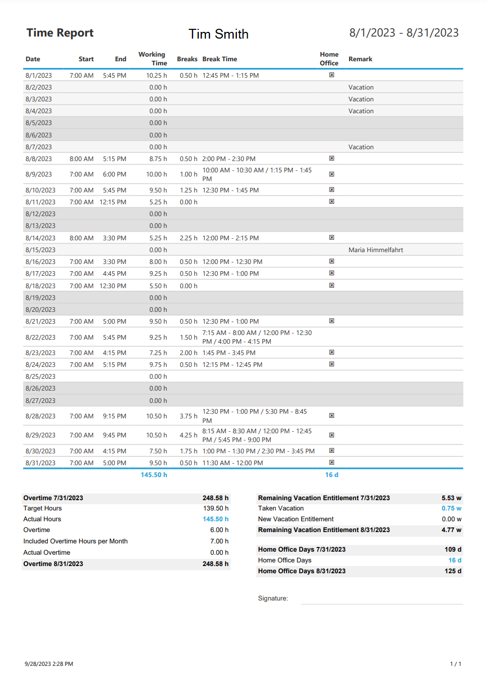

# Time Reports

The **Time Report** feature in Time Cockpit provides a detailed summary of working time-related information for a specific user during a defined working period. This comprehensive report can be used for tracking and analyzing working hours, breaks, and other essential details.

The report is located at ```USERS --> WORKING TIME --> Time Report```



## Report Key Elements



1. **User Information:** The report begins with the user's name, allowing you to easily identify the individual to whom the report pertains.

2. **Date:** Each row represents a specific date within the working period.

3. **Working Time:** It shows the user's working hours for the corresponding date, including the start and end times.

4. **Breaks:** The sum of all breaks during the working time. That is all unbooked time.

4. **Break Time:** The report lists the breaks taken during the day, including the total break time for that date.

5. **Home Office:** In some cases, users may work from home. This field indicates whether the user worked from home on a particular date. The report always calculates the home office days since the beginning of the year. Additionally it gives you the number of home offices days for the selected period of time.

6. **Remarks:** Holds additional comments or notes about the work or any special circumstances, like vacations, compensatory times or sick leaves. It does not hold information about actual time sheet entries.

7. **Summary Section:** Towards the end of the report, a summary section displays essential information for the entire reporting period. This includes the total working hours, number of working days, and overtime (if applicable).

8. **Overtime Column:** The report gives you information about 
* the overtime balance at the start of the period
* the planned hours of the user
* the actual working hours of the user
* the overtime in the selected period of time
* the included lump sum overtime per month
* the acutal overtime that goes beyond the included lump sum overtime

9. **Vacation Column:** If the user has taken any vacation days during the reporting period, this section provides an overview of remaining and taken vacation days.

9. **Home Office Column:** This section provides information, if the user has any home office days in the current year or the selected period.

10. **Signature:** This area is intended for a digital signature or acknowledgment.

> [!NOTE]
As always, you can create your own report using SSRS [reporting](~/doc/reporting/custom-reports.md) or contact us at support@timecockpit.com to create your custom report for you.

### Use Cases

- **Employee Tracking:** Human resources and management can use this report to keep track of an employee's daily work hours, ensuring adherence to work schedules and regulations.

- **Overtime Monitoring:** The report helps in identifying overtime hours worked by the employee during the specified period.

- **Leave Management:** It simplifies tracking vacation days and remaining leave entitlement for payroll and scheduling purposes.

## Download Time Reports for Multiple Users

Users can conveniently generate time reports in PDF or Excel format for a specified time period. This feature is particularly useful for users who need to generate time reports for multiple individuals, especially at the end of the month.

TODO: video

### Accessing the Feature
1. Navigate to the user list within time cockpit.
2. Select multiple users for whom you wish to generate time reports.
3. Click on the "Actions" menu.

### Generating Time Reports
1. In the "Actions" menu, choose the "Print Time Reports" option.
2. An opening dialog will appear, allowing you to configure the report generation.

### Configuring Time Reports
1. In the dialog, you can specify the desired time period for which the reports should be generated.
2. Select the file format, either PDF or Excel.

### Generating Reports
1. After configuring the parameters, execute the action.
2. Time Cockpit will initiate the report generation process for each selected user.
3. The generated reports will be packed into a ZIP archive.
4. Download the reports.