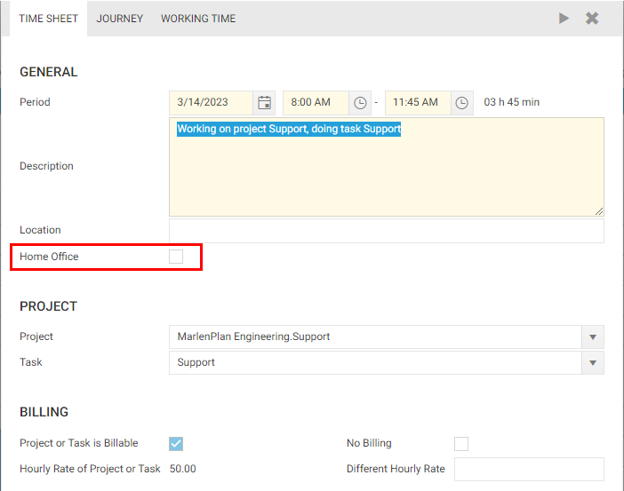
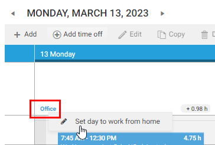
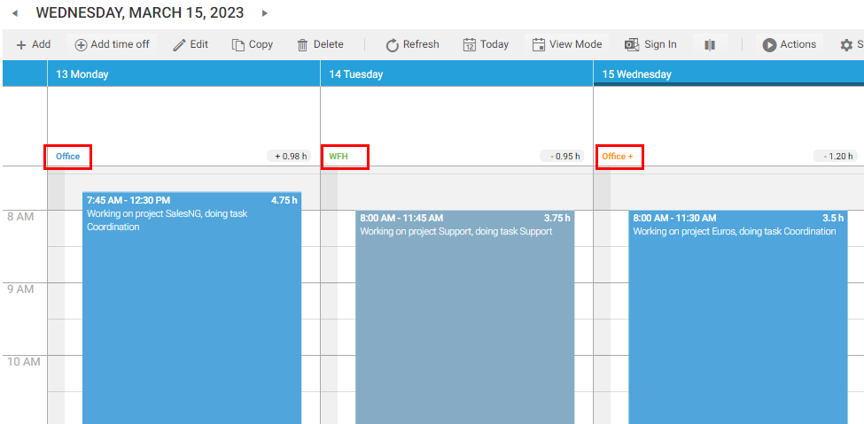
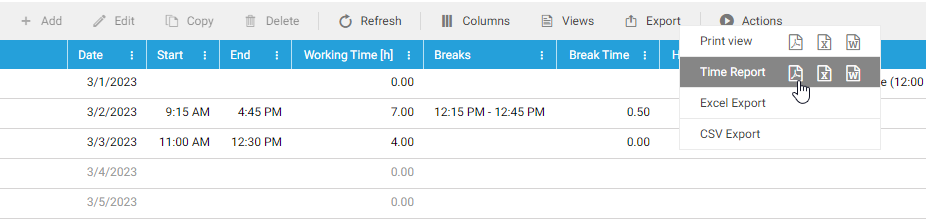
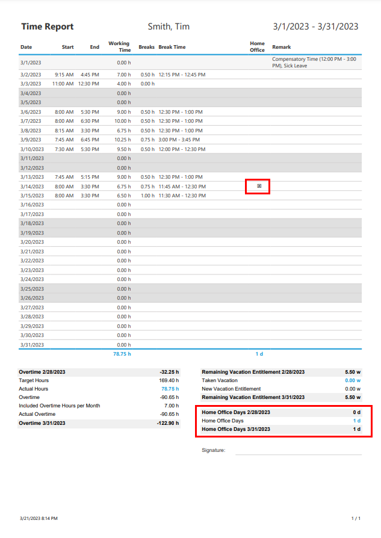

# Work From Home vs. Office

Since the corona pandemic remote work has become increasingly common. Time cockpit allows you to flag time sheet entries as work from home or office. This information can be important for various reasons. Various companies use this information to optimize their office space usage and reduce costs. Additionally, some countries (like Austria) offer special allowances for days spent working from home. Thus, it is important to accurately track work from home days to ensure that employees are paid the correct allowances.

# Flagging a Time Sheet Entry

By default, all time sheet entries that are created are marked as **office work**. To indicate that you performed a task at home (or remote), check the **Home Office** flag in the time sheet form.

> [!NOTE] 
Please be aware, that this only sets the given time sheet entry to **Home Office**. It does not indicate that you spent the whole day working from home.

# Flagging a Whole Day

If you want to set a whole day to **Office** or **Work From Home** you can do that directly in the time sheet calendar.

1. Look for the work location indicator in the top row of the time sheet calendar.
2. Right-click the indicator with your mouse.

1. If all your time sheet entries on a given day are marked as **Home Office**, the indicator will display **Office** and you set the whole day to work from home. This will set the **Home Office** flag on all the time sheet entries on a given day.
2. If none of your time sheet entries are marked as **Home Office** the indicator will display **WFH** and you set the whole day to office This will remove the **Home Office** flag on all the time sheet entries on a given day.
3. If you have a mixture of office and work from home (e.g. you worked from home in the afternoon), time cockpit will show a **Office+** indicator (see the following screenshot).

> [!NOTE] 
In some countries employees are only payed work from home/home office allowances if the **whole** working time was spent at home. That is, all time sheet entries on a given day must be marked as **Home Office**.

# Reporting

In the standard data model, time cockpit displays the information if an employee has spent her day in the office or at home in the time report.

1. Navigate to [Time Report](https://web.timecockpit.com/app/lists/APP_DefaultTimeReportList) to view the standard time report or navigate to **Users** --> **Working Time** --> **Time Report** in the menu
2. Click **Export** --> **Time Report** to open the printable PDF time report.

1. The time report marks each day a user has spent working from home with a little checkbox. Further, it gives you an aggregated value how much time an employee has spent working from home in the given period of time.

> [!NOTE] 
If you want to analyse information about your employees working from home in a different way, take a look at time cockpit's [customization capabilities](~/doc/data-model-customization/overview.md) or drop us a mail at support@timecockpit.com.