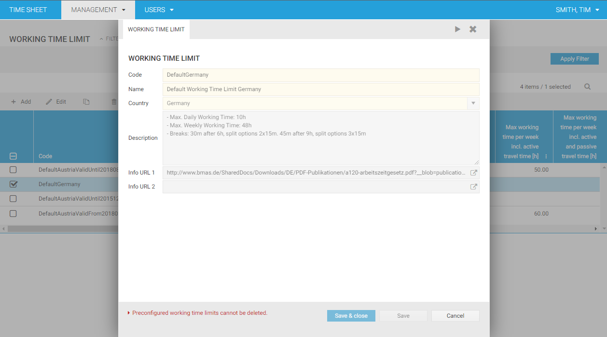
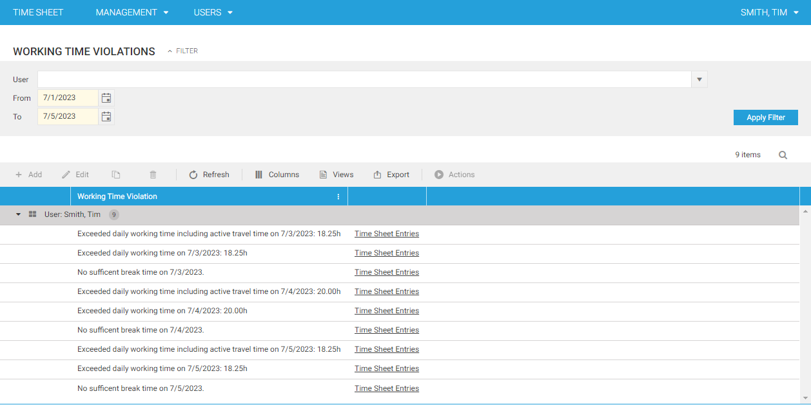

# Working Time Regulations	

Since version 1.39, time cockpit provides a set of predefined rules for Austria and Germany that can be used to determine violations of working time limits in a given period.

> [!WARNING]
Please note that time cockpit does not ensure that legal obligations are fulfilled. It is the responsibility of the company using time cockpit to ensure to determine the applicable working time limits and enforce them. time cockpit only helps to highlight possible violations of working time limits.

## Predefined Working Time Limits

Predefined working time limits are shipped for Austria and Germany.

> [!WARNING]
Please note that time cockpit is not liable for the correctness of these rules.

- Limits for Austria
    - 10 hours maximum per day
    - 50 hours maximum per week
    - 30 minutes break after 6 hours (2x15 or 3x10 minutes)
- Limits for Germany
    - 10 hours maximum per day
    - 48 hours maximum per week
    - 30 minutes break after 6 hours (2x15 minutes), 45 minutes break after 9 hours (3x15 minutes)

Per default, time cockpit does not check any working time limits. You need to enable the checks once in the global settings. Further, you need to enable the checks that are actually performed. That is, you can disable certain checks if they do not apply to your company.

Per default, time cockpit does not take travel times into account for determining an exceedance of a working time limit. A time sheet entry counts as a travel if at least a means to transport is selected.

Per default, time cockpit does not take duration time sheet entries into account. This is because duration time sheet entries do not have a begin- or end time. This is because time cockpit cannot determine if a break was held within a certain period of time.

In the module **User** in the section **Working Time** you can view the violations under **Working Time Violations**. You can filter for a certain user and a select a period of time that should be checked for violations.

> [!NOTE]
Please note that by default time cockpit will select the current month as period. However, time cockpit will expand the period you selected to always include full weeks at the beginning and end of the period. If it would not do that, it would potentially miss violations of a weekly working time limit. Exceedance of the working time per day, are only calculated for the exact period you chose in the filter.

## Configurable Working Time Limits

If the working time limits of Austria and Germany do not apply to you, you can configure your own working time limits in time cockpit. You can do that in **Working Time Limits** in the module **User**. For the working time limit to work, you need to set four parameters:

- Max working time per day: Indicates the maximum number of hours worked on a day
- Max working time per week: Indicates the maximum number of hours worked in a week
- Break after: Indicates the hours after which the first break needs to be taken
- Min break length: Indicates minimum number of minutes after Break after

> [!NOTE]
In contrast to the pre-configured limits for Austria and Germany, you cannot configure splitting options for breaks.

## Custom Working Time Limits

If neither the Austrian/German nor a configured limit suffices, you can implement your custom rules. That may be required if you have custom working time weights that do not count to the working time or have complex break splitting rules in your company. Please contact [support@timecockpit.com](mailto:support@timecockpit.com) if you are interested in how to implement custom working time limits.