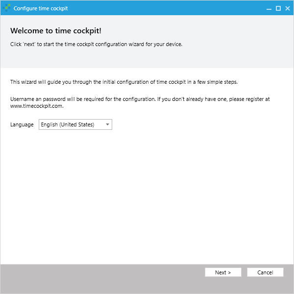
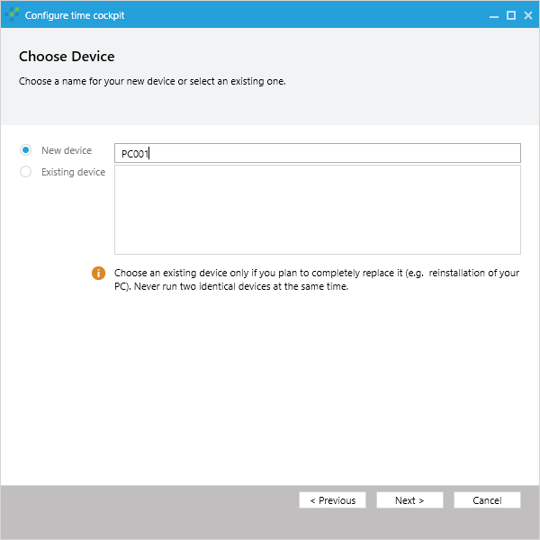
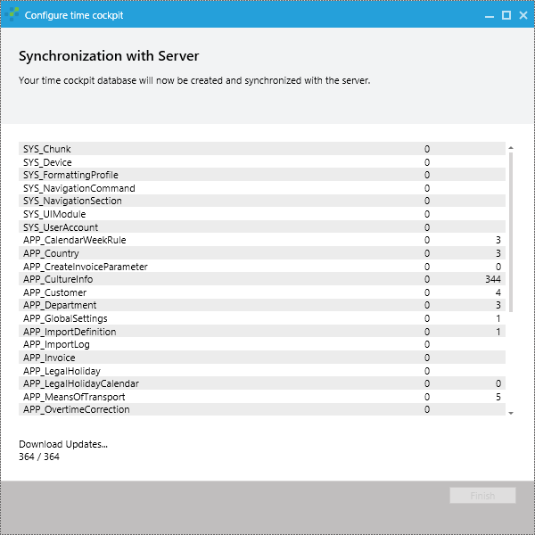

# Configuration Wizard

> [!NOTE]
After installing time cockpit successfully the configuration wizard will guide through the first steps to configure time cockpit. If you cancel the configuration wizard, time cockpit will show the wizard again the next time you start time cockpit.

> [!NOTE]
You need to have internet access to install and configure time cockpit. In chapter [system requirements](installation-instructions.md#system-requirements) you will find the requirements for the firewall configuration. If time cockpit cannot connect to SQL Azure, the configuration wizard cannot be completed.

## Step 1 - Choose Your Language

First of all select the language for your time cockpit installation. You can change the language anytime later in the options dialog.



## Step 2 - Enter Username and Password

Enter username and password of your time cockpit user. You have to enter your credentials only the first time you are starting time cockpit. They will be stored encrypted on your computer so you do not have to enter it again.

If you do not have a time cockpit yet, you can create a new one at the [time cockpit website](https://www.timecockpit.com). After your account is created successfully, you will receive an email with installation and configuration instructions.


## Step 3 - Choose Your Local Storage Location

Choose the storage location of your local time cockpit database. time cockpit is offline-capable similar to Microsoft Office Outlook. If you have internet access, changes are synchronized automatically every 15 minutes and you can trigger sync manually, but you can also use time cockpit when you are offline.

Find more technical information on the local storage in chapter [system architecture](system-architecture.md).

> [!NOTE]
Time cockpit does not support network drives as storage location.


## Step 4 - Enter the Name of Your Device

You can install time cockpit on multiple devices (e.g. your desktop computer in the office, your notebook, your computer at home). time cockpit will sync changes automatically to all your devices, so every device has to have an unique name. If you install time cockpit on a new device, enter a new unique name. time cockpit will suggest to use your computer name If time cockpit was installed on this device previously, you can select the name of the device in the "existing devices" listbox.

> [!NOTE]
Please make sure that you do not use two devices with the same name at the same time, when using an existing device name. time cockpit will not work correctly and may even lose data when synchronizing two devices with the same name.



## Step 5 - Choose Your Signal Data Password

We need to store your time cockpit username and password (stored hashed) on our servers to allow you to authenticate at our services. But we think that your automatically tracked signal data (see [signal trackers](~/doc/signal-tracker/overview.md)) is worth protecting still more. So you can choose a separate password to encode your signal data.

Contrary to the password that is used for authentication on our servers the signal data password will never be sent to our servers. So there is no way to decode your signal data on another computer than yours. If you are using multiple devices, you will have to enter it on any device you are using time cockpit. If you are using the Silverlight web client, you will have to enter your signal data, too.

> [!WARNING]
Because your password is not stored on our servers, please store your signal data password carefully. If you lose the password, you will lose all stored signals. There is no way to recover them.


## Step 6 - Synchronization

time cockpit now has all information needed und synchronizes data from the server. Usually this takes only a few minutes. Afterwards you can finish the configuration wizard. time cockpit is now ready for use.



## Resetting the Configuration

There are several scenarios why a reset of the local configuration of a time cockpit client might be necessary:

- A different time cockpit user should be used.
- A device has not been used for a long time and is no longer compatible with the other devices of your account.
- The local database has been removed or can no longer be used or synchronized.

The next time the application is started after the configuration has been reset the configuration wizard will be shown. This allows you to run a new initial synchronization for that client.

> [!WARNING]
Please note, that all data that has been created or modified on the client and has not been synchronized will be dismissed.

The configuration can be reset by starting TimeCockpit.UI.exe with the following command line parameter:

```
--reset-configuration
```

As an example the full command to reset the configuration of a default installation is:

```
C:\Program Files\software architects\time cockpit\time cockpit 2010\TimeCockpit.UI.exe --reset-configuration
```

After the configuration has been reset the command line parameter should no longer be passed to the application in order to resume normal operation.

An alternative way of resetting the configuration is to manually delete the local configuration file and data.

- **Configuration file**: Delete Time Cockpit.config in the folder `%LocalAppData%\software architects\time cockpit`.
- **Data**: The default database location is `%LocalAppData%\software architects\time cockpit\data`. The file time cockpit.tic and the folder time cockpit blob store have to be removed. In previous versions of time cockpit the default database location was a folder time cockpit in `My Documents`.