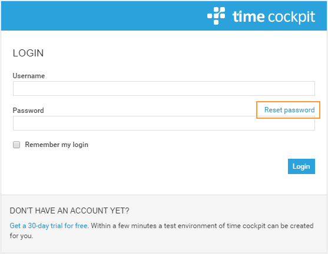
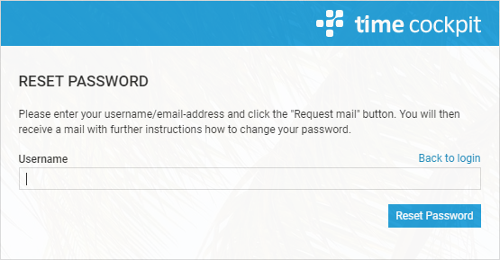
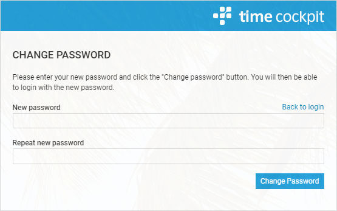

# Reset Password

To reset your password just navigate to the login-page of our time cockpit web client [web.timecockpit.com](https://web.timecockpit.com/) and click at the link 'Reset password'.

Enter your e-mail address you were registered at timecockpit and click the Button 'Reset Password'.

'''In case of an unknown username please contact your time cockpit administrator to find out your registered e-mail address. If you are the time cockpit administrator please contact us at [support@timecockpit.com](mailto:support@timecockpit.com) to ask for your valid e-mail address.'''

After a few minutes you will receive a mail at your entered e-mail address. To set a new password click on the button 'Change password!' and fill in the fields in the opening web site and click on the button 'Change Password'

