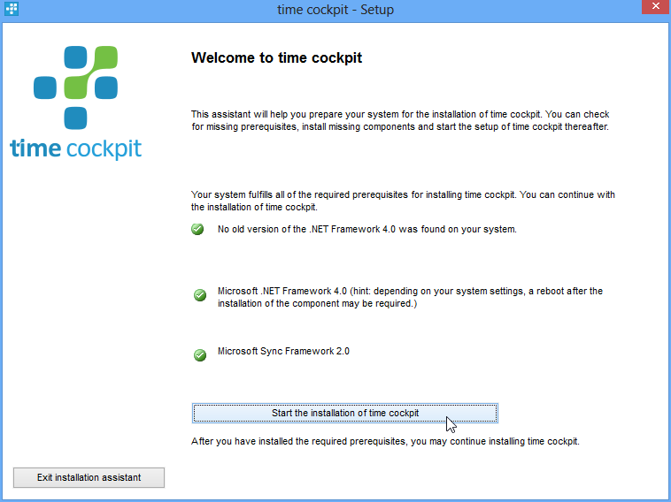

# Installation Instructions	

Download the latest installer for time cockpit from the [time cockpit website](https://www.timecockpit.com). Login with your user and password and go to the "My Account" page. There you will find the latest version of time cockpit. The installation wizard helps you to check, if all prerequisites are installed. If there are missing prerequisites, the installer helps you to install the missing components.

When you start time cockpit the first time the configuration wizard will guide you through the first steps to configure time cockpit.

## System Requirements

time cockpit requires the following software components:

- Supported operating systems: Microsoft Windows XP 32-bit SP3 or higher, Microsoft Windows Vista SP 1 or higher (32- or 64-bit), Microsoft Windows 7 (32- or 64-bit), Microsoft Windows 8 (32- or 64-bit), Microsoft Windows 10 (32- or 64-bit)
- Microsoft .NET Framework 4.0
- Microsoft Sync Framework 2.0
- Microsoft Visual Studio 2010 is required to integrate time cockpit with Microsoft Team Foundation Server. If Microsoft Visual Studio 2010 is not installed, data from Microsoft Team Foundation Server cannot be imported.

You can install all required software components with the [installation wizard](configuration-wizard.md) or you can download them from Microsoft and deploy them automatically (see [installation for IT administrators](#installation-for-it-administrators)).

time cockpit synchronizes all data with Microsoft SQL Azure (find more information in [system architecture](system-architecture.md)). To allow synchronization open ports 443 (web service calls via HTTPS) and 1433 (SQL Azure) outgoing in your firewall.

## Standard Installation

### Installation Wizard

> [!NOTE]
You need to have internet access to install and configure time cockpit, and the ports mentioned in system requirements have to be opened, otherwise the installation will fail.

> [!NOTE]
Please note that original version of time cockpit are always signed with a certificate from software architects. Do not install versions with another publisher than software architects.

The installation wizard will guide you through the following steps to install time cockpit:

1. Start the installation wizard TimeCockpit_[Version].exe.
1. The installation wizards tells you if there are missing system requirements. Please use the respective hyperlinks to install missing requirements.
1. If all requirements are fulfilled, start the time cockpit setup by clicking the button "Start the installation of time cockpit" and follow the instructions on screen.

> [!NOTE]
The installation wizard if time cockpit automatically recognizes if you are working with a 32-bit or 64-bit operation system and installs the respective files in the correct folder.

### Configuration Wizard

After installing time cockpit successfully, the configuration wizard will help you to set up time cockpit when starting it the first time. Learn more about the [configuration wizard ...](configuration-wizard.md)

## Installation for IT Administrators

If you are an IT administrator you possibly want to install all components separate and configure them excactly to your needs. The following instructions show you how to install the prerequisites.

### Installing Microsoft .NET Framework 4.0

time cockpit is based on the Microsoft .NET Framework 4.0. You can download it from [Microsoft .NET Framework 4.0](http://www.microsoft.com/downloads/details.aspx?FamilyID=9cfb2d51-5ff4-4491-b0e5-b386f32c0992&displaylang=en).

> [!NOTE]
Please not that you possibly need to restart your computer after installing Microsoft .NET Framework 4.0. Find more information in this blog entry.

### Installing Sync Framework 2.0

time cockpit uses the Microsoft Sync Framework 2.0 to synchronize data with SQL Azure. Download the Sync Framework from [Microsoft Sync Framework 2.0 Redistributable Package](http://www.microsoft.com/downloads/details.aspx?FamilyID=109DB36E-CDD0-4514-9FB5-B77D9CEA37F6&displaylang=en).

You only need to install the core component `Synchronization-v2.0-x64-ENU.msi` (for 64-bit systems) or `Synchronization-v2.0-x86-ENU.msi` (for 32-bit systems). Other sync framework components like the database providers are not necessary for time cockpit.

### Installing time cockpit

If all prerequisites for time cockpit are installed you can either use the installation wizard or you can use the lightweight installation routines `TimeCockpit.Setup.x86.Release.Productive.msi` or `TimeCockpit.Setup.x64.Release.Productive.msi` to automatically roll out time cockpit without user interaction. Find more information on automating installation on [MSIEXEC](http://msdn.microsoft.com/en-us/library/aa367988(VS.85).aspx). The installation wizard of time cockpit provides a command line parameter [/EXTRACT:[path]](https://help.timecockpit.com/html/93de1e41-f31c-41e4-968b-44166e8be97b.htm#CommandLineSetup) that allows you to extract the MSI packages.

You can also distribute time cockpit by copying all file from the program files folder (usually `%ProgramFiles%\software architects\time cockpit`). Plus you have to create a shortcut in the start menu if desired. time cockpit does not register any COM cor other components.

It is possible to run multiple instances of time cockpit on one computer (e.g. for test purposes or if you are working for multiple companies that use time cockpit). To create a second instance, proceed as follows:

1. Open the folder `C:\program files\software architects\time cockpit` (or your time cockpit installation folder, if you chose another folder).
1. Copy the folder `time cockpit 2010`.
1. In the new folder open the xml configuration file `TimeCockpit.UI.exe.config` with a text editor. Find the attribute `/configuration/appSettings/add[@key='Configuration']/@value` and insert the name of your new instance (e.g. instance2). Do not use white spaces or special characters. Fill in the same name in the attribute `/configuration/system.serviceModel/client/endpoint/@name`.
1. Repeat the last step for the xml configuration files `TimeCockpit.SignalTracker.UI.exe.config` and `TimeCockpit.ExecuteScript.exe.config`.
1. Start `TimeCockpit.UI.exe` in the new folder to start your new instance. In the window title you will see the name of your instance. Please note that on the first start you will have to configure your new instance with the [configuration wizard](configuration-wizard.md).

## Auto-Start Behavior of Signal Trackers

By default, time cockpit configures the [signal trackers](~/doc/signal-tracker/overview.md) to start automatically whenever you log in. End users who do not want signal trackers to collect data, can stop them in the [Signal Tracker Configuration UI](~/doc/signal-tracker/overview.md#signal-tracker-configuration-ui). Once a signal tracker has been stopped, it will not automatically start even if you restart your computer.

Companies can change the signal tracker auto-start behavior from the opt-out model described above to an opt-in model by adding a key to the computer's registry before a user starts time cockpit's signal trackers for the first time. In practice we recommend to automate pushing the change to the registry to all computers using e.g. Active Directory Group Policies or third-party tools for software deployment. The registry key that switches the time cockpit installer from opt-out to opt-in is `HKEY_LOCAL_MACHINE\SOFTWARE\software architects\SkipInitialSignalTrackerAutostart` (type `DWORD`, value `1`).

When the signal trackers are started for the first time the registry key is checked to determine the autostart behavior. If it does not exist, the signal trackers are set to auto-start (default behavior). If it exists, all signal trackers are set to the stopped state. In this case you have to start them explicitly if you want them to collect data.

## Command Line Parameters for the Installation Wizard
The [installation wizard](#installation-wizard) supports the following command line parameters:

Parameter | Description
--- | ---
`/?` | Displays brief help on the available command line parameters.
`/EXTRACT:[path]` | Use this parameter to extract the embedded MSI packages in the specified path. Administrators can use this option to install the components with specific options or for automatic deployment.
`/LOG:[path]` | Log errors and warnings during installation in the specified path.

## Troubleshooting

We recommend the following steps if an error occurs during installation:

1. Check if all necessary requirements are fulfilled. The [installation wizard](#installation-wizard) will show you missing prerequisites.
1. Restart the installation by using the `/LOG` option command parameter of the [installation wizard](#installation-wizard). Then open the log file and check for errors.
1. Install the components of time cockpit separately like described in [Installation for IT administrations](#installation-for-it-administrators). Create a log file for failing components with the [MSIEXEC option /L](http://msdn.microsoft.com/en-us/library/aa367988(VS.85).aspx). Then open the log file and check for errors.

If you do not succeed by following these steps, please send us the log files from step two or three to [support@timecockpit.com](mailto:support@timecockpit.com). We will do our best to support you on installing time cockpit.