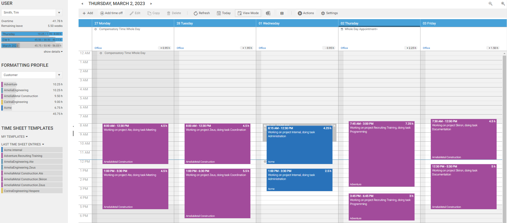
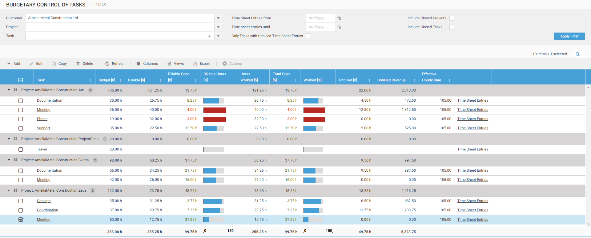

# Getting Started With Time Cockpit

## What Can Time Cockpit Do For You?

### Graphical Calendar

We want to make life easier for employees by providing a graphical calendar for creating and manipulating time sheet entries. Switch between day, week, or work week view depending on the level of details you need. The graphical visualization ensures that you will immediately recognize booking mistakes like missing time sheet entries or unwanted overlapping time sheet entries. For further information refer to [Time Sheet Calendar](~/doc/timesheet-calendar/calendar.md).

### Project-based Time Tracking

Effective project management requires accurate time tracking, which helps managers understand the time and effort needed to complete a project, allocate resources, and create realistic timelines. Time cockpit simplifies project-based time tracking, providing insights into project progress and resource utilization. For further information refer to [Working with Timesheet Entries](~/doc/timesheet-calendar/working-with-timesheet-entries.md) and  [Project-based Time Tracking](~/doc/project-time-tracking/customer-project-task.md).

### Attendance Time Tracking

Time cockpit is focused on project-based time tracking, but it also provides features for attendance time tracking such as managing different working time models, calculating overtime, absence time management, working time violations and more. With that, it providing valuable data for downstream HR and payroll purposes. For further information refer to [Attendance Time Tracking](~/doc/employee-time-tracking/working-time.md).

<!-- ### Activity Tracking

The activity trackers help you to reconstruct the time you work on your PC. They automatically log what you are doing. Additionally you can import the call history from your phone if phone calls are relevant for your time sheet. As a developer connect time cockpit to your Microsoft Team Foundation Server to see when you checked in files and when changes happened to your work items. The graphical time sheet calendar visualizes this log and lets you transform activities into time sheet entries with a few mouse clicks. -->

<!--  -->

### Made-to-Measure

You track hours per task or per project, or do you need to assign cost centres? We ship a data model that works for many smaller companies, but we allow you to tailor time cockpit to your needs. 

You can add new tables, complement existing tables with properties and relations and customize all lists and forms. There is a built-in scripting environment with IronPython and you can even access the time cockpit API with .NET or the powerfull [Web API](~/doc/web-api/overview.md).

With time cockpit's customization capabilities, you can integrate it into your organizational structure and processes to streamline your work. Tailoring time cockpit to your unique business needs can help you automate time-consuming tasks and reduce the need for manual work. Free up time for employees to focus on more high-value activities, ultimately improving productivity and reducing costs. If you want to learn more please schedule a call at support@timecockpit.com

