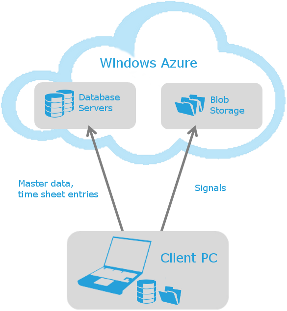

# System Architecture

time cockpit is an offline-capable SaaS (software as a server) solution. You can work with time cockpit no matter if you have internet access. As long as you are connected time cockpit synchronizes your data automatically with the server every 15 minutes by default. In this way you have your latest data available on all your devices. Besides you will not lose data if your computer gets broken or lost.

## Overview

The following illustration shows how data is stored in time cockpit:

### Local Data Store

Local Data Store | Path
--- | ---
Time tracking database | `%LocalAppData%\software architects\time cockpit\data\time cockpit.tic`
BLOB storage | `%LocalAppData%\software architects\time cockpit\data\time cockpit blob store`

### Application Configuration

Application Configuration | Path
--- | ---
General settings | `%ProgramFiles%\software architects\time cockpit\time cockpit 2010\TimeCockpit.UI.exe.config`
User-specific settings | `%LocalAppData%\software architects\time cockpit\Time Cockpit.config`

## Time Tracking Database and Blob Storage

Data in time cockpit can be divided into two categories:

- Master and time tracking data (e.g. customers, projects, tasks, time sheet entries, invoices, etc.)
- Blob data (e.g. signals, file attachments)

Master and time tracking data is stored in a relational database on the client pc. Tracked signals (e.g. computer activity, active window title) are stored as blobs (binary large objects) in the file system. We treat signal data other than master data because the amount of data can become much larger and because we think your private data is worth protecting still more. For these reasons signals are encrypted and compressed with your special [signal data password](configuration-wizard.md#step-5---choose-your-signal-data-password). This way we can minimize the amount of data and your data is protected strong because your signal data password never leaves your pc.

You can [extend the data model](~/doc/data-model-customization/entity.md) for time cockpit. There are various types of properties that you can add. Most of them are stored in the database. If you want to store data as a blob you can use the <xref:TimeCockpit.Data.DataModel.BinaryProperty> (see also [How To: Add a FileProperty](~/doc/scripting/add-file-property.md)).

## Local Data Storage

When starting time cockpit the first time the configuration wizard creates a new, local SQL Server CE database by executing the following steps (the specified paths can be changed in the [configuration wizard](configuration-wizard.md)):

1. The local database file `time cockpit.tic` will be created in directory `%LocalAppData%\software architects\time cockpit\data`.
1. In the same directory a subdirectory named `time cockpit blob store` will be created. It contains the blobs.
1. The storage location of the database will be saved in the file `%LocalAppData%\software architects\Time Cockpit\Time Cockpit.config`*. This file also contains your encrypted username and password which are used to connect to the time cockpit server. Note: this configuration file cannot be transferred to another user. The encrypted username and password can only be encrypted by the Microsoft Windows user who created the file.

*) The name of the configuration file can be changed in the global configuration file `%ProgramFiles%\software architects\time cockpit\time cockpit 2010\TimeCockpit.UI.exe.config`. If setting `configuration/appSettings/Configuration` is empty, we call it a default configuration. If it contains a value, we call it a named configuration. For named configurations the configuration file will contain the name: e.g. Time Cockpit.Test.config for a configuration name "Test". Please note that the configuration name is case sensitive. You can use this setting to run multiple time cockpit instances on one computer simultaneously. Find detailed information in the [installation instructions](installation-instructions.md).

## Central Data Storage

In the cloud your time cockpit data will be stored in the [Microsoft Windows Azure Platform](http://www.microsoft.com/windowsazure/). Like on your local computer we use a relational database (SQL Azure) for your master and time tracking data and blobs (Microsoft Windows Azure Blob Storage) for your signals.

We do not save the access data for the central data storage on your computer, but we determine it at runtime with your username and password. Please note that we do not support accessing the central data storage with other tools than time cockpit. If you want to access your server database read-only with e.g. reporting tools, please contact [support@timecockpit.com](mailto:support@timecockpit.com) for further information.

On the server we only store encrypted and compressed signals. Your signal data password will never be transferred to the server, so there is no way to decrypt your signal data.

To connect to the central data store SQL Azure you need to configure your environment to allow outbound TCP connections over port TCP/1433. Microsoft publishes [Security Guidelines for SQL Azure](http://social.technet.microsoft.com/wiki/contents/articles/security-guidelines-for-sql-azure.aspx). You can [download the IP ranges for all Windows Azure data centers](https://www.microsoft.com/en-us/download/details.aspx?id=56519). If possible you should restrict the firewall rule to these IP ranges. If you prefer we can also give you the DNS name of your time cockpit database.

## Synchronization

If you have internet access time cockpit periodically tries to sync the local and the central data storage. Your data is synchronized in the following steps:

1. Synchronizing schema changes (e.g. new entities, properties, relations)
1. Synchronizing new and changed records
1. Synchronizing deleted records
1. Synchronizing BLOBs

If one step of the synchronization fails all changes will be undone, so your database will never be left in an inconsistent state.

If two users change a record at the same time, the user that synchronizes last will override data from the users that has synchronized before (last client wins). We do versioning on row level and not on column level.
