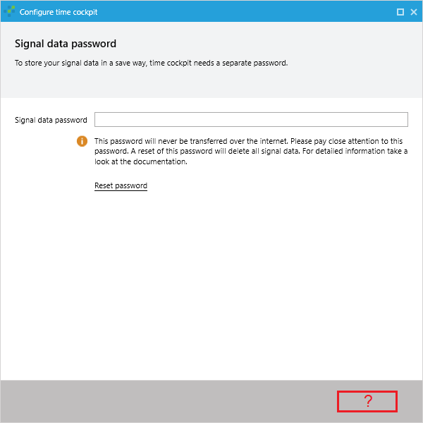

# You have got the error System.Security.Cryptography.CryptographicException… or next Button missing in configuration wizard

## Error cause
The data protection key of timecockpit provided by windows is no longer valid. This may happen e.g. when your windows profile was ported to another pc. Therefore, the existing privacy key must be deleted so that a new valid can be created.

## Background
To protect your personal data (e.g. signals) time cockpit uses the data protection function of windows. This ensures that protected data can only be read using your windows profile.

## How to troubleshoot (removal of invalid data protection key)
1. Stop the signaltracker if it’s running
1. Download the following command line application:
https://statictimecockpit.blob.core.windows.net/utils/ResetTimeCockpitConfigurationEncryption.2015-04-09.zip
1. Start the application and answer the question (“Are you sure that you want to reset the time cockpit configuration encryption? [yes/no]”) with „y“ and confirm with enter key.
1. Now the application tries to delete the invalid data protection key. The result is written to an automatically generated output file that will be created in the same directory as the command line application.
1. In some cases, the data protection key can not be deleted by the application. Thus you have to delete the key yourself in the file explorer. For this reason, please check whether the key still exists. The path and name of the key to be deleted can be found in the output file at the position “Possible TC key at”
1. After removing the key, you have to reset your time cockpit setup. Therefore, in time cockpit's installation folder (typically C:\Program Files\software architects\time cockpit\time cockpit 2010) you find a shortcut called “time cockpit - reset configuration”. Please run it.

   The application will now try to delete the locally stored time cockpit configuration and then restart time cockpit with its setup dialog. In case of an error you have to delete the configuration yourself. To do this, please delete all files in the following directory: “C:\Users\[YourUserName]\AppData\Local\software architects\Time Cockpit” and then start time cockpit.
1. Start time cockpit. It will walk you through the initial configuration wizard. After that, you should be able to use time cockpit as usual.
