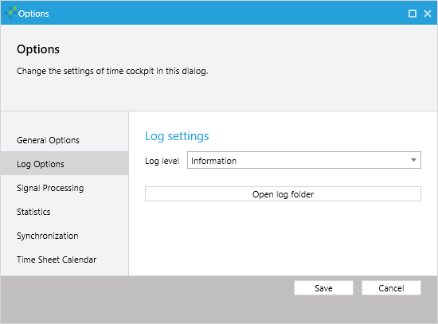

Several sources of diagnostics and troubleshooting information are provided when using time cockpit's software and services. The following sections show how to gather diagnostic information for troubleshooting typical usage scenarios.

## Full Client Log Files

The main UI, signal tracker and script execution application record log files of relevant actions and occurring errors. The full client log files for time cockpit are located in `%LOCALAPPDATA%\software architects\Time Cockpit` and the file names end with `.log` or `.log.xml` depending on the software version. Several log levels allow to choose the level of detail and the amount of data recorded. During normal operation a level of Warning or Error is sufficient. In case of errors the log level can be increased to Information or Verbose to include additional details and ease error diagnostics.

The current format is a log4j-compatible XML format that can be read and visualized by one of the large number of third-party log file viewers. Two free options are [YALV! - Yet Another Log4Net Viewer](https://github.com/LukePet/YALV) and [LogExpert](https://logexpert.codeplex.com/).
