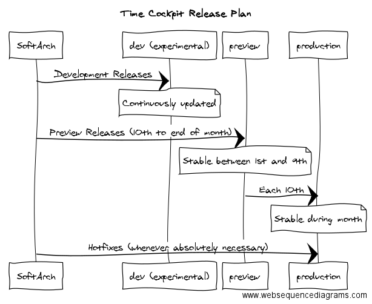

# Web Client

Log in to the web client of time cockpit at <https://web.timecockpit.com>. Use the same username and password as for the full client.

## Limitations

- It is not possible to track computer signals with the web client. But if you have installed the full client to track signals, you can view the tracked signals in the web client, too.
- It is not possible to modify the data model. But all changes made with the full client are available in the web client, too.

## Release Plan

We offer three different time cockpit environments:

### Dev: <https://web-dev.timecockpit.com>

This is an experimental version that we continuously update with new releases. Never use it for production purposes! Some things are likely to be broken. Using it with your production tenant might even lead to data corruption. If you want to use this version, ask for a time cockpit Sandbox.

### Preview: <https://web-preview.timecockpit.com>

We publish preview releases in this environment. Between 10th and end of each month the preview release might be unstable. Still, it is way more stable than Dev. Between 1st and 9th of each month, the preview environment should not change. It contains the release candidate for the upcoming version. You can use this time frame for making your team ready and for giving us feedback. Between 1st and 9th we only update Preview if it is absolutely necessary. 

### Prod: <https://web.timecockpit.com>

This is the stable production environment for time cockpit. On the 10th of each month (resp. the first working day after the 10th) we create Prod from the latest preview release. This is also the new date for our newsletter. During the month, we only update Prod in case of critical hotfixes.

The following picture illustrates our release cadence:

