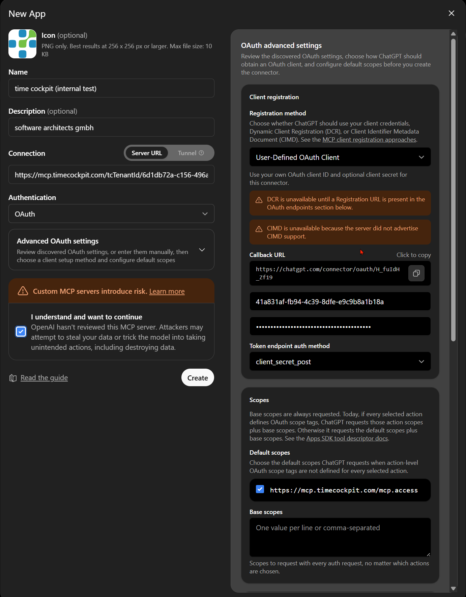
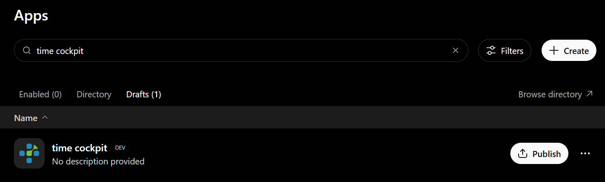
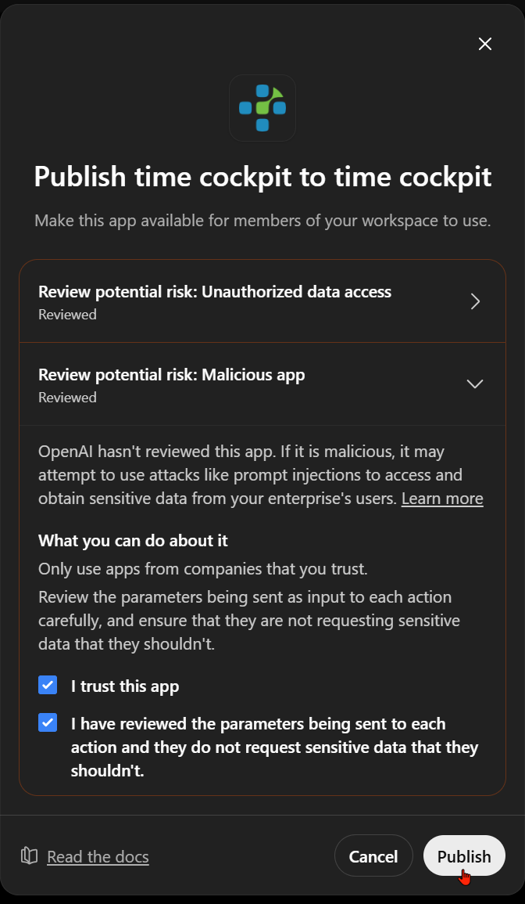
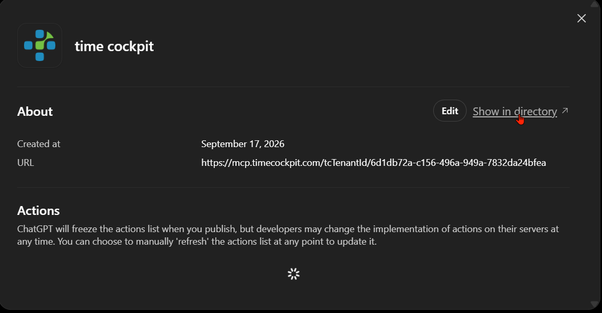
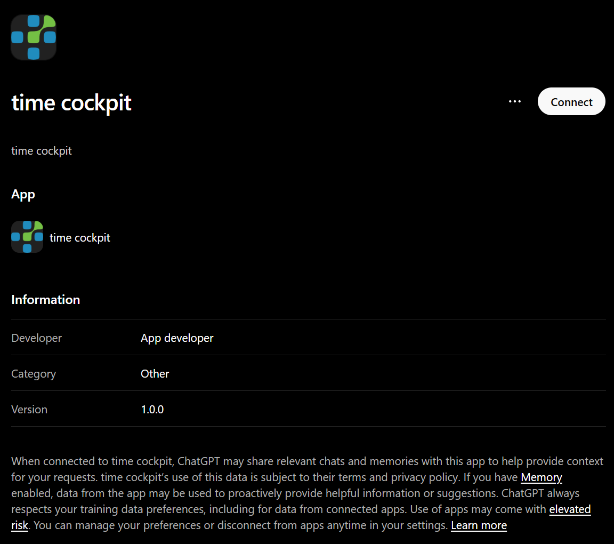
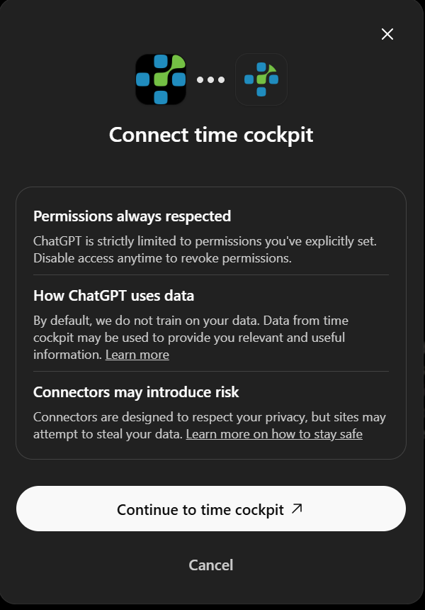
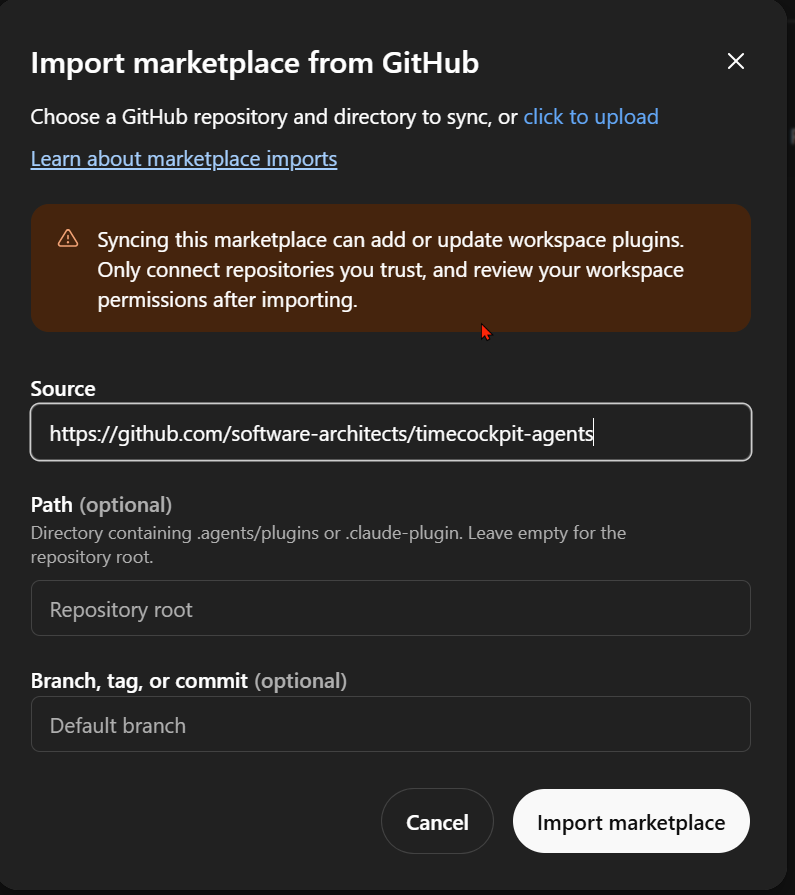

# ChatGPT (Web, Business and Enterprise Workspaces)

> [!WARNING]
> Preliminary documentation: The time cockpit MCP server and this documentation are under active development. Tool names, dialog labels and configuration steps may change without notice. Check back for updates before rolling the setup out to your users.

In ChatGPT, remote MCP servers are registered as **custom apps** by a workspace owner or administrator in the ChatGPT admin console (`chatgpt.com/admin`). The app is created once for the whole workspace and published to its members. Every member then connects to the app individually and signs in with their own Microsoft Entra ID work account. The configuration below has been set up and used with a ChatGPT Business workspace; dialog labels may differ slightly between ChatGPT versions and plans.

> [!NOTE]
> The ChatGPT web interface can be **very slow** when working with custom MCP apps. Tool discovery, publishing and even simple prompts sometimes take a long time, run into timeouts, or fail with **HTTP 429 (Too Many Requests)**. These delays and errors originate on the ChatGPT side, not in the time cockpit MCP server. Retry after a moment; if a dialog appears to hang, reload the page and check the app list before creating a second draft.

## Apps, Plugins, Skills and Marketplaces

OpenAI uses several terms that matter for this setup. In short: the MCP server becomes an **app**; the companion skills arrive as a **plugin** through a **marketplace**.

| Term | Meaning | Where it is managed |
|------|---------|---------------------|
| **App** (also *connector*, *MCP server*) | One connection to an external system, here the time cockpit MCP server with its tools, authentication and permissions. Formerly called *connector*. | Admin console → **Apps** |
| **Plugin** | An installable bundle that can contain **skills**, **apps** (MCP servers) and app templates. Since July 2026 the plugin directory (`chatgpt.com/plugins`) has replaced the former app directory; a published app also appears as a plugin. | Admin console → **Plugins**; users under **Plugins** in the sidebar |
| **Skill** | Reusable instructions ChatGPT loads on demand for a task, e.g. how to book time in time cockpit correctly. Users can address a skill explicitly with `@`. | Admin console → **Skills**, or bundled in a plugin |
| **Marketplace** | A JSON catalog in a GitHub repository (`.claude-plugin/marketplace.json` or `.agents/plugins/marketplace.json`) that lists plugins. A workspace imports it once and syncs it daily. | Admin console → **Marketplaces** |

Further reading: [Apps in ChatGPT](https://help.openai.com/en/articles/11487775-connectors-in-chatgpt), [Developer mode and MCP apps in ChatGPT](https://help.openai.com/en/articles/12584461-developer-mode-and-mcp-apps-in-chatgpt), [Plugins in ChatGPT and Codex](https://help.openai.com/en/articles/20001256-plugins-in-chatgpt-and-codex), [Importing and syncing plugin marketplaces from GitHub](https://help.openai.com/en/articles/20001504-importing-and-syncing-plugin-marketplaces-from-github).

## What You Need

- A ChatGPT **Business, Enterprise or Edu workspace** and an account with the **owner or admin** role. Custom MCP apps are created in the admin console, not in personal settings.
- **Developer mode / custom MCP apps enabled** for the workspace: **Admin → Permissions & roles → Connected data** (label varies: *Developer mode*, *Create custom MCP connectors*). Without it, the **Create** button under **Apps** is missing.
- An **app registration in your Entra tenant** for the MCP server with the `mcp.access` permission granted, see [Entra ID Setup](entra-id-setup.md). ChatGPT is a **hosted client**: it needs the redirect URI registered under the platform **Web**, and the tested configuration used a **client secret** (`client_secret_post`). Use a separate app registration for ChatGPT, as recommended for Copilot Studio, so the secret does not affect your native clients.
- The **client ID** and the **client secret** of that app registration.
- Optionally the **tenant ID** of your time cockpit tenant — only if your Entra tenant is mapped to several time cockpit tenants (see [connection settings](overview.md#connection-settings-header-or-url-segment)).

> [!NOTE]
> Entra ID supports neither Dynamic Client Registration (DCR) nor Client ID Metadata Documents (CIMD). The **New App** dialog shows two orange warnings about this. That is expected — choose **User-Defined OAuth Client** as described below.

## Step 1: Create the App (Administrator)

1. Open `https://chatgpt.com/admin/apps` (or **Workspace settings → Apps**) and click **Create**.
2. **Name**: e.g. `time cockpit`. **Description** and **Icon** are optional; a PNG of 256 × 256 px works as icon.
3. **Connection**: keep **Server URL** and enter `https://mcp.timecockpit.com`. Append [URL segments](overview.md#connection-settings-header-or-url-segment) if you need them, e.g. `https://mcp.timecockpit.com/tcTenantId/<tenant-id>` or `…/access/readonly/scope/owndata`. ChatGPT has no header configuration for custom apps, so URL segments are the only way to pass tenant, sandbox, access and scope.
4. **Authentication**: **OAuth**. Expand **Advanced OAuth settings**; ChatGPT discovers the Entra endpoints and the scope from the server metadata.
5. Under **Client registration → Registration method** select **User-Defined OAuth Client**.
6. Copy the **Callback URL** (`https://chatgpt.com/connector/oauth/<callback-id>`). The callback ID is unique to this app draft. **Register exactly this URL as a redirect URI of platform type Web** on your Entra app registration before anyone connects. Do not close the dialog, delete the draft or start a second draft afterwards — a new draft gets a new callback ID.
7. Enter the **client ID** and the **client secret** of your app registration. **Token endpoint auth method**: `client_secret_post`.
8. **Scopes**: keep the discovered default scope `https://mcp.timecockpit.com/mcp.access` checked. **Base scopes** can stay empty.
9. Read the risk notice, tick **I understand and want to continue**, and click **Create**.

The app now appears under **Apps → Drafts**. ChatGPT contacts the server and reads its tool list ("actions"); this can take a while.

## Step 2: Publish the App to the Workspace (Administrator)

1. Under **Apps → Drafts**, click **Publish** next to the app.

   

2. The dialog **Publish … to <workspace>** asks you to review two potential risks (*Unauthorized data access*, *Malicious app*). Expand each, tick **I trust this app** and **I have reviewed the parameters being sent to each action …**, then click **Publish**.

   

3. The app moves to **Apps → Enabled** and is now visible to all members in the plugin directory of the workspace. Click the app to see its details; **Show in directory** opens the page members will see, **Edit** lets you change name, description and icon.

   

Notes for administrators:

- **Installed for everyone:** In the admin console you can mark the app (or the plugin that contains it) as **Installed** for the workspace instead of only *Available*. Installed apps show up for every member without searching the directory; each member still has to connect their own account (Step 3). Access can also be restricted by role under **Permissions & roles**; see [Plugin controls](https://learn.chatgpt.com/docs/enterprise/apps-and-connectors).
- **Frozen action list:** ChatGPT freezes the list of actions (tools) when you publish. When time cockpit adds or renames tools, an administrator has to open the app details and **refresh** the actions manually.
- **Confirmation prompts:** Under **Apps** you can configure per action whether ChatGPT asks the user before calling it. This is independent of the server-side [confirmation handshake](access-and-confirmation.md) for writing tools, which stays in force.

## Step 3: Connect Your Account (Every Member)

Publishing does not sign anybody in. Every member connects individually and authenticates with their own Entra ID account:

1. In ChatGPT open **Plugins** in the sidebar and select **time cockpit** (or open the link from **Show in directory**).
2. Click **Connect**.

   

3. The dialog **Connect time cockpit** explains how ChatGPT handles permissions and data. Click **Continue to time cockpit**.

   

4. Sign in with your Microsoft work account and accept the requested `mcp.access` permission (unless your administrator has granted admin consent for the whole tenant). Entra redirects you back to `https://chatgpt.com/connector/oauth/…`.
5. Start a **new chat**. The app is available via the **+** menu or by mentioning it; a first test is *"Use time cockpit and run ping, then tell me who I am"*. See [Verify the Connection](verify-connection.md).

The same rules apply as with Claude Code, Codex or VS Code: the MCP server acts with **your** time cockpit permissions, the `access` and `scope` settings of the URL narrow them further, and writing tools require confirmation. See [Access, Scope, and Confirmation](access-and-confirmation.md) and [Limits and Truncation](limits.md). Tokens are stored by ChatGPT per user; **Disconnect** on the plugin page removes them.

## Step 4: Import the Companion Skills (Administrator)

The [companion skills](companion-skills.md) from the GitHub repository **software-architects/timecockpit-agents** teach ChatGPT how to work with time cockpit (TCQL, booking patterns, reporting). For ChatGPT they are delivered as a **plugin marketplace**:

1. Open **Admin → Marketplaces** and click **Add** (**Import marketplace from GitHub**).
2. **Source**: `https://github.com/software-architects/timecockpit-agents`. **Path**: leave empty (the repository root contains the `.claude-plugin` and `.agents/plugins` catalogs). **Branch, tag, or commit**: pin a release tag such as `v0.1.7` for customer workspaces, or leave empty to follow the default branch.
3. Click **Import marketplace**. The initial import can take up to an hour; afterwards ChatGPT syncs daily, and **Sync now** triggers an update on demand.

After the import the plugin appears under **Admin → Plugins**. Set it to **Installed** (or **Available**) and, if needed, grant access via **Manage access**. Two points to keep in mind:

- The marketplace sync imports skills and the app *reference* only. It does **not** create the MCP app and does not connect anyone's account. The app from Step 1 must exist and be published in the workspace, and every member still connects it themselves.
- Skills become active in new chats. Users can address one explicitly with `@timecockpit-tcql` and similar names.

## Outlook: time cockpit in the OpenAI Plugin Directory

Today the app has to be created in every workspace as a custom MCP app, which is why OpenAI shows the *"OpenAI hasn't reviewed this app"* warnings. We are working on offering time cockpit as a **verified plugin in the public OpenAI plugin directory**, so that a workspace can install it directly and the manual app registration in ChatGPT becomes unnecessary. The Entra ID app registration in your tenant will still be required, because ChatGPT authenticates against your Entra tenant. See [Submit plugins](https://developers.openai.com/plugins/deploy/submission) for OpenAI's review process.

## Troubleshooting

| Symptom | Cause / solution |
|---------|------------------|
| Dialogs hang, prompts time out, `429 Too Many Requests` | Load and rate limiting on the ChatGPT side; not related to the MCP server. Wait and retry; reload the admin page before creating a second draft. |
| `AADSTS50011: redirect URI … does not match` during **Connect** | The callback URL of *this* app (`https://chatgpt.com/connector/oauth/<callback-id>`) is not registered on the Entra app registration, or it is registered under *Mobile and desktop* instead of **Web**. Copy it from **Edit → Advanced OAuth settings**. |
| `AADSTS7000218` / *client_assertion or client_secret required* | The app registration expects a secret but none was entered, or **Token endpoint auth method** is not `client_secret_post`. Enter the secret; if it has expired, create a new one in Entra and update the app. |
| `AADSTS650052` / permission cannot be granted | The MCP API has no service principal in your tenant yet, see [Make the time cockpit MCP API Available in Your Tenant](entra-id-setup.md#make-the-time-cockpit-mcp-api-available-in-your-tenant). |
| **Create** button missing under **Apps** | Developer mode / custom MCP apps are disabled for the workspace, or your role is not owner/admin. |
| Members do not see the app | The app is still a draft, is only *Available* and not *Installed*, or role-based access excludes them. |
| Tools missing after a server update | The action list is frozen at publish time; refresh it in the app details. |
| The assistant does not use the app | Start a new chat and select the app in the **+** menu or mention it by name. |

## Related Pages

- [MCP Server Overview](overview.md)
- [Entra ID Setup](entra-id-setup.md) — redirect URIs and client secret for hosted clients
- [Verify the Connection](verify-connection.md)
- [Companion Skills & APM](companion-skills.md)
- [Use Cases and Prompts](~/doc/ai-assistants/use-cases-and-prompts.md)
- OpenAI: [Apps in ChatGPT](https://help.openai.com/en/articles/11487775-connectors-in-chatgpt), [Developer mode and MCP apps](https://help.openai.com/en/articles/12584461-developer-mode-and-mcp-apps-in-chatgpt), [Plugins in ChatGPT and Codex](https://help.openai.com/en/articles/20001256-plugins-in-chatgpt-and-codex), [Importing plugin marketplaces from GitHub](https://help.openai.com/en/articles/20001504-importing-and-syncing-plugin-marketplaces-from-github), [Plugin management](https://learn.chatgpt.com/docs/enterprise/plugin-management), [Authentication for plugins](https://developers.openai.com/plugins/build/auth), [Submit plugins](https://developers.openai.com/plugins/deploy/submission)
