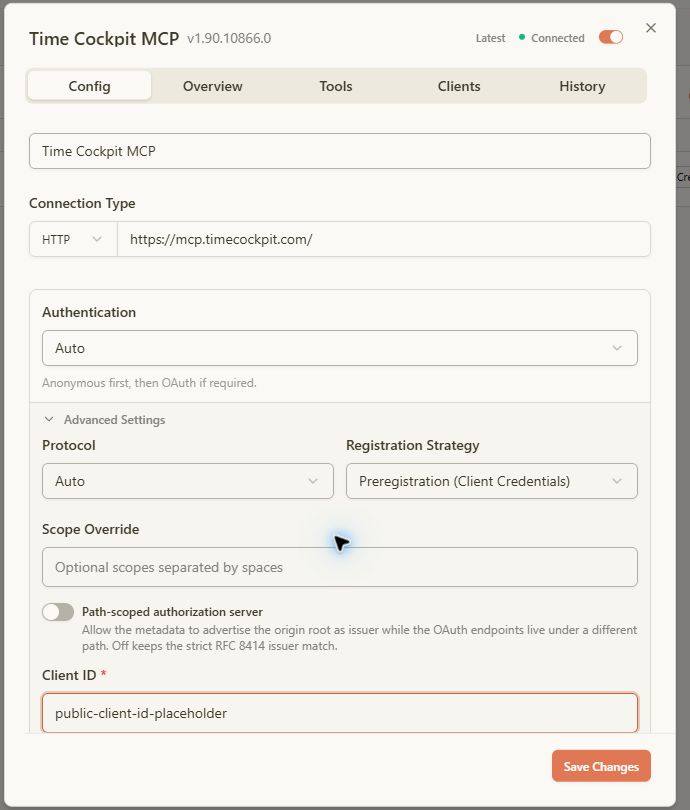
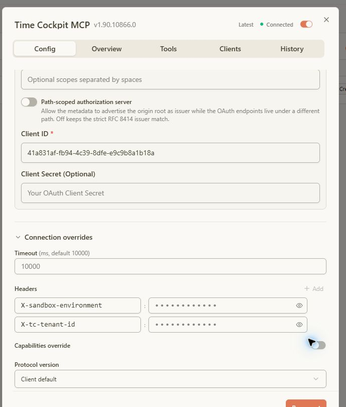
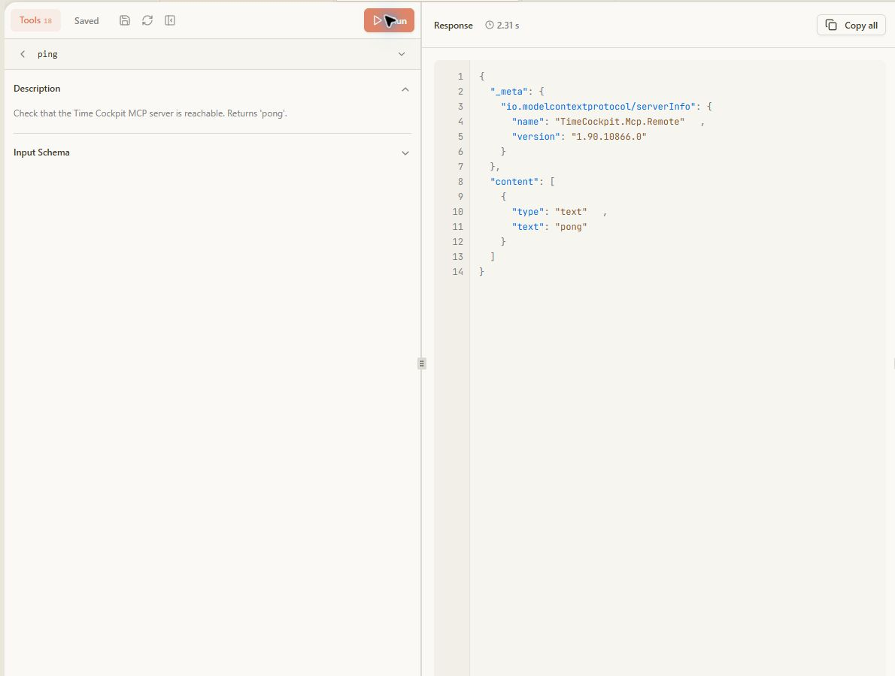
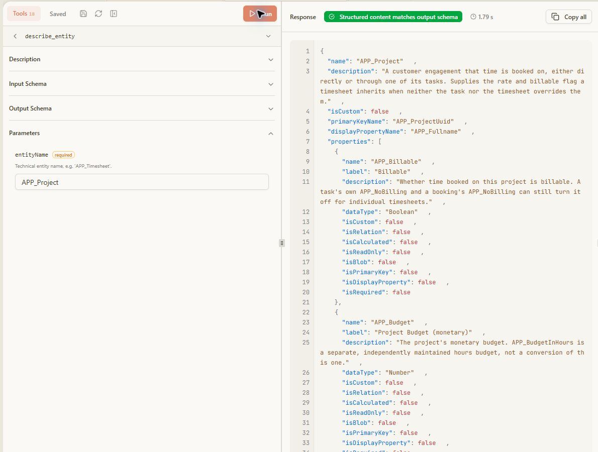
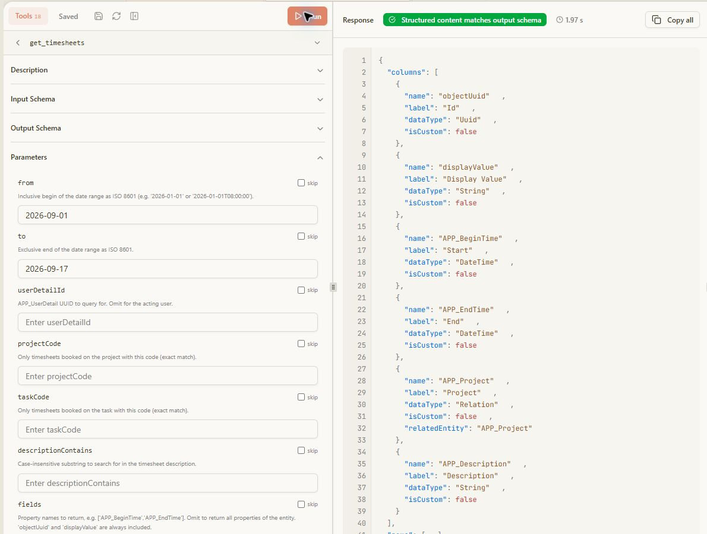

# Test the MCP Server with MCPJam Inspector

> [!WARNING]
> Under construction: The time cockpit MCP server and this documentation are under active development, and breaking changes are possible. Tools may be renamed, changed or removed, and dialog labels and configuration steps may change without notice. Check back for updates before rolling the setup out to your users, and expect to adapt your configuration, skills and prompts after an update.

[MCPJam Inspector](https://github.com/MCPJam/inspector) is useful for checking the time cockpit MCP connection before configuring an AI assistant. The steps below use the remote production MCP server and route requests to a time cockpit test sandbox.

> [!NOTE]
> A normal user does not need to enter a tenant ID. The server resolves the time cockpit tenant from the Microsoft Entra sign-in when one Entra tenant maps to one time cockpit tenant. Add `X-tc-tenant-id` only when time cockpit support or your administrator has told you that your Entra tenant is mapped to multiple time cockpit tenants.

## Add the server

1. Open MCPJam Inspector and choose **Connect**.
2. Choose **Add Server**.
3. Enter the following connection values:

   | Field | Value |
   |-------|-------|
   | Server Name | `Time Cockpit MCP` |
   | Connection Type | `HTTP` |
   | Server URL | `https://mcp.timecockpit.com` |
   | Authentication | `Auto` |

4. Expand **Advanced Settings**.
5. Set **Registration Strategy** to **Preregistration (Client Credentials)**.
6. Enter the pre-registered time cockpit MCP client ID. Leave **Client Secret** empty; the client is public.
7. Expand **Connection overrides** and add the headers from the next section.
8. Choose **Add Server**. When MCPJam asks to authorize the server, choose **Continue** and sign in with the Microsoft Entra work account used for time cockpit.

Automatic OAuth discovery can fail with the message `Automatic OAuth could not find a usable CIMD or DCR flow`. This is expected for a server that uses a pre-registered client. Selecting **Preregistration (Client Credentials)** and entering the client ID resolves the problem.

## Configuration screenshots

The following screenshots show where the server URL, OAuth registration strategy, client ID, and connection headers are entered. Saved header values are intentionally masked, and the OAuth screenshot uses a placeholder instead of the public client ID.





## Tool screenshots

These sanitized examples show the read-only checks after the connection is established. They contain no customer records, user identifiers, access tokens, or tenant GUIDs.







## Configure the sandbox and tenant headers

For a safe pre-integration test, add this header:

| Header | Value | Purpose |
|--------|-------|---------|
| `X-sandbox-environment` | `test` | Routes the request to the tenant's test sandbox instead of production. |

Only add the tenant header when it is required for tenant routing:

| Header | Value | Purpose |
|--------|-------|---------|
| `X-tc-tenant-id` | `<tenant-id>` | Selects a specific time cockpit tenant when the Entra tenant maps to more than one time cockpit tenant. |

The two headers used for a multi-tenant sandbox test therefore look like this:

```text
X-sandbox-environment: test
X-tc-tenant-id: <tenant-id>
```

Do not configure the same setting both as a header and as a URL segment. The server rejects that combination. See [Connection Settings](overview.md#connection-settings-header-or-url-segment) for the URL-segment alternative.

When sharing MCPJam screenshots, keep saved header values masked. Never reveal the tenant ID, access token, user ID, or returned business data in a screenshot. The header names and the placeholder values shown in this guide are sufficient to document the setup.

## Verify the connection

After MCPJam shows **Connected**, choose **Tools**. The remote server exposes diagnostic and read-only data tools. Run these tests in order:

### 1. `ping`

Choose `ping` and select **Run**. The response should contain `pong`. This confirms that MCPJam can send an authenticated request to the server.

### 2. `entra_whoami`

Run `entra_whoami` to verify the routing. Check that the response reports the expected time cockpit tenant and:

- `SandboxEnvironment` is `test`.
- `TcTenantId` matches the tenant selected for the test.
- `Scope` and `Access` have the values expected for the connection.

This diagnostic tool does not change data or grant permissions.

### 3. `get_entities`

Run `get_entities` without parameters, or set `nameContains` to `timesheet` to keep the response small. This confirms that the MCP server can read the connected tenant's data model.

### 4. `describe_entity`

Set `entityName` to `APP_Project` or `APP_Timesheet` and run the tool. Use the returned property names when building later queries; tenant-specific `USR_` properties are not guaranteed to exist in every tenant.

### 5. `get_timesheets`

Run a narrow, read-only query before trying a broader report. For example:

```json
{
  "from": "2026-09-01",
  "to": "2026-09-17",
  "fields": ["APP_BeginTime", "APP_EndTime", "APP_Project", "APP_Description"],
  "top": 10
}
```

Omitting `userDetailId` keeps the query scoped to the signed-in user. An empty `rows` array is a valid result when there are no bookings in the selected period; it does not indicate a connection failure.

## Troubleshooting

| Symptom | Check |
|---------|-------|
| Automatic OAuth cannot find CIMD or DCR | Set **Registration Strategy** to **Preregistration (Client Credentials)** and enter the pre-registered client ID. |
| Server is connected but the tenant is wrong | Run `entra_whoami`; check the resolved tenant and the requested `TcTenantId`. |
| Results are empty | Check the date range and run `get_timesheets` without a project or task filter. |
| Write tools are missing | Check whether the connection uses `access=readonly`; this intentionally hides writing tools. |
| The sandbox was not selected | Check that `X-sandbox-environment: test` is present and that no conflicting URL segment is configured. |

Do not use `create_object`, `update_object`, `delete_object` or `create_timesheet` as a connectivity test. These tools can change time cockpit data and require their own confirmation workflow.

## Related pages

- [MCP Server Overview](overview.md)
- [Verify the Connection](verify-connection.md)
- [Entra ID Setup](entra-id-setup.md)
- [Companion Skills and APM](companion-skills.md)
