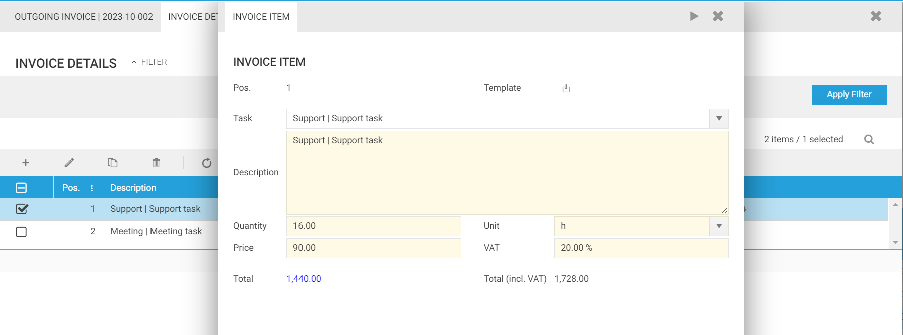
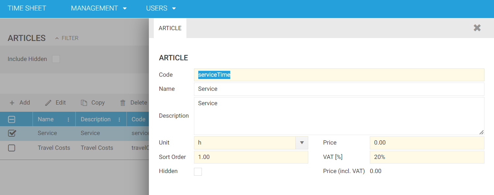
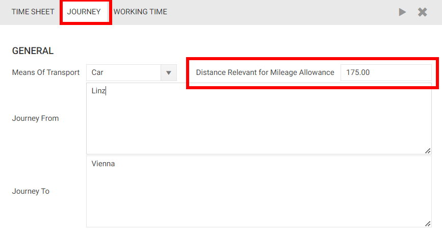
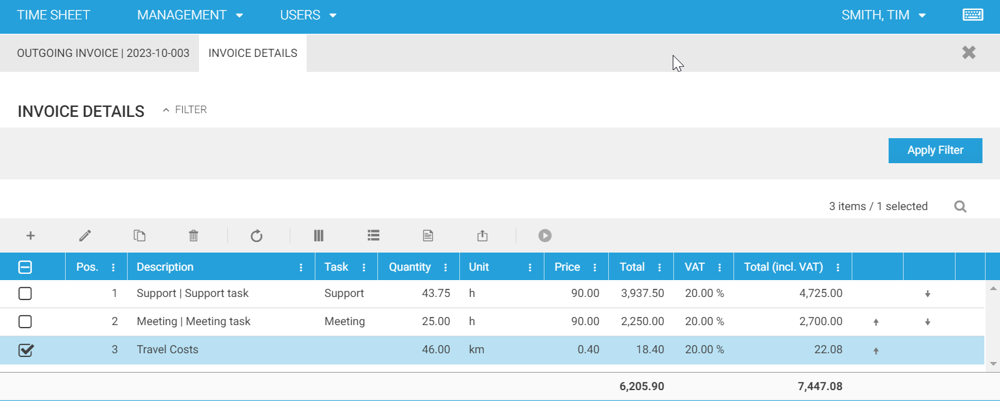
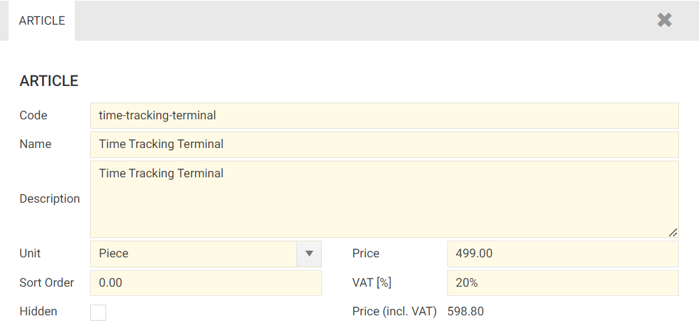
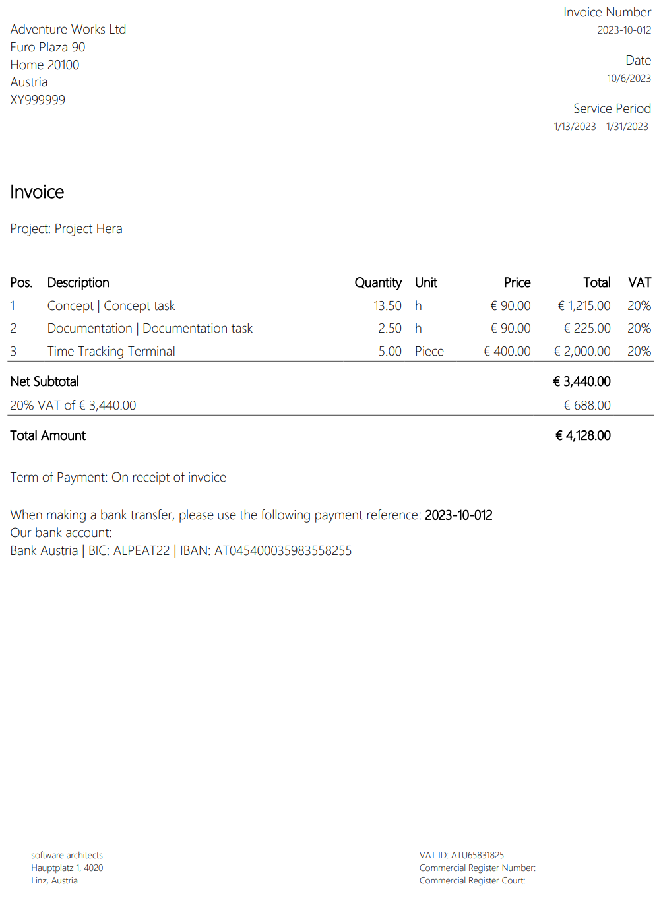

# Invoicing

Time cockpit not only serves as a time tracking tool, but also enables streamlined billing for your tracked time. This article explains how you can create invoices for the recorded hours with time cockpit. 

## Building Blocks of an Invoice

In time cockpit, an invoice does not exist on its own, but is composed of different building blocks. 

### Invoice Item

An invoice always consists of one or more invoice items. An invoice item is a detailed entry on an invoice that represents a specific product, service, or charge along with its associated quantity, unit price, and total cost. Invoice items provide a breakdown of the products or services being billed, making it clear for both the seller and the buyer what is being charged.

An invoice item consists of the following data:

- **Position:** A numerical position identifier for the item on the invoice.
- **Task:** Associated task of a project (if applicable).
- **Description:** A brief description of the product, service, or charge.
- **Quantity:** The quantity or units of the product or service included.
- **Unit:** The unit of measurement for the item.
- **Price:** The unit price or rate for the product or service.
- **VAT:** The applicable Value Added Tax (VAT) rate for the item.
- **Total:** The total cost for this item (Price x Quantity).
- **Total (incl. VAT):** The total cost including VAT.

### Article

In time cockpit, you can either create your own invoice items or you can create invoice items based on articles. An article in time cockpit is a predefined item or service description with associated pricing information that can be easily converted to an invoice item. Articles are essentially templates for common products or services a business provides. Rather than entering the same details for frequently used items on every invoice, users can select articles to populate the invoice item with the relevant product or service information automatically.

An article consists of the following fields:

- **Code:** A unique code identifier for the article.
- **Name:** The name or title of the article.
- **Description:** A brief description of the article's content.
- **Unit:** The unit of measurement for the item.
- **Price:** The unit price or rate for the article.
- **Sort Order:** The order in which the article appears in the list.
- **VAT [%]:** The applicable Value Added Tax (VAT) rate for the article. 
- **Hidden:** Indicates whether the article is hidden or visible in the combobox.
- **Total (incl. VAT):** The total price, including VAT, for the article.

> [!NOTE]
Time cockpit ships articles for service time and travel time. See a list of your articles in your [articles list](https://web.timecockpit.com/app/lists/entity/APP_Article).

## How to Create an Invoice

Certainly, here's a more technical and concise version:

The time cockpit's default data model contains the list [Unbilled Time Sheets](https://web.timecockpit.com/app/lists/APP_UnbilledTimesheetsList). This list shares similarities with the default [Time Sheets](https://web.timecockpit.com/app/lists/entity/APP_Timesheet) list, but adds dedicated filters to distinguish between billable and unbilled hours. Also, this feature provides the `Create Invoice` action to assign timesheet entries to an invoice. To generate an invoice, follow these steps:

1. Open the **Unbilled Time Sheets** list.
2. Select the timesheets you want to include in your invoice.
3. From the **Actions** menu, choose **Create Invoice**.
4. Enter your invoice details.

When you execute the **Create Invoice** action, it assigns the selected timesheets to invoice items. 

>[!NOTE]
Once timesheet entries are associated with an invoice item/invoice, they become **read-only** to prevent inadvertent modifications after billing.

In regard to service time, it is important to note that hourly rates for customers or projects can change over time. To accommodate this, the **Create Invoice** action copies the applicable hourly rate into the `APP_Price` field and the number of billed time sheet entries in the `APP_Quantity` field. This fields are used to calculate the overall net revenue of an invoice.

TODO: Video

> [!NOTE]
Until version [2023-10](~/doc/release-notes/2023-10.md), time cockpit could only aggregate time bookings into invoices. The time bookings assigned to an invoice were no longer editable by users. With version 2023-10, this functionality was expanded to allow the creation of multiple invoice items for a single invoice. As a result, the total invoice amount is now calculated based on the sum of all invoice items.

## Automatic Creation of Invoice Items

When you create an invoice in time cockpit, it analyzes the selected time sheet entries for a project to generate invoice items. If the entries are related to travel, time cockpit uses the "travel time" article as the basis for the invoice item. A time sheet entry is interpreted as travel, if `Distance Relevant for Mileage Allowance` on a time sheet entry is filled in. In the process of generating an invoice, all driven kilometers of the selected time entries are summed up. Description, unit, price, and VAT for the invoice item are set based on the standard article "Travel Costs" (Code: travelCosts).

If time sheet entries represent actual work for a customer, it creates an invoice item for each task within the project, using the "Service" article (Code: serviceTime). The system calculates the total hours for each invoice item from the associated time sheet entries.

The following example shows an invoice with three invoice items.

* Support: An invoice item created for the "Support" task in the given project
* Meeting: An invoice item created for the "Meeting" task in the given project
* Travel Costs: An invoice item created for travels in the given project. Travels are not assigned to any task, so the invoice item is not either.

> [!NOTE]
The calculation of the total invoice amount (**Net Revenue** in the invoice) is therefore based on the sum of all invoice items. 

> [!NOTE]
Prices of generated invoice items can be changed. If so, the updated total of all invoice items is reflected in the invoice the invoice item belongs to.

## Custom Invoice Items and Articles

If the automated invoice item generation logic doesn't meet your requirements, you have the flexibility to create custom invoice items and articles. For instance, if your business offers both time-tracking consulting services and sells hardware time-tracking terminals, and you need to include both on a single invoice, you can define a custom article like "Time Tracking Terminal." It might be structured as follows.

<iframe src="https://player.vimeo.com/video/870320759?badge=0&amp;autopause=0&amp;player_id=0&amp;app_id=58479" frameborder="0" allow="autoplay; fullscreen; picture-in-picture" style="position:absolute;top:0;left:0;width:100%;height:100%;" title="custom-invoice-item"></iframe>

### Creating a Custom Article

1. Navigate to the "Management" module in time cockpit.
2. Open the "Articles" section.
3. Click the "Add" button.
5. Provide all necessary information for the article.
8. Save the article.

### Using the Custom Article in an Invoice

1. Navigate to the "Outgoing Invoices" section in the "Management" module
2.  Search for the project to which you want to add the custom article.
3.  Locate your invoice.
4.  In the invoice details, add a new item.
5.  Select your new article (e.g., "Time Tracking Terminal") from the list of available articles.
6.  Hit "Excute Action."
7.  The information from the article template is copied to the actual invoice.
8.  You can edit the quantity (e.g., increase it to 25).
9.  Save and close the custom invoice item with the custom article.

## Generate an Invoice Report

Time cockpit can create a comprehensive PDF document for a specific invoice, encompassing essential details for a valid invoice. This includes customer address, invoice number, invoice date, and the service period. 

Furthermore, the document itemizes all the assigned invoice items. Each invoice item is presented with its quantity, unit, price, total amount, and the associated VAT rate. This allows for a thorough overview of the invoice's contents and makes it easy to verify and understand the billed items.

If time sheet entries are associated with the invoice (created using the `Create Invoice` action), the display of the time sheet entry details on the invoice document can be enabled. You can do so by checking the `Incl. Timesheets on Invoice Report` flag on the given invoice. 

>[!NOTE]
If the quantity or price of any of the automatically generated service-related invoice items has been modified after the generation, the time sheet entry details will no longer correspond with the invoice items. In such cases, it is advisable to deactivate the display of the time sheet entry details on the invoice document. This ensures that the invoice remains accurate and consistent with the modified invoice items.

### Invoices without VAT

For invoices with no VAT (all invoice items with 0% VAT), the determination of whether it's an intra-EU transaction or not depends on the customer's country. 

If the customer is **within** the EU, the following statement will be printed below the total amount:

**English**
> According to the reverse charge system, the amounts listed above are exclusive of sales tax. The sales tax must be calculated and paid by the recipient of the service.

**German**
> Die oben angeführten Beträge verstehen sich gemäß dem Reverse-Charge-System exklusive Umsatzsteuer. Die Umsatzsteuer muss vom Empfänger der Leistung berechnet und abgeführt werden.

For customers **outside** the EU, a slightly different statement will be printed below the total amount:

**English**
> The above amounts do not include sales tax. The sales tax must be calculated and paid by the recipient of the service.

**German**
> Die oben angeführten Beträge verstehen sich ohne Umsatzsteuer. Die Umsatzsteuer muss vom Empfänger der Leistung berechnet und abgeführt werden.

When automatically invoice items are generated automatically using the `Create Invoice` action, the decision to use VAT or not is based on either the customer address or the overwritten address of the invoices.

### Corporate Information of the Invoice Issuer

In the footer of the invoice document, the corporate information of the entity issuing the invoice is displayed. You can manage this information at [**Management --> Billing --> Companies**](https://web.timecockpit.com/app/lists/entity/APP_Company).

>[!NOTE]
At the moment only one company/invoice issuer is supported.

## Adding Timesheet Entries to an Existing Invoice

## Credit Note