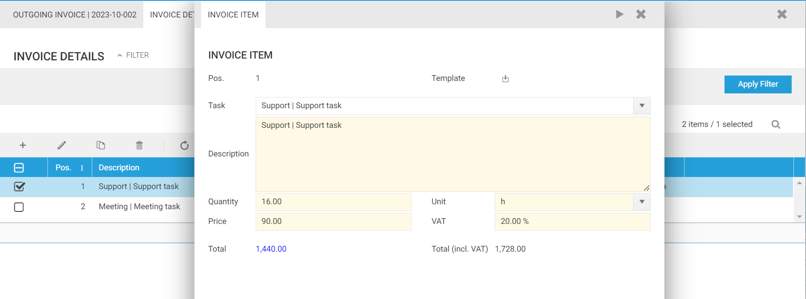
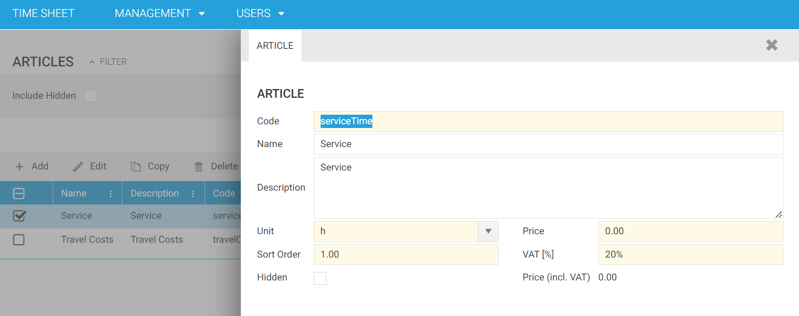
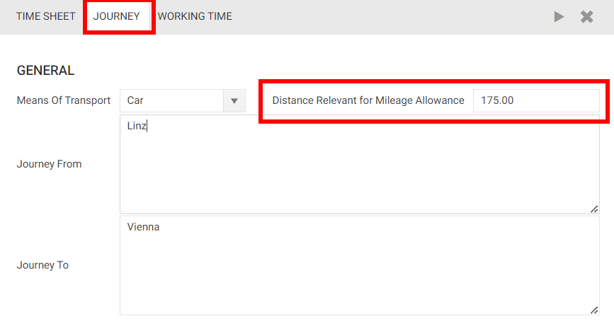
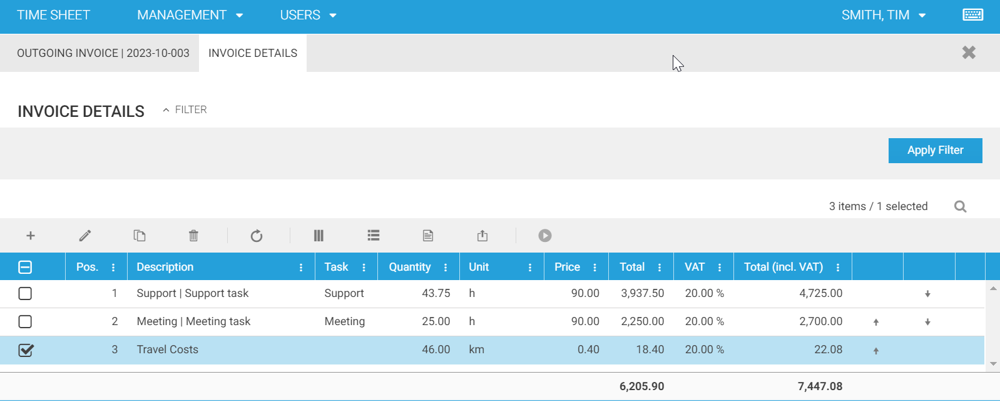
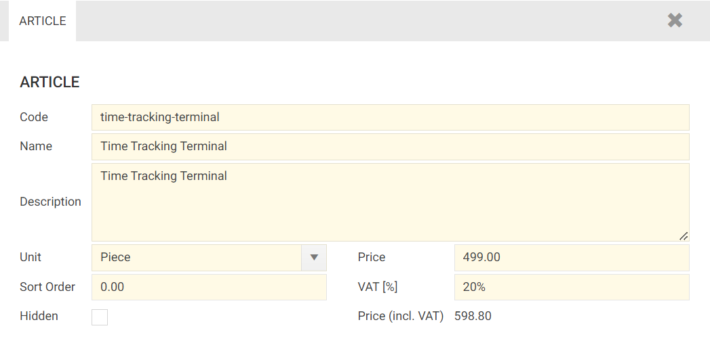
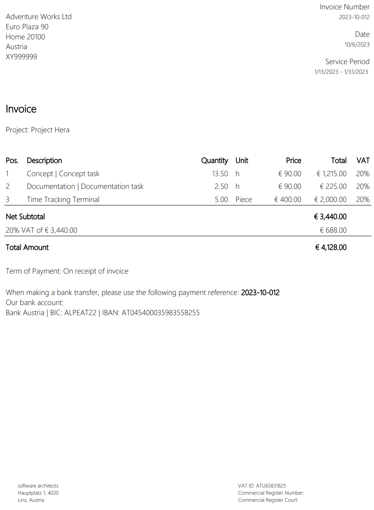
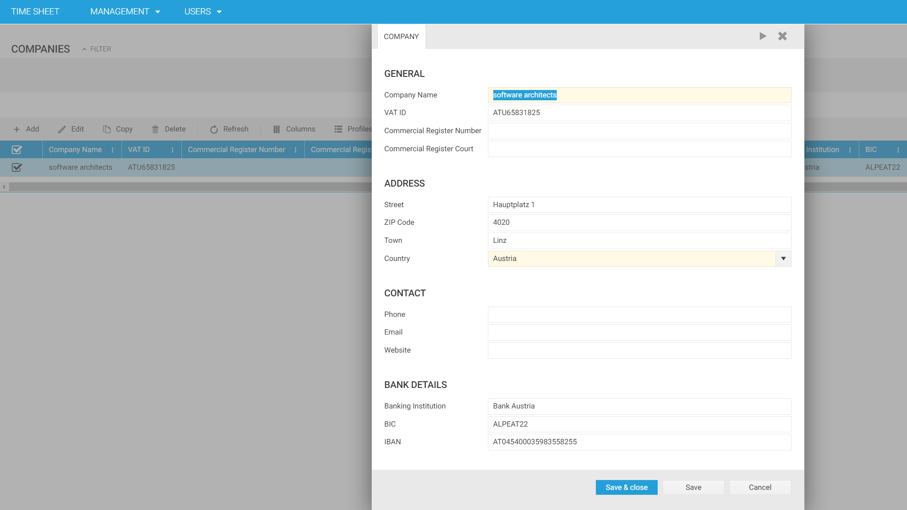
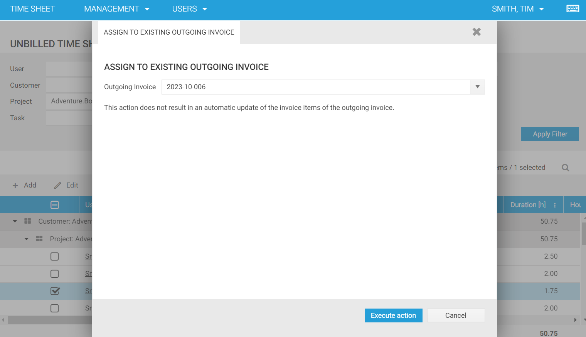

# Invoicing

Time cockpit not only serves as a time tracking tool, but also enables streamlined invoicing for your tracked time. This article explains how you can create invoices for the recorded hours with time cockpit. 

## Business Case: Why Integrate Time Tracking with Invoicing?

> [!AI-GENERATED]
> This content is AI-generated and requires verification.

### The Challenge: Manual Invoicing Costs Real Money

Without integrated time-to-invoice functionality, professional services businesses struggle with:

- **Revenue Leakage**: Manual invoice creation misses 10-20% of billable hours due to forgotten tasks, unbilled travel time, and rounding down. A 10-person consultancy billing €150/hour can lose €30,000-€60,000 annually.
- **Delayed Billing Cycles**: Reconstructing hours worked from emails, spreadsheets, and memory delays invoicing by 2-4 weeks, extending cash collection by the same timeframe. This impacts working capital and cash flow.
- **Billing Errors**: Manual data entry produces 8-12% error rates in quantities, rates, or descriptions, leading to client disputes, payment delays, and time spent issuing corrections or credit notes.
- **Time-Consuming Process**: Finance teams spend 4-8 hours per week manually creating invoices for a 20-person team, translating to 200-400 hours annually (€10,000-€20,000 in labor costs at €50/hour).
- **Poor Revenue Recognition**: Without clear assignment of hours to invoices, monthly revenue recognition becomes a spreadsheet nightmare, creating audit risks and inaccurate financial reporting.
- **Client Disputes**: Invoices lacking detailed timesheet breakdowns face 20-30% more client questions and payment delays as clients can't verify the work performed.

### The Solution: Direct Time-to-Invoice Workflow

Time cockpit's integrated invoicing system eliminates the gap between time tracking and billing:

- Select unbilled timesheets directly from the system
- Automatically generate invoice items grouped by task
- Apply correct hourly rates from customer/project/task hierarchy
- Include travel costs automatically from mileage entries
- Mark timesheet entries as billed (prevents double-billing)
- Generate professional PDF invoices with timesheet details
- Track invoiced vs. unbilled hours in real-time

### 7 Key Benefits with ROI

**1. Faster Billing Cycles & Improved Cash Flow**  
Reduce time from work completion to invoice issuance from 2-4 weeks to 1-3 days. Every week saved in billing delay is a week earlier you receive payment.

*ROI Example*: A consultancy billing €50,000/month improves cash flow by €25,000-€37,500 by cutting billing delay from 3 weeks to 1 week, equivalent to a short-term loan without interest costs.

**2. Eliminate Revenue Leakage**  
Capture 95-100% of billable hours vs. 80-90% with manual methods. The "Unbilled Time Sheets" list ensures nothing falls through the cracks.

*ROI Example*: Recovering 10% of previously missed billable hours for a 15-person team billing 1,200 hours/year per person at €120/hour generates **€216,000 in additional annual revenue**.

**3. Reduce Billing Administration Time**  
Automate invoice item creation, rate application, and document generation. Cut finance team time from 4-8 hours/week to 30-60 minutes/week.

*ROI Example*: A 20-person consultancy saves 150-250 hours of finance time annually. At €50/hour fully loaded cost, that's **€7,500-€12,500 saved per year**.

**4. Improve Billing Accuracy & Reduce Disputes**  
Eliminate manual data entry errors. Hourly rates pulled directly from customer/project/task master data match contracted rates.

*ROI Example*: Reducing billing disputes from 15% to 2% of invoices (for 200 invoices/year) saves 26 disputes × 2 hours follow-up time each = 52 hours annually (€2,600 at €50/hour).

**5. Accelerate Payment Collection**  
Detailed invoices with timesheet breakdowns reduce client questions and payment delays. Clients can verify tasks, hours, and rates immediately.

*ROI Example*: Reducing payment collection time (DSO) from 45 days to 35 days improves cash flow by 22% (10 days earlier payment on a 45-day cycle). For €30,000 monthly billing, that's €10,000 more working capital available.

**6. Accurate Revenue Recognition**  
Invoiced timesheet entries provide clear accrual accounting foundation. Eliminate month-end guesswork about which hours are billed vs. unbilled.

*ROI Example*: Accurate revenue recognition prevents audit findings, reduces month-end close time by 4-6 hours, and enables confident financial reporting to stakeholders.

**7. Flexible Billing Models**  
Support time & materials (automatic invoice item generation), fixed-price projects (manual invoices), retainer arrangements (custom invoice items), and mixed invoicing (hardware + services on one invoice).

*ROI Example*: Winning 2-3 additional clients per year who require specific invoicing formats (e.g., detailed timesheet breakdowns for government contracts) can add €50,000-€150,000 in annual revenue.

### Workflow Comparison: Traditional vs. Time Cockpit Invoicing

**Scenario**: Law firm bills €180/hour for associate time. At month-end, need to invoice client for 56 hours worked across 3 matters (contracts, litigation, advisory).

**Traditional Process (Excel + Accounting Software)**:
1. Finance team emails each lawyer requesting hours worked for client (2 hours delay)
2. Lawyers check calendars, emails, notes to reconstruct hours (4 lawyers × 20 minutes = 80 minutes)
3. Finance receives responses over 3-5 days, follows up on missing data (2 hours)
4. Finance manually enters 56 line items into Excel, calculates totals (45 minutes)
5. Finance copies data into accounting software invoice template (20 minutes)
6. Finance discovers hourly rate increased to €190/hour on Feb 1 but wasn't informed, must recalculate (15 minutes)
7. Finance generates PDF, emails to client (10 minutes)
8. Client calls with questions about 4 vague descriptions like "client work" (30 minutes)

**Total time**: 7+ hours (€350+ labor cost)  
**Billing delay**: 3-5 days after month-end  
**Error rate**: High (rate incorrect initially, descriptions vague)

**Time Cockpit Process**:
1. Finance opens "Unbilled Time Sheets" list, filters to client (1 minute)
2. Selects all unbilled timesheets for client (30 seconds)
3. Clicks "Create Invoice" action (10 seconds)
4. System automatically groups 56 hours into 3 invoice items by task (Contracts: 24h, Litigation: 18h, Advisory: 14h) (automatic)
5. System applies correct €190/hour rate from customer master data (automatic)
6. System calculates totals: €10,640 net revenue (automatic)
7. Finance reviews invoice, checks "Incl. Timesheets on Invoice Document" for detailed breakdown (30 seconds)
8. Finance generates PDF invoice with full timesheet details (20 seconds)
9. Finance emails invoice to client (2 minutes)
10. Client receives invoice with complete timesheet breakdown showing dates, descriptions, hours per day—no questions (0 follow-up time)

**Total time**: 5 minutes (€4 labor cost at €50/hour)  
**Billing delay**: Same day or next business day  
**Error rate**: Minimal (rates pulled from master data, descriptions from logged timesheets)

**Time savings**: 7 hours reduced to 5 minutes = **6.92 hours saved per invoice** × 15 invoices/month = **104 hours saved per month** = **1,248 hours annually** = **€62,400 saved per year** (at €50/hour finance labor cost)

### Business Metrics to Track

Monitor these KPIs to measure invoicing effectiveness:

- **Days Sales Outstanding (DSO)** = (Accounts Receivable ÷ Total Credit Sales) × Number of Days  
  *Target*: 30-40 days for B2B professional services

- **Revenue Leakage Rate** = (Billable Hours Worked - Billable Hours Invoiced) ÷ Billable Hours Worked × 100  
  *Target*: <5% (ideally <2%)

- **Time to Invoice** = Average days from period end to invoice issue date  
  *Target*: <3 days

- **Billing Error Rate** = (Invoices Requiring Corrections ÷ Total Invoices Issued) × 100  
  *Target*: <3%

- **Invoice Dispute Rate** = (Invoices with Client Disputes ÷ Total Invoices Issued) × 100  
  *Target*: <5%

- **Finance Team Invoicing Time** = Hours spent per invoice cycle  
  *Target*: <1 hour per 20 invoices

These metrics are available through time cockpit's [built-in reports](../reporting/overview.md) like the "Unbilled Time Sheets" list and revenue reports.

### For Different Organization Sizes

**Small Teams (2-10 employees)**:  
Primary value is eliminating revenue leakage. Even small teams with 2-3 billable consultants lose €10,000-€30,000 annually to forgotten hours. Start with basic automatic invoice generation from timesheets.

**Medium Teams (10-50 employees)**:  
Focus on billing cycle speed and finance team efficiency. At this scale, manual invoicing consumes 10-20 hours/week. Integrated invoicing can reduce this to 1-2 hours/week, saving €20,000-€40,000 annually in labor costs alone.

**Large Teams (50+ employees)**:  
Critical for revenue recognition accuracy and audit readiness. Use custom invoice items and articles for complex billing arrangements (retainers, fixed-price, T&M hybrids). Invest in training finance team on invoice reports and unbilled timesheet filters.

### Getting Started with Invoicing in Time Cockpit

1. **Setup Hourly Rates**: Define hourly rates in customer, project, or task master data. Time cockpit applies rates hierarchically (task rate overrides project rate overrides customer rate).

2. **Configure Articles**: Review default articles (serviceTime, travelCosts) and create custom articles for your specific services (e.g., "Senior Consultant", "Project Management", "Training").

3. **Train Team on Timesheet Details**: Ensure employees enter clear descriptions in timesheet entries—these become invoice item descriptions. Vague entries like "client work" create client disputes.

4. **Enable Travel Tracking**: If you bill travel costs, train employees to complete "Distance Relevant for Mileage Allowance" field in timesheet entries for automatic travel cost invoice items.

5. **Create First Invoice**: Open [Unbilled Time Sheets](https://web.timecockpit.com/app/lists/APP_UnbilledTimesheetsList), select timesheets for one client, execute "Create Invoice", review generated invoice items, generate PDF.

6. **Monitor Unbilled Hours**: Check the Unbilled Time Sheets list weekly to identify hours not yet invoiced. This prevents revenue leakage and ensures monthly billing cycles.

7. **Setup Company Information**: Configure your [company master data](https://web.timecockpit.com/app/lists/entity/APP_Company) with address, tax ID, bank details—this populates invoice footer.

See also: [Invoice Data Fields](invoice-data-fields.md), [Customer/Project/Task Hierarchy](customer-project-task.md), [Budgetary Control](budgetary-control.md)

## Building Blocks of an Invoice

In time cockpit, an invoice does not exist on its own, but is composed of different building blocks. For a comprehensive description about an invoice refer to [Invoice Data Fields](~/doc/project-time-tracking/invoice-data-fields.md).

### Invoice Item

An invoice always consists of one or more invoice items. An invoice item is a detailed entry on an invoice that represents a specific product, service, or charge along with its associated quantity, unit price, and total cost. Invoice items provide a breakdown of the products or services being billed, making it clear for both the seller and the buyer what is being charged.

An invoice item consists of the following data:

- **Position:** A numerical position identifier for the item on the invoice.
- **Task:** Associated task of a project (if applicable).
- **Description:** A brief description of the product, service, or charge.
- **Quantity:** The quantity or units of the product or service included.
- **Unit:** The unit of measurement for the item.
- **Price:** The unit price or rate for the product or service.
- **VAT:** The applicable Value Added Tax (VAT) rate for the item.
- **Total:** The total cost for this item (Price x Quantity).
- **Total (incl. VAT):** The total cost including VAT.

> [!NOTE]
Invoice items within an invoice may have varying VAT rates, which are appropriately reflected in the invoice document. Additionally, credit notes can be generated using negative values.

### Article

In time cockpit, you can either create your own invoice items or you can create invoice items based on articles. An article in time cockpit is a predefined item or service description with associated pricing information that can be easily converted to an invoice item. Articles are essentially templates for common products or services a business provides. Rather than entering the same details for frequently used items on every invoice, users can select articles to populate the invoice item with the relevant product or service information automatically.

An article consists of the following fields:

- **Code:** A unique code identifier for the article.
- **Name:** The name or title of the article.
- **Description:** A brief description of the article's content.
- **Unit:** The unit of measurement for the item.
- **Price:** The unit price or rate for the article.
- **Sort Order:** The order in which the article appears in the list.
- **VAT [%]:** The applicable Value Added Tax (VAT) rate for the article. 
- **Hidden:** Indicates whether the article is hidden or visible in the combobox.
- **Total (incl. VAT):** The total price, including VAT, for the article.

> [!NOTE]
Time cockpit ships articles for service time and travel time. See a list of your articles in your [articles list](https://web.timecockpit.com/app/lists/entity/APP_Article).

## How to Create an Invoice

The time cockpit's default data model contains the list [Management --> Billing --> Unbilled Time Sheets](https://web.timecockpit.com/app/lists/APP_UnbilledTimesheetsList). This list shares similarities with the default [Management --> Customer and Project Hierarchy --> Time Sheets](https://web.timecockpit.com/app/lists/entity/APP_Timesheet) list, but adds dedicated filters to distinguish between billable and unbilled hours. Also, this feature provides the `Create Invoice` action to assign timesheet entries to an invoice. To generate an invoice, follow these steps:

1. Open the **Unbilled Time Sheets** list.
2. Select the timesheets you want to include in your invoice.
3. From the **Actions** menu, choose **Create Invoice**.
4. Enter your invoice details.

When you execute the **Create Invoice** action, it assigns the selected timesheets to invoice items. 

<iframe src="https://player.vimeo.com/video/871357620?badge=0&amp;autopause=0&amp;player_id=0&amp;app_id=58479" frameborder="0" allow="autoplay; fullscreen; picture-in-picture" style="position:absolute;top:0;left:0;width:100%;height:100%;" title="invoicing"></iframe>

>[!NOTE]
Once timesheet entries are associated with an invoice item/invoice, they become **read-only** to prevent inadvertent modifications after billing.

Hourly rates for customers or projects can change over time. For this reason the action `Create Invoice` copies the concrete valid hourly rate into field `APP_HourlyRateBilled` of a time sheet entry. This field is also used in the calculated field `APP_Revenue` which shows you the revenue time sheet entries generated.

> [!NOTE]
Until version [2023-10](~/doc/release-notes/2023-10.md), time cockpit could only aggregate time bookings into invoices. The time bookings assigned to an invoice were no longer editable by users. With version 2023-10, this functionality was expanded to allow the creation of multiple invoice items for a single invoice. As a result, the total invoice amount is now calculated based on the sum of all invoice items.

## Automatic Creation of Invoice Items

When you create an invoice in time cockpit, it analyzes the selected time sheet entries for a project to generate invoice items. If the entries are related to travel, time cockpit uses the "travel time" article as the basis for the invoice item. A time sheet entry is interpreted as travel, if `Distance Relevant for Mileage Allowance` on a time sheet entry is filled in. In the process of generating an invoice, all driven kilometers of the selected time entries are summed up. Description, unit, price, and VAT for the invoice item are set based on the standard article "Travel Costs" (Code: travelCosts).

If time sheet entries represent actual work for a customer, it creates an invoice item for each task within the project, using the "Service" article (Code: serviceTime). The system calculates the total hours for each invoice item from the associated time sheet entries.

The following example shows an invoice with three invoice items.

* Support: An invoice item created for the "Support" task in the given project
* Meeting: An invoice item created for the "Meeting" task in the given project
* Travel Costs: An invoice item created for travels in the given project. Travels are not assigned to any task, so the invoice item is not either.

> [!NOTE]
The calculation of the total invoice amount (**Net Revenue** in the invoice) is therefore based on the sum of all invoice items. 

> [!NOTE]
Prices of generated invoice items can be changed. If so, the updated total of all invoice items is reflected in the invoice the invoice item belongs to.

## Custom Invoice Items and Articles

If the automated invoice item generation logic doesn't meet your requirements, you have the flexibility to create custom invoice items and articles. For instance, if your business offers both time-tracking consulting services and sells hardware time-tracking terminals, and you need to include both on a single invoice, you can define a custom article like "Time Tracking Terminal." It might be structured as follows.

<iframe src="https://player.vimeo.com/video/870320759?badge=0&amp;autopause=0&amp;player_id=0&amp;app_id=58479" frameborder="0" allow="autoplay; fullscreen; picture-in-picture" style="position:absolute;top:0;left:0;width:100%;height:100%;" title="custom-invoice-item"></iframe>

### Creating a Custom Article

1. Navigate to the "Management" module in time cockpit.
2. Open the "Articles" section.
3. Click the "Add" button.
5. Provide all necessary information for the article.
8. Save the article.

### Using the Custom Article in an Invoice

1. Navigate to the "Outgoing Invoices" section in the "Management" module
2.  Search for the project to which you want to add the custom article.
3.  Locate your invoice.
4.  In the invoice details, add a new item.
5.  Select your new article (e.g., "Time Tracking Terminal") from the list of available articles.
6.  Hit "Excute Action."
7.  The information from the article template is copied to the actual invoice item.
8.  You can edit the quantity (e.g., increase it to 25).
9.  Save and close the custom invoice item with the custom article.

## Creating Manual Invoices

In time cockpit, you have the flexibility to create manual invoices when needed. This functionality allows you to generate invoices that may not fit the standard automatic invoice generation process. Manual invoices can be necessary in situations where you want to include custom billing items, services, or products that are not covered by the regular time tracking entries.

### Steps to Create a Manual Invoice

1. Navigate to [**Management --> Billing --> Outgoing Invoices**](https://web.timecockpit.com/app/lists/entity/APP_Company) list.
2. Click the "Add" button.
4. Fill in the relevant details for the manual invoice, including customer information, invoice number, and invoice date.
5. Add custom invoice items as needed. You can specify the description, quantity, unit price, and tax rates for each item.
6. Review the invoice and make any necessary adjustments.
7. Save the manual invoice.

>[!NOTE]
With manual invoices, invoice items are **not** automatically generated from the time sheet entries within a specific period, giving you full control to define custom billing items and their details as needed.

## Generate an Invoice Report

Time cockpit can create a comprehensive PDF document for a specific invoice, encompassing essential details for a valid invoice. This includes customer address, invoice number, invoice date, and the service period. 

Furthermore, the document itemizes all the assigned invoice items. Each invoice item is presented with its quantity, unit, price, total amount, and the associated VAT rate. This allows for a thorough overview of the invoice's contents and makes it easy to verify and understand the billed items.

If time sheet entries are associated with the invoice (created using the `Create Invoice` action), the display of the time sheet entry details on the invoice document can be enabled. You can do so by checking the `Incl. Timesheets on Invoice Document` flag on the given invoice. 

>[!NOTE]
If the quantity or price of any of the automatically generated service-related invoice items has been modified after the generation, the time sheet entry details will no longer correspond with the invoice items. In such cases, it is advisable to deactivate the display of the time sheet entry details on the invoice document. This ensures that the invoice remains accurate and consistent with the modified invoice items.

### Invoices without VAT

For invoices with no VAT (all invoice items with 0% VAT), the determination of whether it's an intra-EU transaction or not depends on the customer's country. 

If the customer is **within** the EU, the following statement will be printed below the total amount:

**English**
> According to the reverse charge system, the amounts listed above are exclusive of sales tax. The sales tax must be calculated and paid by the recipient of the service.

**German**
> Die oben angeführten Beträge verstehen sich gemäß dem Reverse-Charge-System exklusive Umsatzsteuer. Die Umsatzsteuer muss vom Empfänger der Leistung berechnet und abgeführt werden.

For customers **outside** the EU, a slightly different statement will be printed below the total amount:

**English**
> The above amounts do not include sales tax. The sales tax must be calculated and paid by the recipient of the service.

**German**
> Die oben angeführten Beträge verstehen sich ohne Umsatzsteuer. Die Umsatzsteuer muss vom Empfänger der Leistung berechnet und abgeführt werden.

When invoice items are generated automatically using the `Create Invoice` action, the decision to use VAT is based on whether the customer's and the invoicing party's home country is the same.

### Corporate Information of the Invoice Issuer

In the footer of the invoice document, the corporate information of the entity issuing the invoice is displayed. You can manage this information at [**Management --> Billing --> Companies**](https://web.timecockpit.com/app/lists/entity/APP_Company).

>[!NOTE]
At the moment only one company/invoice issuer is supported.

## Adding Timesheet Entries to an Existing Invoice

Occasionally, a time sheet entry may not have been included in an invoice. In such instances, you can utilize the "Assign to Existing Outgoing Invoice" action. Here are the steps:

1. Navigate to the [**Management --> Billing --> Unbilled Time Sheets**](https://web.timecockpit.com/app/lists/APP_UnbilledTimesheetsList) list.
2. Select the time sheet entry that you wish to append to an existing invoice.
3. Execute the 'Assign to Existing Outgoing Invoice' action.

>[!NOTE]
Please note that using this action will add the time sheet entry to the existing invoice without updating the invoice items or the total amount of the invoice.