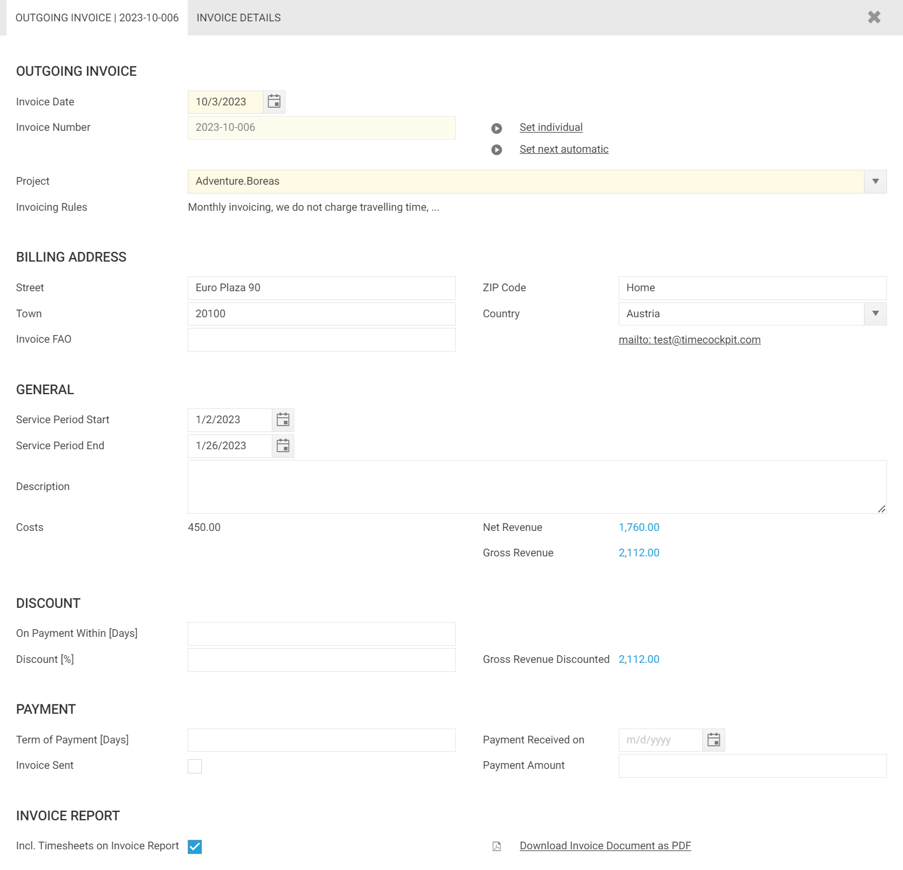

# Invoice Data Fields

This section provides a detailed overview of the most important data fields related to invoices in time cockpit. Learn how to effectively utilize these fields to create and manage invoices.

## Outgoing Invoice Section

### Invoice Date
When using the action `Create Invoice`, the invoice date field will be automatically set to the current date. However, when creating an invoice manually, you have to set this field according to your preferences.

### Invoice Number
Time cockpit can automatically create an invoice number for your next invoice. Per default, it will create an invoice number following the pattern: `:FormatDate(@InvoiceDate, "yyyy") + '-' + :FormatDate(@InvoiceDate, "MM") + '-'`. That is, if you create an invoice in October 2023, it will create the prefix **2023-10-** and add a sequential number for the invoice, e.g. **2023-10-001**. You can control the pattern of the invoice number in your [global settings](https://web.timecockpit.com/app/lists/entity/APP_GlobalSettings). 

If you want to set a custom invoice number for a single invoice, you can use the `Set individual` action and set your custom invoice number. 

### Invoice Rules
This information is derived from the invoicing rules specific to the project corresponding to the invoice.

## Billing Address Section

The billing address is required for generating the invoice document. Per default, the billing address is derived from the billing address of the customer. However, you can override the billing address for each invoice. To manage the billing address of your customers navigate to your [customer list](https://web.timecockpit.com/app/lists/entity/APP_Customer).

>[!NOTE]
The address also has impact on your invoice document in regard to VAT. Please take a look at [Invoice](~/doc/project-time-tracking/billing.md) - Generate an Invoice Report.

## General Section

### Service Period Start and End

The start and end date is printed on the invoice document. If the invoice is created using `Create Invoice` on selected time sheet entries, the service period is automatically determined according to the first and last time entry.

### Net Revenue

In an invoice, the `Net Revenue` represents the total earnings derived from all invoice items assigned to the invoice. This figure provides the overall revenue generated, excluding any Value Added Tax (VAT). 

### Gross Revenue

In an invoice, the `Gross Revenue` represents the total earnings derived from all invoice items assigned to the invoice **including** Value Added Tax (VAT) for the corresponding invoice items.

### Calculated and Deviating Revenue [Depracated]

> [!NOTE]
In past versions of time cockpit provided the fields `Calculated Revenue` and `Deviating Revenue`. Both fields are no longer required for future invoices. We recommend disabling the display of these fields in the [global settings](https://web.timecockpit.com/app/lists/entity/APP_GlobalSettings). For existing invoices, the value entered in the 'Deviating Net Revenue' field is still considered in the 'Net Revenue' field. It is not possible to simultaneously use deviating revenue and invoice items in a single invoice.

## Discount Section

When creating an invoice in time cockpit, you have the option to offer payment discounts to your customers. This feature allows you to define a date by which, if the customer pays before that date, they are entitled to a discounted price.

To set up the payment discount:

1. Enter a numeric value in the `On Payment Within [Days]` field to specify the number of days within which the customer must make the payment to qualify for the discount.

2. In the `Discount [%]` field, enter the percentage of the discount offered to the customer.

Once you've configured these settings, time cockpit will automatically calculate and display the `Discount Due Date` to avail of the discount. Additionally, the system will calculate the `Gross Revenue Discounted` for your convenience.

>[!NOTE]
If you set the `Payment Received On` date on the invoice and it falls within the discount period, time cockpit will automatically prefill the `Payment Amount` with the value for `Gross Revenue Discounted`.

## Invoice Report Section

In this section, you can configure and generate a PDF version of the invoice. To begin report generation for your invoice, simply use the `Download Invoice Document as PDF` option.

Additionally, you can use the `Incl. Timesheets on Invoice Report` flag to specify whether the invoice report should include time sheet entry details for each invoice. This flag provides control over the level of detail in your invoice report.
