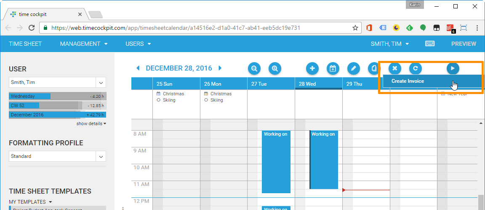

# January 2017

## Time Sheet Calendar Improvements

- It is now possible to execute actions for time sheet entries directly in the time sheet calendar 

- Improved performance for moving, resizing and saving time sheet entries

## List Improvements

- Improved performance for auto sizing columns, especially for Microsoft Edge and IE 11. Columns are automatically resized after loading data. Lists with lots of columns are effected most by these improvements.
- Scrolling performance has improved for lists with lots of date and boolean columns.
- All types of actions are now available in the HTML5 client, even when used in ActionCells.
- Impersonation now also works when opening hyperlinks in new tabs or windows.

## Form Improvements

- TreeViewRelationCells, which can display hierarchical data like Tasks in a combo box, can now be used in the HTML5 client.