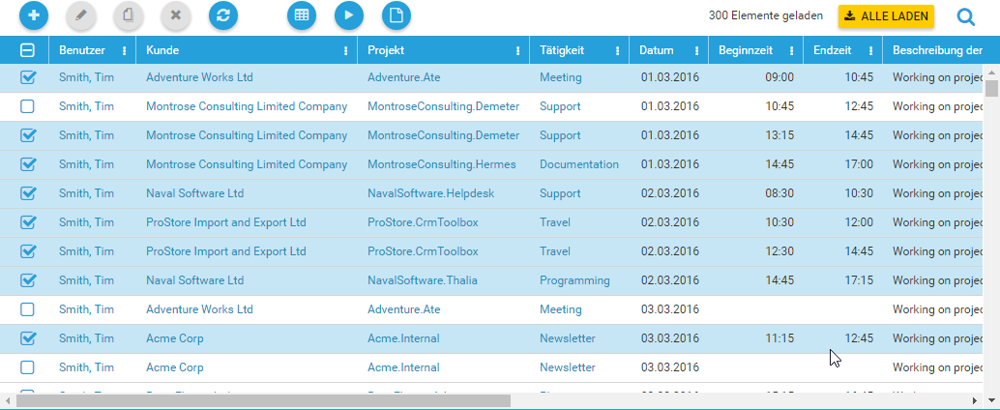
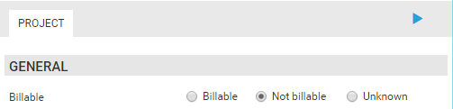

# April 2017

## Read-Only Expression and Permissions in Calendar

Time sheet entries for which you do not have a write permission or which fulfill the read-only expression are shown semitransparent. You cannot resize or move them. But it is still possible to create a copy of affected the time sheet entries. When creating a copy of a read-only time sheet entry, all properties contained in the read-only expression are set to null. Let's assume there is a read-only expression Current.APP_Invoice <> Null. All time sheet entries assigned to an invoice would be shown semitransparent. After copying such a time sheet entry, the assigned invoice property will be set to null.


## Multi-Select in Grid

Additionally to ticking off the checkboxes in the leftmost column, you can now select multiple items by pressing SHIFT or CTRL while clicking on a row. SHIFT selects all rows from the already selected row to the clicked row. CTRL adds or removes a row to the already selected rows.



## Radio Buttons for Boolean Values

This feature is available in the Full Client for a while and this month it has found its way into the new HTML5 Client. The BooleanRadioButtonCell allows to specify a text for the value True, False and Null.

```html
<Form ModelEntityName="USR_BooleanRadioButtonCellTestEntity" xmlns="http://www.timecockpit.com/2009/ui/data">
  <Tab Header="Project">
    <Section Header="General">
      <SectionColumn>
        <BooleanRadioButtonCell Content="=Current.USR_Billable" FalseText="Not billable" TrueText="Billable" NullText="Unknown" Header="Billable" />
        ...
```

The specified texts are displayed next to radio buttons.



You can use the BooleanRadioButtonCell in lists, too. It will also display the text instead of a checkbox.

## Better Sizing of Grids

Footer rows with aggregates are now displayed below the last content row of the grid instead of the bottom edge of the browser window.

## New Kendo Input Controls

We have updated our input controls to the newest version of the kendo controls.

## Edit Triggers in UI

In the administration module of the full client, it is now possible to edit triggers. Triggers can be executed before or after an entity object is saved. [Read more about triggers ...](https://help.timecockpit.com/?topic=html/0E986E12-5817-46FF-B9C9-9246C2846E95.htm)


## Fix: Printing PDF Reports did not Work

Printing PDF reports on a machine with .NET Framework 4.6 installed did not work in previous versions. We had to update to the new version of the telerik controls, to fix this issue. [Read more about the problem ...](https://feedback.telerik.com/Project/143/Feedback/Details/168198-printing-does-not-work-with-net-framework-4-6-installed)