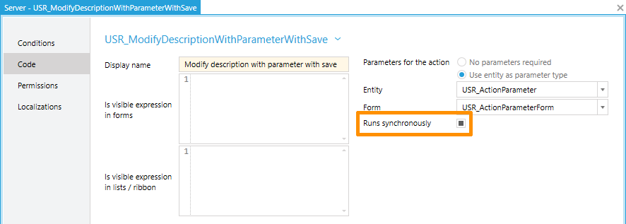

# May 2017

## Hide Signal Details Area

If you are not using the signals from the time cockpit signal tracker for booking, the area at the right side of the screen for signal details takes away lots of space from the calendar.


In the new version, there is an option to hide the signal details area. Select Plugins in the menu:


In the signals area of the plugins you will find a new item Signal Tracker. Turn it off by sliding the button to the left side:


When you go back to the time tracking calendar, the signal details area will no longer be shown:


## ScriptingException for Actions

Until now, the recommended way to handle errors in actions was to raise a `ValidationException`. The exception text was displayed in a MessageBox. There is one big problem when using a `ValidationException`: it is handled as if the action has been executed successfully. If a parameter form is shown, the form will be closed. If the action is used for editable lists, all user input will be reset.

In the new version, we offer a new `ScriptingException` for these scenarios. The `ScriptingException` will keep parameter forms open and will not reset user input in editable lists. In order to make this work, the action has to run synchronously. Otherwise the parameter form may already be closed, when the `ScriptingException` is reached in the action code.



The `ScriptingException` offers multiple overloads:

```cs
 public ScriptingException(string message)
 public ScriptingException(string message, Exception innerException)
 public ScriptingException(string title, string message)
 public ScriptingException(string title, string message, Exception innerException)
 ```

## Fix: Error Handling in Web API

In the last versions, we often showed a generic "Internal Server Error" when an exception occurred in our Web API instead of providing information about the real error. This is especially annoying if you are creating your own list and form definitions for time cockpit because there are scenarios where lists or forms may work in the full client but not in the web client. A common cause of error is unsigned code which can only be executed in the full client ([read more about code signing in time cockpit ...](https://www.timecockpit.com/blog/2014/11/27/Why-You-Need-to-Sign-Your-Custom-Code)). In the new version you will get better information about the cause of an error.