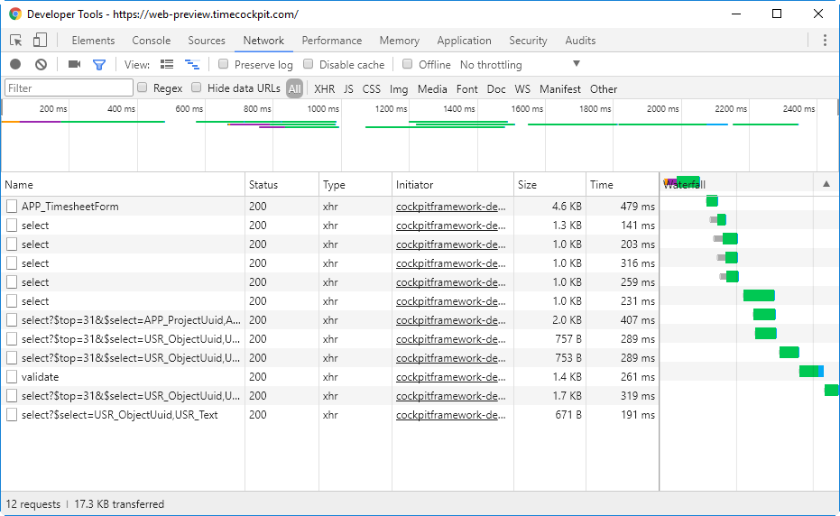
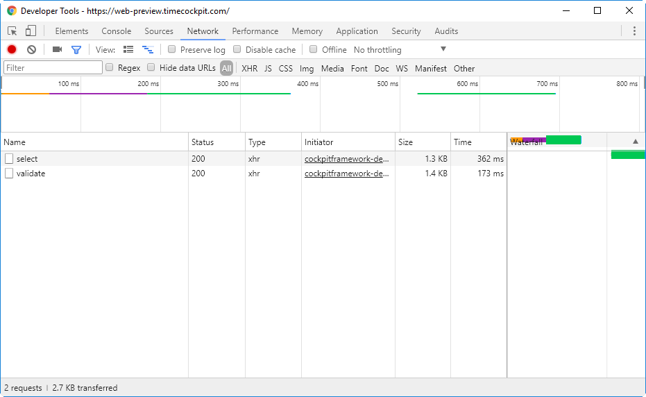

# July 2017

[!include[only in preview](~/only-in-preview-available.md)]

## Performance

### Caching of Combo Box Values

In the new version, values for combo boxes are cached in the local storage of the browser. Time cockpit maintains the last update version per model entity. The web client fetches the last update versions regularly and cleans up the cache when the last update version of a model entity has changed. The following screenshot shows all web service requests that are necessary to open the form to edit a time sheet entry the first time:

The next time the same form is opened, much less requests to the server are required:

The following actions clear the cache for a combo box:

- **Click "Delete cached data" in menu**: This removes all cached combo box values.

- **Edit entity object in same browser**: Each cache entry knows on which model entities it depends. The projects combo box for example depends on `APP_Project` and on `APP_Customer` which is used in the display name (e.g. Demo Customer.First Project). Whenever you edit a project or a customer in the same browser, all cached values for combo boxes showing projects are removed immediately.

- **Edit entity object in other browser or full client**: The web client checks the last update version of all model entities every minute. When an entity object was changed, the cached values will be removed after one minute at the latest.

- **No action**: The cache will be cleaned up after 24 hours and the values will be reloaded from the server the next time they are requested by a combo box.

### Caching of Static Files

We have improved caching of static files like CSS, JavaScript or JSON resources. Some of them were not cached properly in previous versions. This improves the initial load time of time cockpit.

## Bug Fixes

- Texts that are displayed in time sheet entries in the calendar can now contain `<` and `>`.
- FileCells do not need to contain a list of allowed extensions anymore.
- A user must be selected in the time sheet calendar before a new time sheet entry can be created.