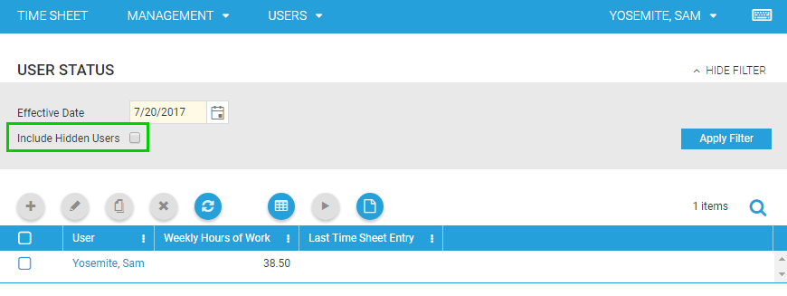
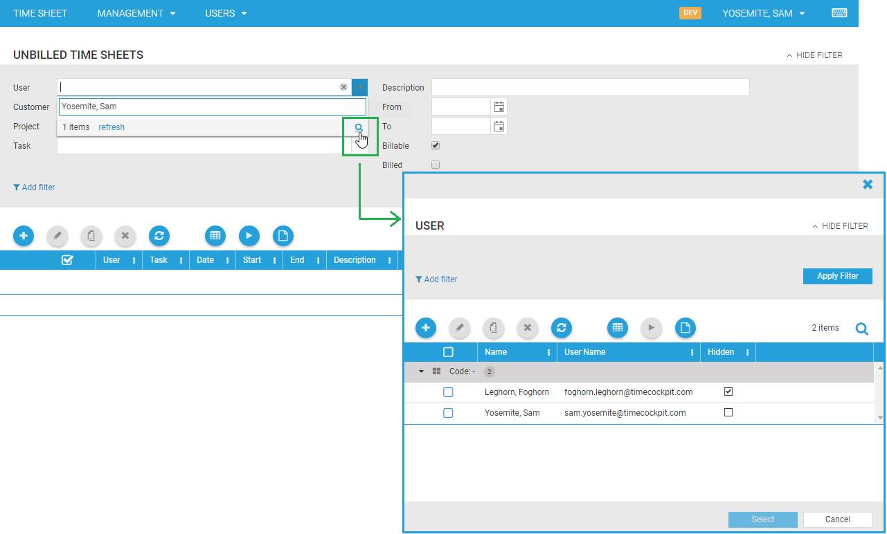
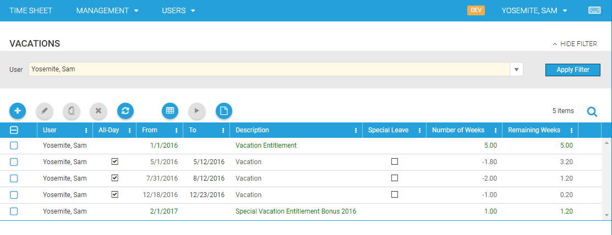

# August 2017

## Handling of Hidden Users

In the user settings of timecockpit there is a checkbox to set a user to hidden. This is not a new feature but until this version the “Hidden-Setting” will be considered in nearly all lists and forms in time cockpit (exceptions are listed below). This means that hidden users will not be displayed by default to improve the overall view. 

In some lists (such as **User Details**, **User Status**, **Vacation Entitlement**, etc.) it is possible to display hidden users again when the necessary filter is activated:

Lists with historically expiring data are deliberately excluded from this change. This concerns the following lists:

- Time Sheets
- Unbilled Time Sheets
- Working Time Violations

These lists are usually used for a particular filtered period of time. Thus, time sheets on a project in the past or working time violations in the past should also be displayed for hidden users so that they won’t be mistakenly overlooked. In general, you won’t have time sheets for hidden users in the current time range so that they will no longer appear in these lists over time.

### Changes for User Selection Fields

In the new version of time cockpit hidden users sill not be listed anymore in user selection fields by default. If you still want to select a hidden user, this is possible by opening the base table of user details through a click on the loupe button in the selection list:

> [!WARNING]
At least one user in your account has to install the latest version of the time cockpit full client to get the new version of the time cockpit data model for your account.

## Changes in List Vacations

In the new version of timecockpit the column **description** in the list vacations contains also the description text of vacation entitlements (displayed in green color) if the vacation entitlement itself contains a description. Otherwise just the words **Vacation Entitlement** are displayed. Before this version the description column always contained **Vacation Entitlement**.

> [!WARNING]
At least one user in your account has to install the latest version of the time cockpit full client to get the new version of the time cockpit data model for your account.

## Bug Fixes

- It is now possible to create time sheet entries in the calendar that last until midnight.
- Highlighting errors in combo boxes when searching for data are fixed.
- ImageCells are now also working in forms.
- LookupConditions for RelationCells are now working.