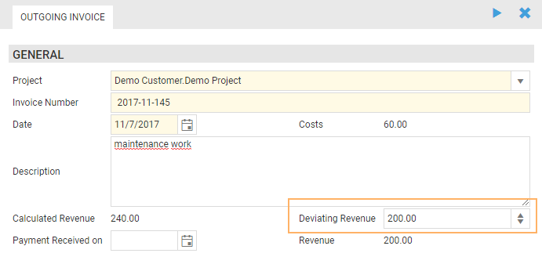

# December 2017

## Billing of Fixed Price Projects

In the previous version of time cockpit it was just possible to create invoices for previously created timesheets. The revenue of the invoice was calculated by summing up all related timesheets considering their durations and hourly rates. The revenue could not be changed.

In this version of time cockpit we added the possibility to override this calculated revenue using the new input field "Deviating Revenue": 

The field "Revenue" displays the resulting revenue of the invoice. If the field "Deviating Revenue" is empty it contains the value of "Calculated Revenue". This ensures that already created invoices using older versions of time cockpit are not affected by this version update. The deviating revenue can be set during the creation of the invoice and of course afterwards. 

Also, it is now possible to create invoices without a timesheet since the revenue can be set individually, independent of any calculated revenue. To do that, you just need to use the plus button to add a new invoice and fill in the fields "Project", "Invoice Number", "Date" and "Deviating Revenue".

For deleting invoices nothing has changed. You still have to use the action "Delete Invoice" to ensure that any related timesheets are removed from the invoice.

## Performance of Editable Lists

The performance for editable lists has been improved in the new version. Nevertheless, please use as few input contols as possible by limiting the number of editable columns and by limiting the number of rows by filters.

## Bug Fixes in HTML5 Client

- Resize behavior of time sheet entries in calendar at the end of day has been fixed
- In duration picker the day is not changed when 00:00 is entered for end time
- Use script source in lists if defined even if TCQL is defined
- Empty sections in menu are hidden
- Use defined form width
