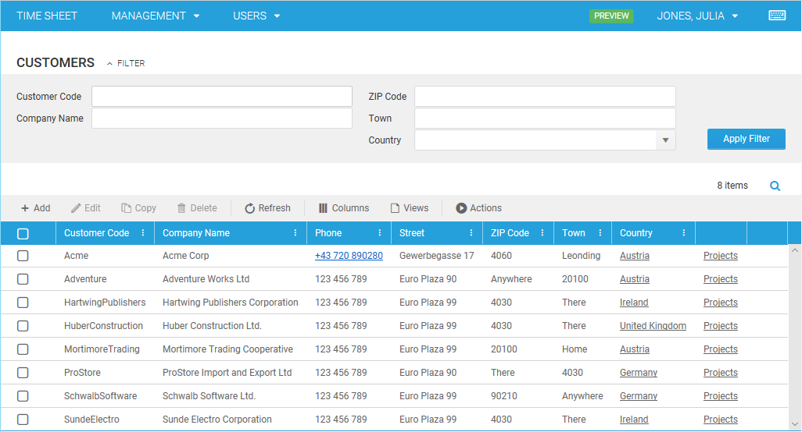
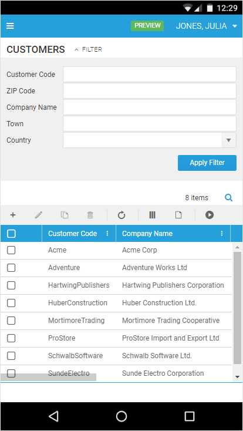
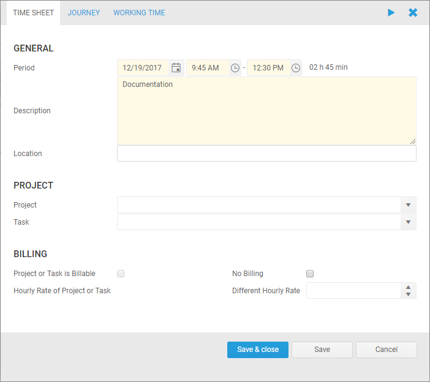

# January 2018

## Toolbar in Lists and Calendar

We have replaced the blue icon buttons above lists and above the calendar with a toolbar, that shows an icon and a caption for each button.

On smaller devices, the captions of the toolbar buttons are omitted so that still all buttons can be displayed in one row.

If the available space would really be too little for all buttons, there will appear an arrow on the right side that allows you to expand an overflow area for buttons that lack space in the main toolbar area.

## New Kendo Controls

We have upgraded to the latest version of the [Kendo UI](https://demos.telerik.com/kendo-ui/) controls and we have switched to their Default Theme. Therefore, lots of controls like textboxes, date pickers, combo boxes or buttons look slightly different in the new version.

## Bug Fixes in HTML5 Client

- Selected rows in lists do not get lost when scrolling
- Changes in editable lists are not discarded when collapsing the parent group
- It is now possible to scroll and to select items in the calendar by touch