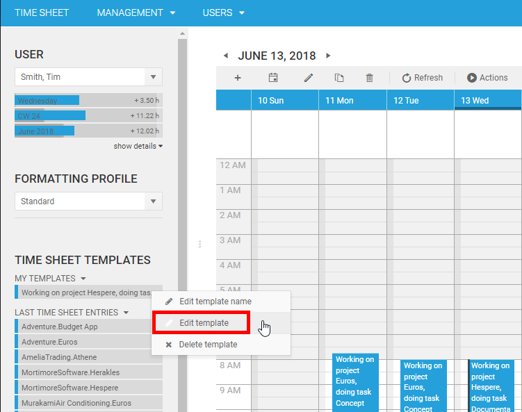
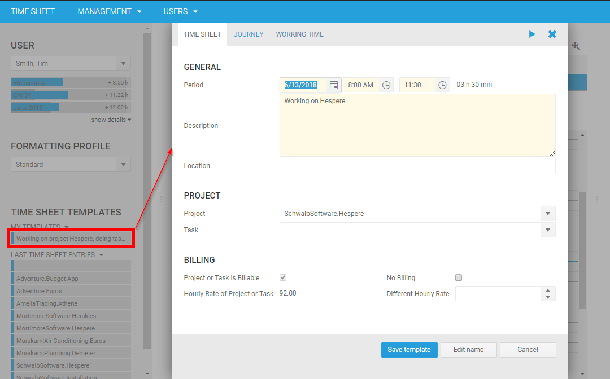
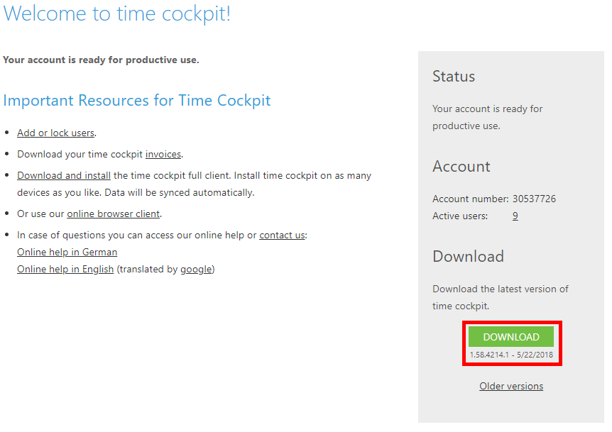
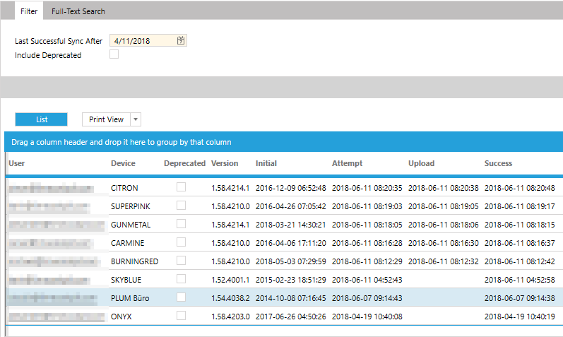

# June 2018

You may wonder what we have been doing the last 3 months and why we have not been publishing any What’s New article. Of course, we have not been idle.

## Web Client

### Angular 5

Over the last 3 months we have invested a lot of time in technology nurturing. We have migrated the time cockpit shell (main menu) from Angular JS to Angular 5. This enables us to migrate forms and lists step by step and also to integrate individually implemented components more easily (see also https://www.timecockpit.com/blog/2016/05/31/Whats-New-in-Version-June-2016). 

Before this change, individually developed components where embedded in an Iframe. When the Iframe was loaded, time cockpit had to load its Java Script data access layer a second time. With the new version, the time cockpit shell can share the Java Script data access layer.

Further, with the new version we can implement your own form or list with custom logic as external component and use it in time cockpit with the same look and feel as the rest of the application. If you need guidance send us a mail at support@timecockpit.com.

### Template Bookings

In this release we have improved template booking functionality. Until now, it was only possible to edit the name of a template booking after it has been created. If you wanted to change the template booking itself, you had to delete it and afterwards recreate it. 
Now, if you have an existing template booking you can edit it by clicking "Edit template" in the context menu of the template booking. 



A time sheet form appears and you can change all the properties you find necessary. If you remove required properties or relations from the template, time cockpit will give you validation errors as information, but you will still be able to save the template.
Removing required information is a vast improvement over the same feature in the full client. There, you were only able to create template bookings for valid time sheet entries.



## Full Client

### Time Cockpit Auto-Updater
Our customers grow and time cockpit has to grow with them.
If no form of automated rollout is in place, an update of the time cockpit full client on multiple devices can be a tedious task.
On the other hand, for us as a service provider, it gets harder and harder to get a new version of time cockpit to our customers.
The result is a growing number of outdated clients causing increased maintenance efforts on both ends.

To simplify this scenario we integrated [Squirrel](https://github.com/Squirrel/Squirrel.Windows) to auto-update time cockpit. If you download the latest version of time cockpit from our website this will be the last version that you will ever have to download from our website. Once installed, time cockpit will notify you whenever a new version of time cockpit is available. If you agree to download and install the new version, time cockpit will do so automatically. 



If you are a time cockpit power user with multiple configurations (e.g. two tenants, or a prod and test environment) you need to adapt your time cockpit shortcuts. In most cases shortcuts should now point to ```%LOCALAPPDATA%\TimeCockpit\TimeCockpit.UI.exe``` which will redirect to the correct version. Drop us a mail at support@timecockpit.com if you require additional support or have open questions.

### Sync Improvements - Diagnostics

For time cockpit admins, it was difficult in the past to know what versions of time cockpit their users have installed. Thus, we have added a sync statistics list that gives time cockpit admins basic information about what versions of time cockpit are installed and when the devices have been synchronized. This feature helps gaining an overview of how current the serverside data is and if there might be synchronization issues when rolling out substantial customizations. The list is only available in the Customizations section under "Lists" and is called ```APP_SyncDeviceStatusList```.



### Sync Improvements - Skip Chunks

For users with just a single time cockpit device we added a new option – Skip Chunks. If this option is enabled for a user, no signals are uploaded to the server. That is, you can use your signals locally to help you create your time sheet entries, but the signals are not synchronized to your other devices. Please keep in mind that if you e.g. set up a new PC, your signals are lost, since they cannot be downloaded from the server. If your time cockpit account has a significant number of devices with slow or unreliable network connections you can reduce potential performance issues on the server database by disabling signal synchronization with this setting. This option is for advanced use only and needs communicating the change to a company's employees. Let us know at support@timecockpit.com if you need help activating this setting.

## OnCockpit

Have you ever wondered what is driving time cockpit under the hood and what it enables it to be customizable? It is the cockpit framework. Over the years, we have built various data driven applications for our customers on top of our framework. 
In the past we often used time cockpit’s infrastructure to host those non-time cockpit applications. To cleanly separate time cockpit and cockpit framework customers we have worked on extending the underlying infrastructure over the last month. Customers can soon host their applications under the new domain **".oncockpit.com"**. Further, we are working on the changes to make the login page customizable.

## DSGVO

Since May 25th 2018 the DSGVO is in force in all EU-countries. To conform to the DSGVO, we now provide an easy to use service to close a DSGVO agreement with us on our website. You can simply follow the link https://app.hellosign.com/s/a699af6a and review and sign a DSGVO agreement with us. 