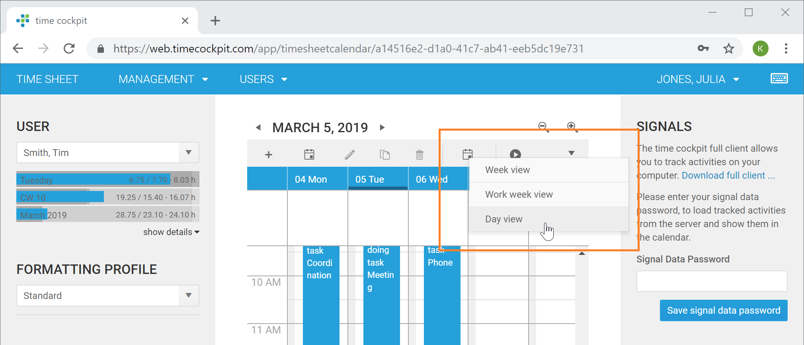
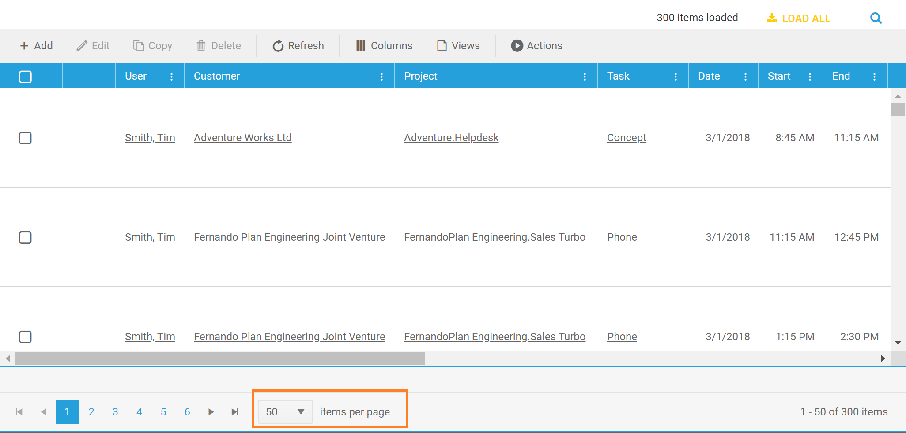

# March 2019

## Web Client

### Day and Work Week View in Calendar

The time sheet calendar now provides three different view types:

- Week: shows 7 days
- Work week: shows 5 days from Monday to Friday
- Day: shows only the selected day

### Paging in Editable Lists

It is now possible to change the number of items that are displayed in editable lists. The available options are:

- 50
- 100
- 200
- all

## Bug Fixes & Improvements

* Wrong time sheet entries were displayed when switching months in calendar