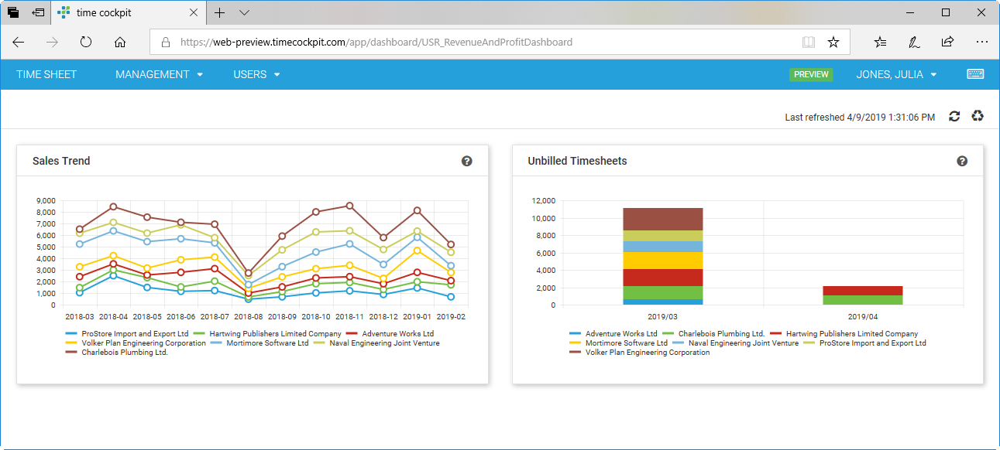

# April 2019

## Web Client

### Dashboards

Dashboards allow you to arrange different type of data on a board. At the moment charts, key figures and lists are supported.

[Read more ...](../data-model-customization/dashboard.md)

## Bug Fixes & Improvements

* Performance improvements by new input controls for numeric and boolean values
* Performance improvements for drag & drop of time sheet templates with duration lower than 30 minutes
* Wrong time sheet entries were displayed when switching months in calendar