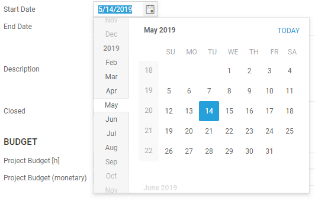

# May 2019

## Web Client

### New Date and Time Picker

* Use Alt + ↓ and Alt + ↑ to open and close the calendar.
* Use ← and → to navigate between day, month and year.
* Use ↑ and ↓ to increment and decrement the selected value or just type the values for day, month and year without separators (e.g. 05142019).
* If you skip one of the values for day, month, or year, the current day, month, or year will be used.

Keyboard Shortcuts:

* t or c - today
* p - last day of previous month
* n - last day of month

## Bug Fixes & Improvements

* Do not send error report when permissions fail - only show error dialog.
* Time sheet entries where not displayed correctly side by side when the begin time of a time sheet entry was dragged to an earlier start time.
* Actions could not be executed when all entries in a list where selected with the 'select all' check box in the top left corner.
* Time sheet entries created with CTRL + I had a begin time of 8am instead of the end time of the latest time sheet entry.
* Property ShowListAllowed in RelationCells was ignored in web client.