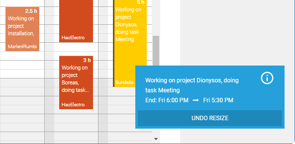

# June 2019

## Undo

It is now possible to undo move and resize operations of the last 10 seconds in time sheet calendar. In the bottom right corner notifications will be displayed for every available undo operation. 

Additionally, you can use CTRL + Z to undo the last operation.

## Bug Fixes & Improvements

- Line breaks in time sheet entries and tooltips are displayed.
- It is possible to impersonate as another user without quitting current impersonation first.
- The property ShowListAllowed in ComboBoxes was not used in HTML5 client.