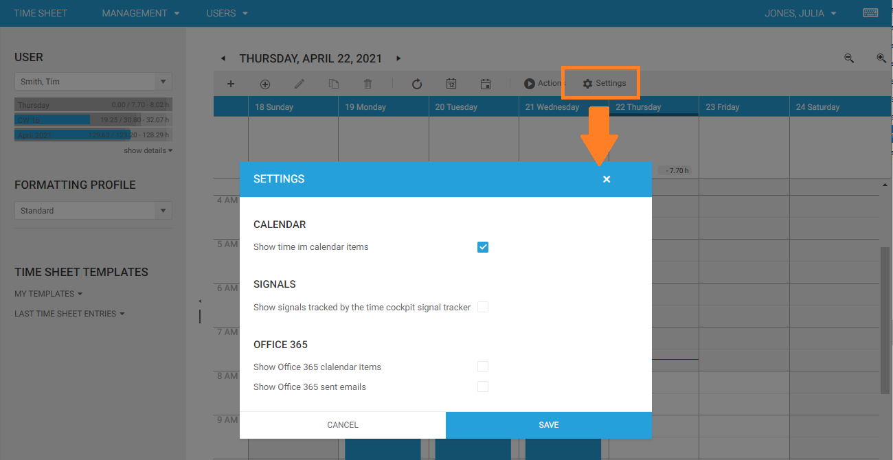
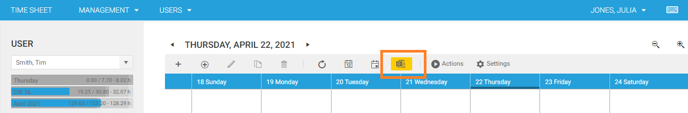
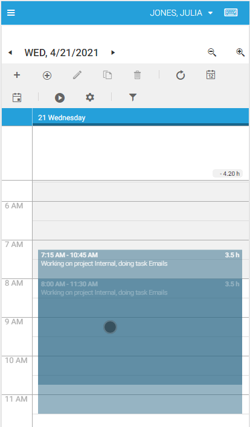
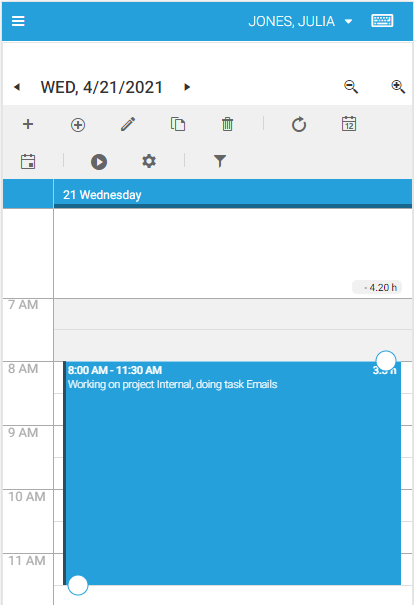
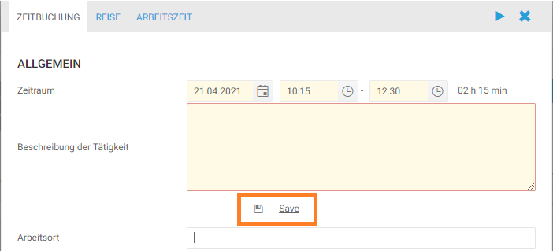

# April 2021

## Calendar

There are a few changes in the UI of the new time sheet calendar:

### Settings

We have removed the *Plugins* menu item, instead there is a new *Settings* item in the toolbar above the calendar.



### Office 365

If your have checked *Show Office 365 calender items* or *Show Office 365 sent emails* in the new settings dialog, you will find a new Icon in the toolbar above the calendar. It will be yellow highlighted, if your are currently not singed in.



### Mobile View

It is now possible to drag & resize time sheet entries in the mobile view of the calendar. Press time sheet entries for a second to enable drag & drop, when the color changes you can drag the item.



When you tap a time sheet entry, resize handles will become visible that allow you to change begin and end time.



Swipe left and right to change the selected day.

## Forms

### SaveButtonCell

There is a new type of form control, that allows you to show a save button in the form.

```html
<web:SaveButtonCell 
    Content="='Save and load dependencies'" 
    Header=" " 
    Icon="save" 
    LabelPosition="None" 
    Align="Center|Left|Right" 
    Close="False"
    Foreground="=:Iif(Current.APP_Description = 'red', 'Red', 'Green')" 
    IsEnabled="=:Iif(Current.APP_Description = 'test', False, True)"
    IsVisible="=:Iif(Current.APP_Description = 'test', 'Collapsed', 'Visible')" />
```

You can find the list of available icons at https://www.telerik.com/kendo-angular-ui/components/styling/icons/.



## Bug Fixes & Improvements

- Scrollbar in import results table was not shown.