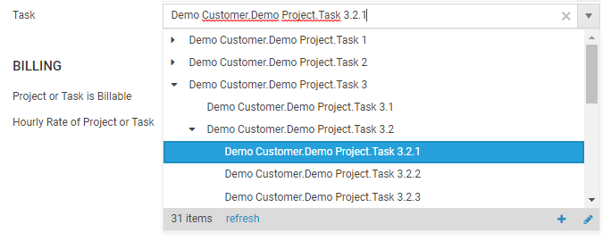

# July 2022

## ManyToManyRelationCell

The ManyToManyRelationCell allows to select multiple values in a combo box.


```
<ManyToManyRelationCell BackReference="UserDetailRolesOfUserDetail" Relation="APP_UserRole" DisplayProperty="APP_UserDetail" />
```

## TreeViewRelationCell

The ManyToManyRelationCell allows to display hierarchical data in a combo box.



```
<TreeViewRelationCell Condition="=:Iif(Current.Project = Null, '1 = 0', 'Current.Project = Null Or Current.Project.ProjectUuid={' + Current.Project.ProjectUuid + '}') + ' And (Current.Closed = Null Or Current.Closed = False)'" Content="=Current.APP_Task" ParentRelation="USR_ParentTask" DisplayProperty="APP_Fullname" />
```

## Bug Fixes & Improvements

- SelectFirstIfNewAndSingle in RelationCells
- add 'add' and 'edit' buttons to RelationCells
- fix: when selection RelationCell values via lookup list select button was not enabled when exactly one element was selected

