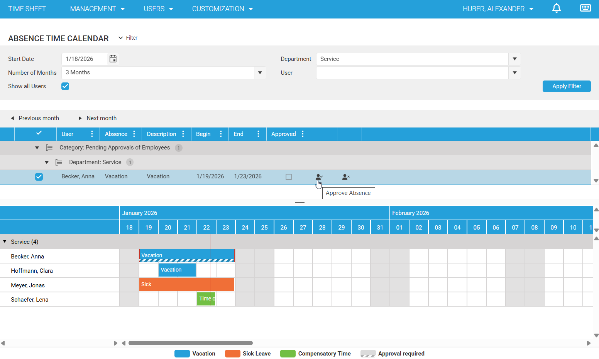
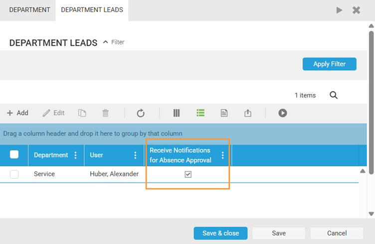
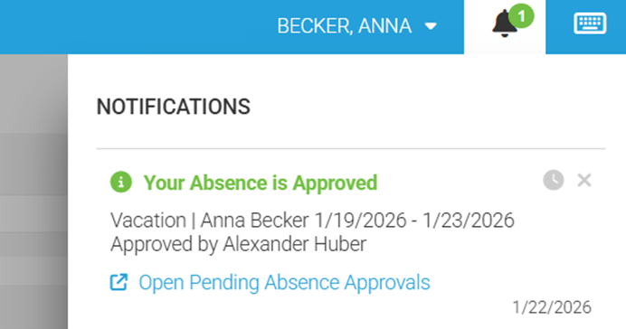
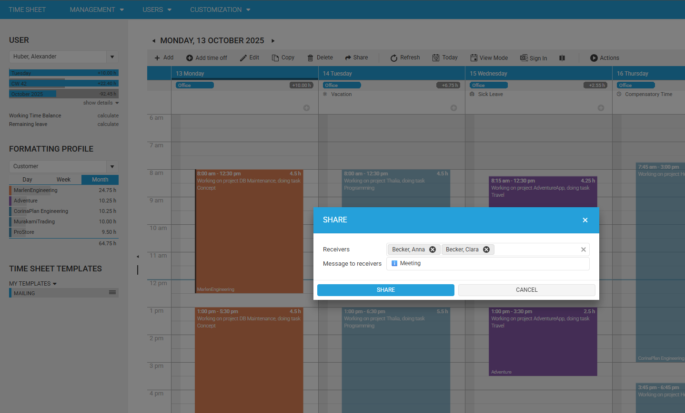
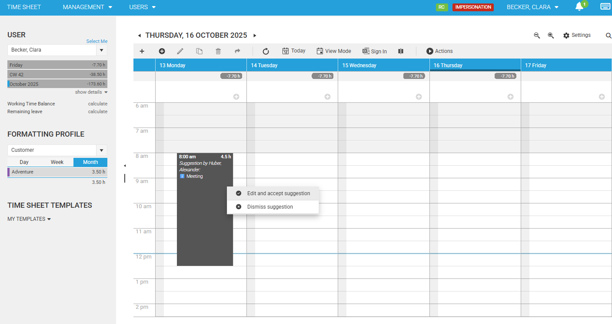

# 📅 February 2026

## ✨ Improvements

### Absence Calendar: Better overview for teams and approvers

The absence calendar gives HR and department leads a clearer, more actionable overview of planned and ongoing absences.
In addition to the calendar itself, pending approvals are surfaced in a list above the calendar, making it easy to review what needs attention.
👉 [Read more](~/doc/employee-time-tracking/absence-time-management)

### Absence Approval Workflow: Transparent requests with automatic notifications

Absence approvals can be enabled per absence type (vacation, compensatory time off, sick leave) in [Global Settings](https://web.timecockpit.com/app/forms/entity/APP_GlobalSettings).
When enabled, employees can request absences and the responsible approvers can approve or reject them directly in the absence calendar.

The day-to-day workflow is notification-driven: approvers (department leads) automatically receive a notification when a new request needs approval, and requesters receive a notification once their absence is approved or rejected (including who processed it and when). If an absence is rejected, it is removed automatically to keep the process clean and consistent.
👉 [Read more](~/doc/employee-time-tracking/absence-time-management.html)

Approvers can tailor how they get informed: department leads can disable receiving absence-approval notifications in their department settings. This is helpful if approvals are handled by HR, if a deputy takes over, or if a lead wants to reduce notification noise.

Requesters are kept in the loop as well. Once an absence is approved (or rejected), time cockpit sends a confirmation notification that includes who processed the request and when. In case of rejection, an optional rejection reason can be included so employees immediately understand what needs to be changed.

### Privacy by design in the absence calendar

To protect employees’ privacy, regular users can see colleagues’ absences in the calendar, but the **absence type** (vacation vs. sick leave vs. compensatory time) is intentionally hidden. This supports coordination without unnecessary disclosure.
👉 [Read more](~/doc/employee-time-tracking/absence-time-management.html)

### Timesheet Suggestions (Share Timesheet): Share entries as actionable templates

Sharing time bookings is now more structured: you can share one or more existing timesheet entries as **suggestions**.
Receivers see them as read-only items in the Timesheet Calendar and can either edit and accept a suggestion (which creates a new timesheet entry based on it) or dismiss it.

This reduces back-and-forth, helps teams book consistently, and keeps project accounting cleaner.
👉 [Read more](~/doc/timesheet-calendar/timesheet-suggestions-share-timesheet.html)

## 🔐 Permissions / Admin Notes

### Expanded standard roles for more granular control

Building on the default permissions model, we added more predefined roles so organizations can map responsibilities more precisely.
Highlights include **Project Manager** (`ProjectManager`) for managing assigned projects and tasks with project-level visibility, **Project Controller** (`ProjectController`) for organization-wide oversight of project time tracking and billing-related views, and **Department Lead** (`DepartmentLead`) for approving/rejecting absence requests plus viewing time/absence data for employees in their departments.

👉 [Standard permissions overview](~/doc/employee-time-tracking/default-permissions.html)
👉 [Migration guide](~/doc/migration-guides/default-permissions.html)

### How to enable absence approvals (quick checklist)
  1. Enable approvals per absence type in **Global Settings**.
  2. Enable “Absence approval required” per user (user master data) for the users who should go through approvals.
  3. Ensure approvers have the right role (typically **Department Lead** or **Human Resources Admin**).

  👉 [Absence approval workflow details](~/doc/employee-time-tracking/absence-time-management.html)

### How to enable Timesheet Suggestions (quick checklist)
  1. Enable **Timesheet Suggestions** in **Global Settings**.
  2. Ensure users have access to the Timesheet Calendar and can create timesheet entries.

  👉 [Timesheet suggestions / Share timesheet](~/doc/timesheet-calendar/timesheet-suggestions-share-timesheet.html)

## ✨ Minor Improvements

* **Notification Text Supports Markdown**
  Notification texts can now be authored using **Markdown** for better formatting (e.g., bold text, lists, links).

* **Improvement of the Attendance/Absence Area (ZBK)**
  Improved usability and clarity of the **Anwesenheits-/Abwesenheitsbereich** in the ZBK.

* **Mobile View: Checkbox/Text Layout Improvements**
  Optimized the mobile layout for **checkboxes and text** and prevented unwanted focus behavior in text fields.

## 🛠 Bug Fixes

* **Group Header Not Evaluated**
  Fixed an issue where the **group header** was not evaluated correctly.

* **Missing Error Messages for DefaultValues/ValidationRule**
  Fixed an issue where error messages for **DefaultValues** and **ValidationRule** were not displayed.

---

> **Note:**
> These release notes describe what’s included in the February 2026 release. Availability can depend on rollout rings and tenant configuration.
> If you have questions, please contact support@timecockpit.com.